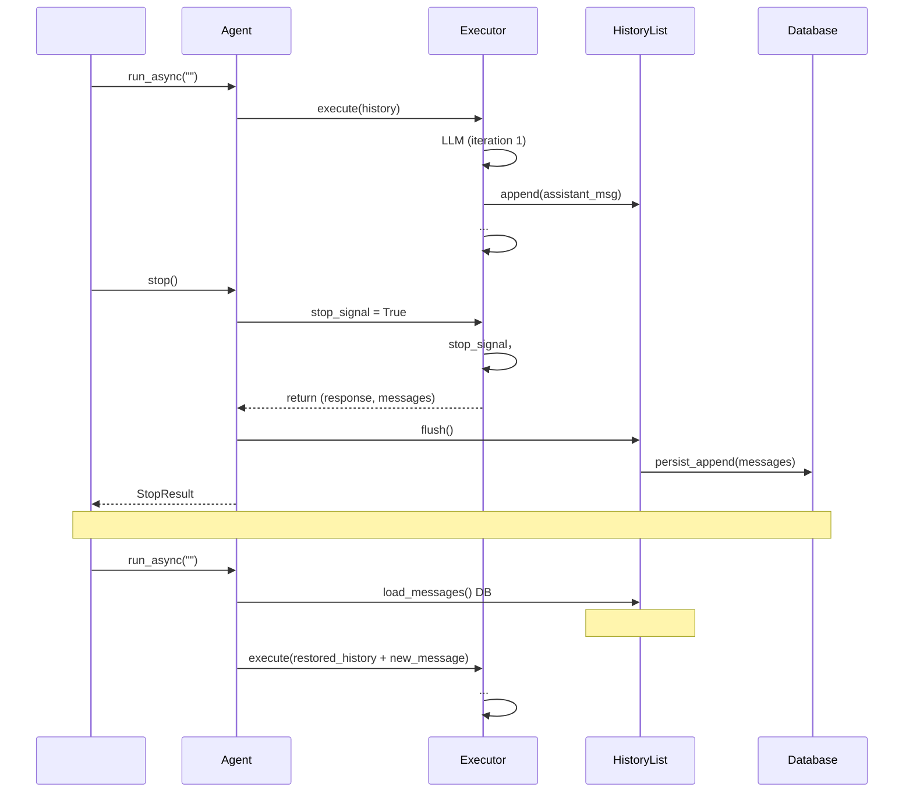

# RFC-0001: Agent 

- ****: implemented (Phase 1-4)
- ****: P1
- ****: `architecture`, `dx`, `session`
- ****: `nexau` (core framework)
- ****: 2026-02-14
- ****: 2026-02-14

## 

（stop） Agent ， run （、LLM 、）， `HistoryList.flush()`  run 。 RFC ""， stop ，。

## 

### 

1. ****：`HistoryList` ——`append()`/`extend()`  `_pending_messages`， `flush()` 。`flush()`  `Agent._run_inner()`  try/except （[agent.py:972](nexau/archs/main_sub/agent.py#L972), [agent.py:988](nexau/archs/main_sub/agent.py#L988), [agent.py:996](nexau/archs/main_sub/agent.py#L996)）。 `agent.stop()` ， flush 。

2. **stop **：`agent.stop()` → `executor.cleanup()`  `stop_signal=True`  `cancel_futures=True`  ThreadPoolExecutor（[executor.py:1032-1058](nexau/archs/main_sub/execution/executor.py#L1032-L1058)）。Executor  stop_signal （[executor.py:274-285](nexau/archs/main_sub/execution/executor.py#L274-L285)），：
   -  Agent  LLM ，stop_signal  LLM 
   - `asyncify`  future ，`CancelledError`（ `BaseException`） `_run_inner`  `except Exception` ， flush 
   -  executor ，`_run_inner`  `run_async`  `_persist_session_state` 

3. **""**： Cursor、Claude Code  Agent 。NexAU  stop ""——，，。

4. ****：`AgentStopReason` （[stop_reason.py:18-26](nexau/archs/main_sub/execution/stop_reason.py#L18-L26)） `USER_INTERRUPTED` ，stop_signal  `stop_reason=None`， after_agent hooks 。

### 

-  Agent ，
-  Agent 
- ， session 

## 

### 

```
 Agent
       │
       ▼
┌──────────────────────────────────────────────────┐
│  agent.stop(force=False)                         │
│                                                  │
│  1.  stop_signal = True                      │
│  2.  LLM （）            │
│     (force=True ， cleanup)          │
│  3. （ LLM ）            │
│  4.  history.flush()                    │
│  5.  stop_reason = USER_INTERRUPTED           │
│  6.  StopResult                              │
└──────────────────────────────────────────────────┘
       │
       ▼
┌──────────────────────────────────────────────────┐
│                                      │
│                                                  │
│  agent.run_async(message="")                │
│  → （）         │
│  →                                        │
└──────────────────────────────────────────────────┘
```

### 

#### 1.  `USER_INTERRUPTED` 

 `AgentStopReason` ：

```python
class AgentStopReason(Enum):
    MAX_ITERATIONS_REACHED = auto()
    STOP_TOOL_TRIGGERED = auto()
    ERROR_OCCURRED = auto()
    CONTEXT_TOKEN_LIMIT = auto()
    SUCCESS = auto()
    NO_MORE_TOOL_CALLS = auto()
    USER_INTERRUPTED = auto()  # 
```

Executor  stop_signal ：

```python
if self.stop_signal:
    stop_response = "Stop signal received."
    stop_response, messages = self._apply_after_agent_hooks(
        agent_state=agent_state,
        messages=messages,
        final_response=stop_response,
        stop_reason=AgentStopReason.USER_INTERRUPTED,  #  None
    )
    return stop_response, messages
```

#### 2. Executor  flush 

 `executor.cleanup()` ，：

-  `stop_signal = True`（）
-  `_shutdown_event`（）
- ****  `shutdown(wait=False, cancel_futures=True)`  executor
-  `_shutdown_event: threading.Event`，

 `_run_inner`  finally  flush：

```python
async def _run_inner(self, agent_state, merged_context, **kwargs) -> str:
    try:
        response, updated_messages = await asyncify(self.executor.execute)(...)
        self.history = updated_messages
        self.history.flush()
        return response
    except Exception as e:
        # ...  ...
        self.history.flush()
        raise
    finally:
        # 、， flush
        if self.history._pending_messages:
            self.history.flush()
```

#### 3.  LLM 

 stop_signal  LLM ，：

** A：（Streaming）**

LLM  API ， token ：

-  `LLMCaller`  `stop_signal`，
-  assistant message  history
- 

** B：**

-  LLM （， 30s）
- ，（）

#### 4.  `agent.stop()` API

 `force` """"，：

```python
class Agent:
    async def stop(self, *, force: bool = False, timeout: float = 30.0) -> StopResult:
        """ Agent 。

        Args:
            force: True （），
                   False （）
            timeout: （ force=False ）

        Returns:
            StopResult 
        """
        # 1. 
        self.executor.stop_signal = True
        self.executor.shutdown_event.set()

        if force:
            # 2a. ： executor
            self.executor.cleanup()
        else:
            # 2b. ：（）
            await self._wait_for_execution_complete(timeout=timeout)

        # 3.  flush
        self.history.flush()

        # 4.  session state
        await self._persist_session_state(...)

        return StopResult(
            messages=list(self.history),
            stop_reason=AgentStopReason.USER_INTERRUPTED,
        )

    def sync_cleanup(self) -> None:
        """（ __del__ ）。"""
        self.executor.cleanup()
```

#### 5. StopResult 

```python
@dataclass
class StopResult:
    """Agent 。"""
    messages: list[Message]
    stop_reason: AgentStopReason
    interrupted_at_iteration: int
    partial_response: str | None = None  #  LLM （）
```

#### 6. 

 `run_async` （[agent.py:741-774](nexau/archs/main_sub/agent.py#L741-L774)）。 `agent.run_async(message="")` ：

1. `load_messages()` （）
2. 
3. Agent ，

， flush 。

### 



## 

### 

|  |  |  |  |
|------|------|------|------|
| A:  |  |  DB ，； event sourcing  run-level  |  |
| B:  checkpoint（ 10s flush） |  |  10s ； |  |
| C:  flush（） | ； run-level ； |  `stop()` API（`force` ）； LLM  | **** |
| D: WAL（Write-Ahead Log） |  | ； WAL  |  |

### 

- `stop(force=False)`  LLM ，
- （）
-  `finally`  flush （ SIGKILL）

## 

### 

- [x] Phase 1: 
  -  `AgentStopReason.USER_INTERRUPTED`
  -  `_run_inner`  `finally`  flush
  -  executor stop_signal  stop_reason
  - 

- [x] Phase 2:  `agent.stop()` API
  -  `stop(force=False, timeout=30.0)`  `StopResult`
  -  `_wait_for_execution_complete` 
  - `force=True`  + ，`force=False`  + 
  - `sync_cleanup()`  `__del__` 
  - 

- [x] Phase 3: 
  -  `LLMCaller`  stop_signal 
  - 
  - 

- [x] Phase 4: Transport 
  - TransportBase  `_running_agents`  Agent
  - `handle_request` / `handle_streaming_request` / Agent
  -  `handle_stop_request()`  Agent
  - HTTP/SSE:  `POST /stop`  + `StopRequest`/`StopResponse` 
  - Stdio:  `agent.stop` JSON-RPC 
  - 

### 

|  |  |
|------|------|
| `nexau/archs/main_sub/agent.py` | Agent ， `stop(force=)` API |
| `nexau/archs/main_sub/execution/executor.py` | Executor ， stop  |
| `nexau/archs/main_sub/execution/stop_reason.py` |  `USER_INTERRUPTED`  |
| `nexau/archs/main_sub/execution/stop_result.py` | `StopResult`  |
| `nexau/archs/main_sub/history_list.py` | HistoryList， finally flush |
| `nexau/archs/session/agent_run_action_service.py` | ， |
| `nexau/archs/transports/` | Transport ， `POST /stop`  `agent.stop`  |

## 

### 

-  `stop()`  `_pending_messages`  flush
-  stop_signal （LLM 、、）
-  `AgentStopReason.USER_INTERRUPTED`  after_agent hooks
-  `finally`  `CancelledError`  flush

### 

- ：run → stop →  DB  → run（）→ 
- ：run  stop 
- ：LLM  stop 

### 

1.  Agent，
2.  stop
3. 
4. ， Agent 

## 

> 。

### 1. 

****:  30s， `stop(timeout=)` 。

- `agent.stop(timeout=30.0)` — 
- Transport ：`StopRequest.timeout` （HTTP）、`params.timeout`（Stdio JSON-RPC）
- 30s （LLM  < 20s）；，
-  `_wait_for_execution_complete` （），`stop()`  flush 

### 2. 

****: ；。

- Executor  `_shutdown_event`（[executor.py:813](nexau/archs/main_sub/execution/executor.py#L813)），
-  ThreadPoolExecutor ， `messages` 
- ""—— `_shutdown_event` ，
- LLM  tool_call （ 5 ）， N ，

### 3.  Agent 

****:  stop（ `subagent_manager.shutdown()`）， stop。

- `executor.cleanup()`  `self.subagent_manager.shutdown()`（[executor.py:1086](nexau/archs/main_sub/execution/executor.py#L1086)）， Agent
- `_shutdown_event`  Agent 
-  `stop()` ： Agent  session  Agent， HistoryList ； Agent  `_run_inner` finally  flush
- ， `agent.stop()`  `subagent_manager`  Agent  `stop()`

### 4. 

****: 。

-  `shutdown_event` ，streaming  break，LLM caller  `None`（[llm_caller.py:248](nexau/archs/main_sub/execution/llm_caller.py#L248)）
- Executor  `None`  `stop_signal`， `USER_INTERRUPTED` 
-  token  assistant message （ LLM caller  `None` ）
-  LLM  assistant message + tool results，，
- ， LLM caller  token  partial assistant message 

### 5. Transport 

****: ， SSE 。

- HTTP/SSE: `POST /stop` ， `StopRequest`（user_id, session_id, agent_id, force, timeout）， `StopResponse`（status, stop_reason, message_count, error）
- Stdio: `agent.stop` JSON-RPC ， HTTP 
- ：
  - SSE （server → client），
  - （、）
  - —— HTTP POST ， SSE 

## 

- [Claude Code ](https://docs.anthropic.com/en/docs/claude-code) -  Escape 
- [Cursor Agent ](https://cursor.sh) -  Agent
- NexAU  Session ：`nexau/archs/session/agent_run_action_service.py`
- NexAU HistoryList ：`nexau/archs/main_sub/history_list.py`