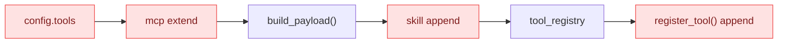
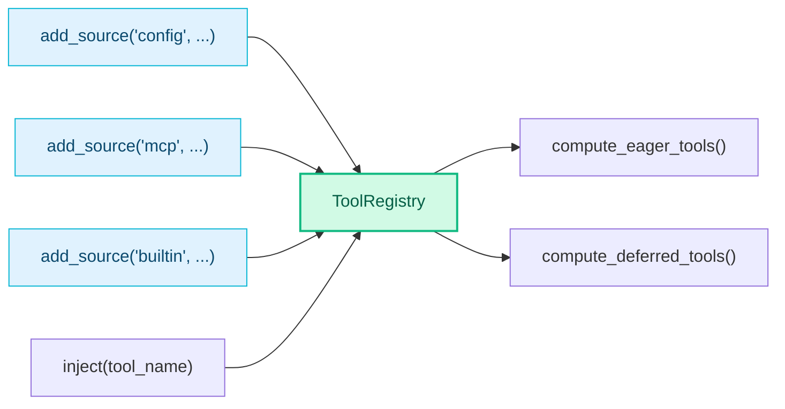

# RFC-0005: Tool Search — 

- ****: implemented (Phase 1.5)
- ****: P1
- ****: `architecture`, `performance`
- ****: nexau (agent runtime)
- ****: 2026-03-06
- ****: 2026-03-12

## 

 NexAU  JSON Schema  `tools` ， context 。 RFC ：

1. **Tool Search**：`defer_loading: true` ， `ToolSearch` 
2. **Computed Tools**：， + ， mutation 

## 

-  schema  200-500 tokens，20  4000-10000 tokens， 2-3 
- MCP Server ，
-  `as_skill` "description "，"schema "
- ：Claude Code 2.1.69  context  18k  4.8k tokens

## 

### 

```mermaid
flowchart TB
    subgraph sources["Sources（）"]
        config["config tools"]
        mcp["MCP tools"]
        builtin["builtin tools<br/>(LoadSkill, ToolSearch)"]
        runtime["runtime eager tools<br/>(deferred unsupported in Phase 1)"]
    end

    subgraph registry["ToolRegistry"]
        compute["compute_tools()"]
    end

    subgraph output["Computed Output"]
        eager["Eager Tools<br/>defer_loading=false<br/>+  deferred"]
        deferred["Deferred Tools<br/>defer_loading=true<br/>"]
    end

    subgraph llm["LLM "]
        tools_param["tools "]
        search["ToolSearch<br/>select / keyword"]
    end

    config --> compute
    mcp --> compute
    builtin --> compute
    runtime --> compute

    compute --> eager
    compute --> deferred

    eager --> tools_param
    deferred --> search
    search -- "" --> eager

    style sources fill:#E0F2FE,stroke:#06B6D4,stroke-width:2px,color:#0C4A6E
    style registry fill:#FEF3C7,stroke:#F59E0B,stroke-width:2px,color:#78350F
    style output fill:#D1FAE5,stroke:#10B981,stroke-width:2px,color:#065F46
    style llm fill:#EDE9FE,stroke:#8B5CF6,stroke-width:2px,color:#5B21B6
```

### `defer_loading` 

 `Tool`  `defer_loading: bool`， `as_skill` ：

| | `defer_loading=false` | `defer_loading=true` |
|---|---|---|
| **`as_skill=false`** | ：schema ，description  prompt  | schema ，description  prompt  |
| **`as_skill=true`** | schema ，description  LoadSkill  | schema ，description  LoadSkill  |

- `as_skill`  **prompt **
- `defer_loading`  **tool schema **

### ToolSearch 

 eager tool，LLM 。description ，（/），。 deferred tool ，。

****：

|  |  |  |
|------|---------|---------|
| **select** | `select:ToolName1,ToolName2`  | LLM ，、 |
| **keyword**（） |  + `description` + `search_hint`  | LLM ， |

****：

|  |  |  |
|----------|------|------|
| tool name | token  part（ CamelCase / `_` / `-` ） | +10 |
| tool name | token  | +5 |
| tool name |  | +3 |
| search_hint | token  | +4 |
| description | token  | +2 |

name ：`WebSearch` → `[“web”, “search”]`，`slack_post` → `[“slack”, “post”]`。

`+keyword` （ name ）， top 5。

** BM25**：

-  vs BM25 ：BM25 （TF）（IDF），
-  <100 ，name  description，
-  BM25  + IDF ，； `ToolRegistry.search()` ，

****：， activate 。 session （additive）。 LLM  function call。ToolSearch  RFC-0006  `ctx.tools.search()`。

### Computed Tools 

#### 



 mutate  `config.tools`，，`build_payload()`  skill tool 。

#### 



`ToolRegistry` ：

- `add_source(name, tools)` — （，）
- `compute_eager_tools()` —  LLM 
- `compute_deferred_tools()` —  ToolSearch 
- `inject(tool_name)` —  deferred tool（ source）
- `get_all()` — （）

 LLM  `compute_eager_tools()` ，`inject()` 。

**（Phase 1）**：

-  **eager tools**
-  **deferred tools**
- `ToolSearch`  discoverability  agent  deferred tools 

## 

### 

|  |  |  |  |
|------|------|------|------|
|  `as_skill`  defer |  | ，`as_skill`  | **** |
| Embedding  |  |  |  |
|  +  activate  |  |  | **** |
| `regex`  |  |  LLM / regex ， | （`select` ） |
| `BM25`  |  | 、 |  |
| `select / keyword`， | 、、 |  | **** |

### 

-  deferred tool  ToolSearch 
- （ `max_inject_per_search` ）
- （`defer_loading`  opt-in）

## 

### Phase 1: 

- [x] `ToolRegistry` （ + computed tools + inject）
- [x] `Tool`  `defer_loading` 
- [x] `ToolSearch` （`select / keyword`，）
- [x] `Agent`  `ToolRegistry`
- [x] `Executor`  `compute_eager_tools()`  tools

### Phase 1.5: Token  + 

Phase 1 。

#### 

1. **Description **：`build_deferred_index()`  deferred tool  +  ToolSearch description， ~10-15 tokens。100  deferred tool = 1000-1500 tokens，， defer_loading  token 。 index ，。
2. ****：`tool_search()`  `tools: [{name, description}]`， LLM  `tools`  schema，description  token。
3. **CamelCase **：`_score_tool`  `_` / `-` ， CamelCase。 `"web"`  `WebSearch`  (+5)  (+10)。

#### 

**1. ToolSearch description **

 description ，：

```yaml
# Phase 1（）
description: >-
  Search for or select deferred tools...
  <available-deferred-tools>
  - GetWeather: Get current weather for a city
  - SlackSend: Send message to Slack channel
  </available-deferred-tools>

# Phase 1.5
description: >-
  Search for or select deferred tools to make them available for use.
  Use "select:ToolName" for direct selection, or keywords to search.
```

LLM —— tools ， ToolSearch。， `search_hint` 。

Description ， turn 。`build_deferred_index()` ， description。

**2. **

```python
# Phase 1（）
{
    "result": "Found 2 tool(s). They are now available for use.",
    "tools": [{"name": "GetWeather", "description": "Get current..."}],
    "query": "weather",
    "matched_count": 2,
}

# Phase 1.5
"Found 2 tool(s): GetWeather, SlackSend. They are now available for use."
```

。 dict 。LLM  schema，。

**3. CamelCase **

```python
# Phase 1（）
name_parts = re.split(r"[_\-]", name_lower)
# "WebSearch" → ["websearch"]  ←  "web"

# Phase 1.5:  re.sub 
s = re.sub(r"([A-Z]+)([A-Z][a-z])", r"\1_\2", tool.name)
s = re.sub(r"([a-z\d])([A-Z])", r"\1_\2", s)
name_parts = [p for p in re.split(r"[_\-]", s.lower()) if p]
# "WebSearch" → ["web", "search"]  ←  "web"  +10
# "HTTPClient" → ["http", "client"]  ← 
```

 Claude Code  CamelCase 。

**4.  edge case **

|  |  |
|------|---------|
|  query `""` / `"  "` |  |
| `select:NonExistent` | ， |
|  | ， |
| deferred  |  |
| `max_results=0` |  |
| `get_tool` / |  Tool / None |

#### 

- [x] ToolSearch description （ deferred index ）
- [x] `tool_search()` ：， dict 
- [x] `_score_tool`  name  CamelCase（ regex ）
- [x]  edge case （CamelCase 7 tests + edge cases 12 tests）

### Phase 2: 

- [ ] MCP Server  `defer_loading: true`
- [ ] 
- [ ] 

### 

|  |  |
|------|------|
| `nexau/archs/tool/tool.py` |  `defer_loading`  |
| `nexau/archs/tool/tool_registry.py` | ：ToolRegistry |
| `nexau/archs/main_sub/agent.py` |  ToolRegistry |
| `nexau/archs/main_sub/execution/executor.py` |  tools |
| `nexau/archs/tool/builtin/tool_search.py` | ：ToolSearch |

## 

1. ： session ？（→ Phase 2 ）
2. ~~？~~ → Phase 1  `max_inject_per_search=5`
3.  Context Compaction（RFC-0004）：compaction  ToolSearch ？
4. ~~ToolSearch description  deferred index  token ~~ → Phase 1.5 （ description）

##  A： — Claude Code / Codex CLI / NexAU

### 

|  | Claude Code | OpenAI Codex CLI | NexAU (Phase 1.5) |
| ---- | ----------- | ---------------- | ----------------- |
|  |  `<available-deferred-tools>` | ， app  | ， description |
|  |  (CamelCase ) | BM25  |  (CamelCase ) |
|  | `tool_reference` () | Client  | Client  |
|  |  (`tool_reference` ) |  (name/desc/score/input_keys) |  ( + count) |
|  |  + delta  |  |  |
|  | token  ≥10% | Feature flag |  deferred  |
|  | Session additive | Session additive | Session additive |
| Deferred  |  + MCP |  Apps/MCP |  |

### 

|  | Claude Code | NexAU | Codex CLI |
| ------ | ----------- | ----- | --------- |
| name token  | +10 (MCP +12) | +10 | BM25 TF-IDF |
| name  | +5 (MCP +6) | +5 | BM25 TF-IDF |
| name  | +3 | +3 | — |
| search_hint  | +4 | +4 | — |
| description  | +2 | +2 | BM25 TF-IDF |
| input_keys  | — | — | BM25 TF-IDF |
| name  | CamelCase + `_` + `-` | CamelCase + `_` + `-` |  |
| `+keyword`  |  |  | — |
|  | 5 | 5 | 8 |

NexAU  Claude Code ， MCP （ MCP ）。

### 

####  NexAU （ Claude Code ）

Claude Code  description  deferred （）， LLM 。NexAU ：

- Claude Code  `tool_reference` ，description  token 
- NexAU  client ， deferred  schema  tools ，index 
- LLM  tools ， ToolSearch，

####  NexAU （ Codex CLI ）

Codex CLI  `{name, title, description, score, input_keys}`， OpenAI  schema，。—— tools  schema。NexAU  count。

####  NexAU 

Claude Code  description  delta 。NexAU  description：

-  description ，
-  Executor  ToolRegistry 
- 

##  B：Claude Code 2.1.69 Tool Search 

 `@anthropic-ai/claude-code@2.1.69` npm  `cli.js` 。

### 

Core Tools（10 ，）：

|  |  |
|------|------|
| Bash |  shell  |
| Read | //PDF/notebook |
| Write |  |
| Edit |  |
| Glob | / |
| Grep |  regex （ripgrep） |
| Agent |  subagent |
| Skill |  slash-command skill |
| StructuredOutput |  JSON  |
| ListMcpResourcesTool |  MCP server  |

Deferred Tools（18 ， ToolSearch ）：

|  |  |
|------|------|
| WebSearch |  |
| WebFetch |  URL  |
| NotebookEdit |  Jupyter notebook |
| LSP | （///hover） |
| AskUserQuestion |  |
| EnterPlanMode / ExitPlanMode | plan  |
| EnterWorktree |  git worktree |
| TodoWrite |  session  |
| TaskCreate/Get/Update/List/Stop/Output | （6 ） |
| SendMessage |  agent （swarm） |
| TeamCreate / TeamDelete |  agent swarm  |

MCP  deferred。： + shell +  = ；/// = 。

### 

```
 ToolSearch = ：
  1.  tool_reference（Sonnet 4+, Opus 4+， haiku）
  2. ToolSearch 
  3. deferred  token  ≥ context  10%（）
```

-  `ENABLE_TOOL_SEARCH` （=，`auto`= 10%，`100`=）
- Feature flag `tengu_defer_all_bn4`  defer（ ToolSearch ）

### ：tool_reference

Claude Code  **Claude API  `tool_reference` **：

```
ToolSearch ，tool_result  content ，：
[{type: "tool_reference", tool_name: "WebSearch"}, ...]
```

Claude API  `tool_reference` ， schema 。，client  tools 。`tool_reference`  Claude ， LLM provider 。

### 

 system prompt ， `deferred_tools_delta` section  deferred （/），。

##  C：OpenAI Codex CLI Tool Search 

### 

Codex CLI  `search_tool_bm25`  Apps 。MCP  Codex Apps ， LLM tool list ，。

### 

 BM25 ，：`name`、`tool_name`、`server_name`、`title`、`description`、`connector_name`、`input_keys`（schema property ）。。

-  top 8
- （`merge_mcp_tool_selection()`），session  additive

### Description 

 Handlebars ， app （ "Google Calendar, Slack"），。， turn 。

### 

：

```json
{
  "query": "calendar create",
  "total_tools": 42,
  "active_selected_tools": ["calendar_create_event", "slack_send"],
  "tools": [
    {
      "name": "calendar_create_event",
      "title": "Create Calendar Event",
      "description": "Creates a new event...",
      "connector_name": "Google Calendar",
      "input_keys": ["title", "start_time", "end_time"],
      "score": 15.7
    }
  ]
}
```

 OpenAI  schema，。 token  tools 。

## 

- [Claude Code 2.1.69 Tool Search](https://x.com/thecat88tw/status/2029485559362842631)
- [Tool  Skill ](https://sxddhcrtbqu.feishu.cn/wiki/ChVwwdXJiiDNHzksQEmc9ktAnte)
- ：`npm pack @anthropic-ai/claude-code@2.1.69`，`cli.js` 13079 
- OpenAI Codex CLI: `github.com/openai/codex`，`codex-rs/core/src/tool_search.rs`
- Issue #280