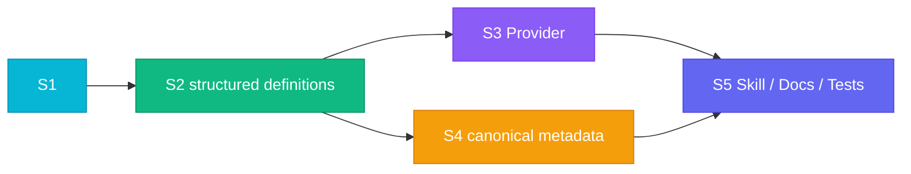

# RFC-0006:  Structured Tool Calling  Provider 

- ****: implementing
- ****: P1
- ****: `architecture`, `runtime`, `api`, `dx`, `compatibility`
- ****: `nexau/archs/tool/`, `nexau/archs/main_sub/`, `nexau/core/`, `docs/`, `examples/`
- ****: 2026-03-12
- ****: 2026-03-13

## 

 NexAU  `tool_call_mode` ：

1. ****：XML  tool calling；
2. **provider **：OpenAI / Anthropic  wire format。

 tool 、、Gemini  provider 。 RFC ：

1.  `tool_call_mode` ：`xml`  `structured`；
2. `openai` / `anthropic` ， `structured`；
3. ** structured tool definition**  structured ；
4. ** LLM **， `llm_config.api_type`  OpenAI / Anthropic / Gemini ；
5. `gemini_rest`  OpenAI ， Gemini request；
6.  tool call  `ModelToolCall` / `ToolUseBlock` / `ToolResultBlock`， UMP history ；
7. tool-based skill、`LoadSkill`、README、 `xml` vs `structured` 。

：**“ tool calling”，“ provider ”。**

---

## 

### 1) `tool_call_mode` “”“provider ”

：

- `xml`  XML tool call；
- `openai`  OpenAI  tool call；
- `anthropic`  Anthropic  tool call。

“”， provider 。，：

-  XML；
-  tool calling。

 OpenAI / Anthropic / Gemini  payload， `llm_config.api_type`， `tool_call_mode` 。

### 2) provider 、 Gemini 

 provider ：

- `Tool.to_openai()` / `Tool.to_anthropic()`  provider ；
- `Agent`  `tool_call_mode`  provider-specific payload；
- `Executor`  vendor  `structured_tool_payload`；
- `gemini_rest`  OpenAI  tool definitions / messages 。

：

-  provider ，tool ；
-  provider ， canonical ；
- ： wire format 。

### 3)  UMP ， structured 

NexAU ：

- `Message` / `ToolUseBlock` / `ToolResultBlock`
- `ModelToolCall`
- OpenAI legacy ↔ UMP 

。 structured tool-calling ，：

- structured tools  provider ；
- Gemini  OpenAI ；
- `Tool.to_openai()` / `to_anthropic()` ，。

### 4)  skill  provider 

README、`docs/getting-started.md`、`docs/advanced-guides/skills.md`、 YAML ：

- `tool_call_mode: openai`
- `tool_call_mode: anthropic`

 provider  tool calling ， tool-based skill / `LoadSkill`  provider 。

### 5)  history  UMP， RFC 

 session history  `list[Message]`， UMP， OpenAI / Anthropic / Gemini  schema。 `xml`  assistant  `<tool_use>`， history  UMP ，。

， RFC  history/session ，：

-  structured tool definition；
- provider ；
-  canonical tool metadata；
- 。

---

## 

### 

1. ** provider **：`tool_call_mode`  `xml` vs `structured`， OpenAI vs Anthropic。
2. ****：structured tool definition、tool call、tool result 。
3. **provider **： provider wire format。
4. ** provider **：`openai_chat_completion`、`openai_responses`、`anthropic_chat_completion`、`gemini_rest`。
5. **/**： YAML / Python API ； session/history ；。
6. **Gemini  OpenAI **：Gemini  tools / messages 。

### 

1.  `xml` ；
2.  YAML schema ；
3.  tool execution / hook / middleware ；
4.  session / history ；
5.  `history=`  legacy  RFC ；
6.  RFC  tool calling  reasoning / tracing / compaction 。

### 

1. **，provider  provider**：`tool_call_mode` ，`api_type`  wire format。
2. ** vendor **：vendor /， Agent/Executor 。
3. ** UMP **：history  `Message` + block ， RFC  persistence schema。
4. ****： alias  API， session migration  RFC。
5. ****： `xml`  `structured`， provider-specific 。

### 

```mermaid
flowchart TB
    subgraph Config[""]
        Mode["tool_call_mode\nxml | structured\n(openai/anthropic )"]
        ToolDef["Tool / SubAgent\n structured definition"]
    end

    subgraph Runtime[""]
        UMP["UMP Messages\nToolUseBlock / ToolResultBlock"]
        Exec["Executor\n structured definitions"]
        Caller["LLMCaller\n api_type "]
    end

    subgraph Adapters["Provider Adapter "]
        OA["OpenAI Adapter"]
        AN["Anthropic Adapter"]
        GE["Gemini Adapter"]
    end

    subgraph Providers["Provider "]
        OReq["openai_chat_completion / openai_responses"]
        AReq["anthropic_chat_completion"]
        GReq["gemini_rest"]
    end

    subgraph History[" History "]
        Hist["list[Message]\n schema\n"]
    end

    Mode --> Exec
    ToolDef --> Exec
    UMP --> Caller
    Exec --> Caller

    Caller --> OA
    Caller --> AN
    Caller --> GE

    OA --> OReq
    AN --> AReq
    GE --> GReq

    UMP --> Hist

    style Config fill:#E0F2FE,stroke:#06B6D4,stroke-width:2px,color:#0C4A6E
    style Runtime fill:#D1FAE5,stroke:#10B981,stroke-width:2px,color:#065F46
    style Adapters fill:#FEF3C7,stroke:#F59E0B,stroke-width:2px,color:#78350F
    style Providers fill:#EDE9FE,stroke:#8B5CF6,stroke-width:2px,color:#5B21B6
    style History fill:#F3F4F6,stroke:#6B7280,stroke-width:2px,color:#111827
```

---

## 

### 1. `tool_call_mode`  `xml` / `structured`

#### 1.1 

，：

|  |  |  |
|------|-----------|------|
| `xml` | `xml` |  |
| `structured` | `structured` |  |
| `openai` | `structured` | ， |
| `anthropic` | `structured` | ， |
| `None` /  | `structured` |  |

#### 1.2 

“ tool calling”，** provider  wire format**。

：

| `tool_call_mode`  | `llm_config.api_type` |  |
|----------------------|-----------------------|----------------|
| `openai` | `openai_chat_completion` | OpenAI |
| `openai` | `anthropic_chat_completion` | Anthropic |
| `anthropic` | `openai_responses` | OpenAI |
| `anthropic` | `gemini_rest` | Gemini |
| `structured` |  provider |  provider  |

****： alias “ structured”。

#### 1.3 

-  `openai` / `anthropic` ，/；
- 、、、`AgentConfig`  `structured`；
-  alias，。

### 2. `api_type`  provider wire format

 `tool_call_mode == structured` ， provider target ：

| `llm_config.api_type` | provider target |  |
|-----------------------|-----------------|------|
| `openai_chat_completion` | `openai` | OpenAI Chat Completions / OpenAI-compatible |
| `openai_responses` | `openai` | OpenAI Responses ，tool schema  OpenAI family |
| `anthropic_chat_completion` | `anthropic` | Anthropic Messages |
| `gemini_rest` | `gemini` | Gemini REST  |

：

1. `xml`  structured provider ；
2. `structured`  `api_type`， fail fast，；
3. OpenAI / Responses / Anthropic / Gemini  provider， adapter registry 。

### 3.  structured tool definition 

#### 3.1 

Tool  SubAgent  structured definition。：

- `name`
- `description`
- `input_schema`
- `kind`（`tool` / `sub_agent`）

：

```json
{
  "name": "read_file",
  "description": "Read and return file content.",
  "input_schema": {
    "type": "object",
    "properties": {
      "file_path": {"type": "string"}
    },
    "required": ["file_path"]
  },
  "kind": "tool"
}
```

#### 3.2 

 definition  `description` ，“structured ”：

-  tool： `tool.description`
- `as_skill=true`  tool： structured  `skill_description`
- `LoadSkill`  workflow 

，**“”**  **“LoadSkill ”** ， provider-specific 。

#### 3.3 `Tool.to_openai()` / `to_anthropic()` 

`Tool.to_openai()` / `Tool.to_anthropic()` ，：

-  definition ；
-  Agent / Executor 。

：

`Tool` / `SubAgent` → ** definition** → provider adapter。

### 4.  `LLMCaller` 

#### 4.1 

 `Agent` / `Executor`  vendor  tool payload， payload。：

- provider ；
- `add_tool()` / `add_sub_agent()`  provider ；
- `gemini_rest`  OpenAI  `tools` 。

#### 4.2 

：

- `tool_call_mode` ****：`xml` / `structured`
-  structured definitions 
- UMP messages / runtime state

，`LLMCaller` ：

1.  `api_type`  provider target；
2.  structured definitions  provider payload；
3.  UMP messages  provider messages；
4.  token counting、request body  API 。

#### 4.3 

：

- `Agent` / `Executor`  vendor-specific `openai_tools` / `anthropic_tools` ；
- `add_tool()` / `add_sub_agent()`  definition， provider ；
- provider-specific payload “”。

### 5.  canonical tool metadata  UMP history 

 RFC  provider-specific persisted schema， structured  canonical contract：

- `ModelToolCall.call_id`： canonical call ID
- `ModelToolCall.name`：
- `ModelToolCall.arguments`： dict
- `ModelToolCall.raw_arguments`：（ provider ）
- `ToolUseBlock.id`： history  canonical call ID
- `ToolUseBlock.input`： dict
- `ToolUseBlock.raw_input`：（）
- `ToolResultBlock.tool_use_id`：tool result  call 

：

1. OpenAI `tool_calls[*]`、Anthropic `tool_use/tool_result`、Gemini `functionCall/functionResponse`  adapter /；
2. provider-specific envelope ** schema**；
3.  provider  call ID（ Gemini ）， canonical ID，；
4. provider-specific  argument /，。

#### 5.1  history 

 RFC  history ：

1. ****：history  `list[Message]`；
2. ** history **：
   - `xml`  XML ；
   -  UMP history ；
   -  RFC  structured  UMP history 。

#### 5.2 `history=` legacy 

 `history=`  legacy dict ，，** RFC **。：

-  RFC  `history=` ；
-  legacy  session migration ；
-  structured 。

 middleware、session persistence、context compaction、sub-agent  UMP， provider 。

### 6. Gemini “ → Gemini ”

 Gemini ，tools  messages  OpenAI 。 RFC  Gemini  Anthropic ：

1. **Tool definitions**： structured definitions  Gemini `functionDeclarations`；
2. **Messages**： UMP  Gemini `contents` / `systemInstruction`；
3. **Responses**：Gemini `functionCall` / `functionResponse`  `ModelToolCall` / `ToolUseBlock` / `ToolResultBlock`；
4. **Compatibility wrappers**： OpenAI  Gemini helper ，， adapter。

 Gemini “ OpenAI”， Gemini 。

### 7. Tool skill / `LoadSkill` /  `structured`

#### 7.1 tool-based skill

 `build_tool_skill_detail()`  structured vs xml ， `openai` / `anthropic`。 RFC ：

- `xml`： XML ；
- `structured`：“ provider  structured tool calling ”；
-  skill  OpenAI / Anthropic 。

#### 7.2 `LoadSkill`

`LoadSkill` ：

- structured ， upfront  brief description / schema；
-  workflow ， `LoadSkill` 。

：

- “structured mode”
-  “openai mode / anthropic mode”

#### 7.3 

 `structured`：

- `README.md`
- `README_CN.md`
- `docs/getting-started.md`
- `docs/advanced-guides/skills.md`
-  YAML / Python 

：

- `openai` / `anthropic` ， alias；
-  `structured`。

---

## 

### 1. 

#### 1.1 

```yaml
tool_call_mode: structured
llm_config:
  api_type: anthropic_chat_completion
```

```python
AgentConfig(
    tool_call_mode="structured",
    llm_config=LLMConfig(api_type="gemini_rest"),
)
```

#### 1.2 

：

```yaml
tool_call_mode: openai
```

```yaml
tool_call_mode: anthropic
```

 `structured`， `api_type` 。

### 2. 

`tool_call_mode`  `structured`。

：

-  `openai` ；
-  `structured` ；
-  `tool_call_mode`  OpenAI ，。

### 3. 

1.  `openai` / `anthropic` ；
2.  alias  provider wire format；wire format  `api_type`；
3.  session/history ；
4. `xml` history  XML ；
5.  Python API  YAML ；
6. `history=` ， RFC 。

### 4. 

- `tool_call_mode=structured` +  `api_type`：；
- provider adapter ：， provider target  tool name / call id；
-  tool / sub-agent  provider schema， fail fast，。

---

## 

### 

|  |  |  |  |
|------|------|------|------|
|  `xml/openai/anthropic`， Gemini  |  | provider ；Gemini ； |  |
|  OpenAI  canonical， Anthropic/Gemini  OpenAI  |  helper  | “”；Anthropic/Gemini  OpenAI；Gemini  |  |
|  history/session  RFC |  legacy  | scope ； history  UMP ； |  |
| `tool_call_mode=xml/structured` + provider  +  UMP history  | ； provider ；scope  |  Agent/Executor/LLMCaller/docs  | **** |

### 

1. Adapter ；
2. `openai` / `anthropic` alias “”；
3. Gemini  OpenAI ，；
4.  legacy ，。

---

## 

### 

- [ ] Phase 1: `tool_call_mode` 
- [ ] Phase 2:  structured tool definitions 
- [ ] Phase 3: OpenAI / Anthropic / Gemini  `LLMCaller`
- [ ] Phase 4:  canonical metadata ， UMP history
- [ ] Phase 5: skill / `LoadSkill` / docs / examples / tests 

### 

#### 



#### 

| ID |  |  |  | Ref |
|----|------|------|------|-----|
| S1 |  | - | pending | §6.3.1 |
| S2 |  structured definitions  Agent/Executor  | S1 | pending | §6.3.2 |
| S3 | OpenAI / Anthropic / Gemini  | S2 | pending | §6.3.3 |
| S4 |  canonical metadata  history  | S2 | pending | §6.3.4 |
| S5 | skill / `LoadSkill` / docs / examples / tests  | S3, S4 | pending | §6.3.5 |

#### 

##### §6.3.1 S1 — 

****

- / `tool_call_mode` ；
-  `openai` / `anthropic` → `structured`；
-  `api_type -> provider target` 。

****

-  `structured`；
- alias ；
- alias  provider ， `api_type` ；
-  `api_type`。

****

- `nexau/archs/main_sub/tool_call_modes.py`
- `nexau/archs/main_sub/config/base.py`
- `nexau/archs/main_sub/config/config.py`
- `tests/unit/test_agent_config.py`
- `tests/unit/test_config.py`

****

- unit tests 、alias、、provider target resolution。

##### §6.3.2 S2 —  structured definitions  Agent/Executor 

****

- Tool / SubAgent  structured definitions；
- `Agent` / `Executor`  definitions， provider ；
- `add_tool()` / `add_sub_agent()` ；
- structured mode  description  vendor 。

****

- `Agent` “ provider payload”；
- `Executor`  definitions ；
-  tool / sub-agent ， structured 。

****

- `nexau/archs/tool/tool.py`
- `nexau/archs/main_sub/agent.py`
- `nexau/archs/main_sub/execution/executor.py`
- `nexau/archs/main_sub/skill.py`
- 

****

- unit tests 、 `add_tool()`、sub-agent 、as_skill 。

##### §6.3.3 S3 — OpenAI / Anthropic / Gemini 

****

- `LLMCaller`  `api_type`  adapter；
- OpenAI / Responses、Anthropic、Gemini  definitions + UMP ；
- Gemini tools / messages ， OpenAI ；
-  `ModelResponse` / `ModelToolCall`。

****

- `openai_chat_completion`  `openai_responses`  OpenAI family structured tools；
- `anthropic_chat_completion`  Anthropic tool schema；
- `gemini_rest`  Gemini  `functionDeclarations` / `contents`；
-  provider  `ModelResponse`。

****

- `nexau/archs/main_sub/execution/llm_caller.py`
- `nexau/archs/main_sub/execution/model_response.py`
- `nexau/core/adapters/anthropic_messages.py`
- Gemini  adapter / helper
- `tests/unit/test_llm_caller.py`
- `tests/unit/test_gemini_rest.py`

****

- unit tests  provider  request payload；
- integration tests  structured mode 。

##### §6.3.4 S4 —  canonical metadata  history 

****

-  `ModelToolCall` / `ToolUseBlock` / `ToolResultBlock`  canonical ；
- structured ；
-  `xml`  `structured`  history ；
-  structured  `list[Message]` 。

****

- structured  tool call / tool result  UMP blocks；
- `xml`  history ；
-  session migration；
- session persistence、context compaction、hook/middleware  Message history 。

****

- `nexau/core/messages.py`
- `nexau/archs/main_sub/execution/model_response.py`
- `nexau/archs/main_sub/execution/executor.py`
-  unit / integration tests

****

- unit tests  canonical call id、raw arguments、tool_result ；
- integration tests  structured  xml  history 。

##### §6.3.5 S5 — skill / `LoadSkill` / docs / examples / tests 

****

- `build_tool_skill_detail()`、`LoadSkill`  `structured`；
- README、CN README、getting-started、skills guide、examples ；
-  alias、Gemini 、history 。

****

-  OpenAI / Anthropic ；
- examples  `structured`；
- tool-based skill  `xml` / `structured`；
- 。

****

- `README.md`
- `README_CN.md`
- `docs/getting-started.md`
- `docs/advanced-guides/skills.md`
- `examples/**/*.yaml`
- integration / unit tests

****

-  smoke check；
- integration tests  skill / `LoadSkill`  structured 。

### 

|  | / |  |
|------|---------------|---------|
|  | `tool_call_modes.py`, config models | `structured` 、alias  |
| Tool  | `tool.py`, sub-agent tool definition |  structured definitions |
|  | `llm_caller.py`, provider adapters | 、Gemini  OpenAI  |
|  | `model_response.py` | canonical call id / arguments  |
|  | `core/messages.py`, executor/runtime path |  UMP history ， migration |
|  | README/docs/examples/skills |  `xml` / `structured` |

---

## 

### 

1. `tool_call_mode` ：
   - `structured` / `xml` / alias /  / ；
2. provider target resolution：
   - `openai_chat_completion` / `openai_responses` / `anthropic_chat_completion` / `gemini_rest`；
3.  structured definition ：
   - tool、sub-agent、as_skill ；
4. provider adapter：
   - OpenAI、Anthropic、Gemini  tools / messages ；
5. canonical runtime metadata：
   - call id、raw arguments、tool_result ；
6. history ：
   - structured  `Message` blocks；
   - xml 。

### 

1.  `tool_call_mode=structured` ：
   - `openai_chat_completion`
   - `openai_responses`
   - `anthropic_chat_completion`
   - `gemini_rest`
2. `as_skill` + `LoadSkill`  structured  schema ；
3.  `add_tool()` / `add_sub_agent()`  structured ；
4. structured ，session persistence  Message history 。

### 

1. `xml` ；
2. `openai` / `anthropic` alias ；
3. context compaction、token counting、session persistence  canonical ；
4. Gemini tool call / tool result  OpenAI 。

### 

1.  YAML（`tool_call_mode: openai`） agent， structured tool calling ；
2.  `structured`， `api_type`  Anthropic / Gemini， tool ；
3.  structured tool call， history  `Message` / UMP ；
4.  README / getting-started / examples  `structured`。

---

## 

1. ，`tool_call_mode`  `xml` / `structured`；
2.  provider “ definitions + UMP → provider adapter → request”；
3. Gemini  OpenAI-shaped tool definitions ；
4. structured  history migration， UMP history / session persistence；
5. `LoadSkill` / docs / examples  `xml` / `structured`；
6.  alias 。

---

## 

1. `openai` / `anthropic` alias  RFC ；
2. `Tool.to_openai()` / `Tool.to_anthropic()` 。

---

## 

|  |  |
|------|------|
| `nexau/archs/main_sub/tool_call_modes.py` | `tool_call_mode`  provider target  |
| `nexau/archs/tool/tool.py` | Tool →  structured definition |
| `nexau/archs/main_sub/agent.py` | Agent  vendor  tools |
| `nexau/archs/main_sub/execution/executor.py` | Executor  definitions， UMP history  |
| `nexau/archs/main_sub/execution/llm_caller.py` |  |
| `nexau/archs/main_sub/execution/model_response.py` | provider  |
| `nexau/core/adapters/legacy.py` |  legacy ， RFC  |
| `nexau/core/adapters/anthropic_messages.py` | Anthropic  |
| `nexau/core/messages.py` | canonical UMP tool metadata  |
| `docs/advanced-guides/skills.md` | skill / `LoadSkill`  |
| `README.md`, `README_CN.md`, `docs/getting-started.md` | `structured`  |

---

## 

- [GitHub Issue #258](https://github.com/china-qijizhifeng/nexau/issues/258) -  `tool_call_mode`， OpenAI / Anthropic / Gemini 
- [RFC-0005: Tool Search — ](./0005-tool-search.md)
- [RFC-0004: Context  TokenCounter Block ](./0004-context-overflow-emergency-compaction-and-error-events.md)
- [RFC ](./WRITING_GUIDE.md)