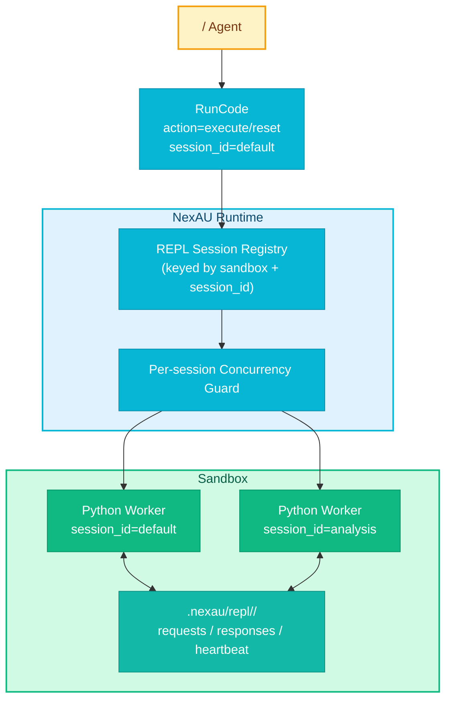

# RFC-0013: RunCode  REPL 

- ****: draft
- ****: P1
- ****: `architecture`, `dx`, `sandbox`
- ****: `nexau` (tool runtime), `nexau` (sandbox integration)
- ****: 2026-03-18
- ****: 2026-03-18

## 

 NexAU  `RunCode`  Python ，，。 RFC  `RunCode`  ** sandbox  REPL **： `session_id`（ `default`） `action`（`execute` / `reset`）， `session_id`  sandbox  Python ； `session_id`  REPL 。 Python， `stdout` / `stderr`，，** sandbox **。

## 

### 

 `run_code_tool` “”， REPL：

- `nexau/archs/tool/builtin/run_code_tool.py`  `sandbox.execute_code(code_block, language="python", timeout=timeout)`；
- `LocalSandbox.execute_code()`  `.py` ，，；
- ：
  1. ：、、；
  2. ：、、；
  3. ：，。

，：

1. ****： import、、；
2. ****：LLM  Python  scratchpad / workbench；
3. ****：，Agent ， token 。

### 

：

- `AgentState.get_sandbox()`  sandbox；
- sandbox ；
- `run_shell_command` / `background_task_manage_tool` “ + /”；
- `E2BSandboxConfig.status_after_run`  `pause`， sandbox ；
- session / global storage ， RFC  REPL  session 。

### 

- RunCode “ Python ”，；
- ，， context ；
-  Claude Code、Cursor  coding agent “ REPL”。

## 

### 

 RFC  ** `RunCode` **， REPL ， Jupyter kernel。：

1. `RunCode`  `session_id`， `default`；
2.  `(sandbox, session_id)`  Python worker；
3. worker  sandbox ， Python ；
4. `RunCode(action="execute")`  worker ；
5. `RunCode(action="reset")`  worker，；
6.  `stdout` / `stderr`，；
7. ** sandbox**， sandbox 。



### 

#### 1. ： `RunCode`

 `ResetRepl`、`InspectRepl` ， `RunCode` 。

：

```python
def run_code_tool(
    code_block: str | None = None,
    timeout: int | None = None,
    description: str | None = None,
    session_id: str = "default",
    action: Literal["execute", "reset"] = "execute",
    agent_state: AgentState | None = None,
) -> ExecutionResult: ...
```

：

- `session_id`  `default`；
-  `session_id` ，，** REPL **；
- `action="execute"`  `code_block`；
- `action="reset"`  `code_block`， `session_id`；
-  Python， `language` 。

#### 2. `session_id` 

`session_id`  **RunCode  REPL **， NexAU  SessionManager  `session_id`。

：

- ：** sandbox **；
- ：`default`；
- ： REPL ；
- ： worker /  Python namespace；
-  sandbox：，。

，`session_id` ：

- ， 1-64；
- （、、`_`、`-`、`.`）；
- sandbox  `session_id`，。

#### 3. REPL worker：“ Python ”， Jupyter

， ** Python worker**， Jupyter kernel 。

：

-  sandbox ；
- （ jupyter_client、kernel gateway、ZMQ）；
-  LocalSandbox  E2B ；
- “”。

 worker ：

```text
.nexau/repl/
  default/
    worker.py
    requests/
    responses/
    heartbeat.json
  analysis/
    worker.py
    requests/
    responses/
    heartbeat.json
```

worker ：

1.  Python namespace；
2.  `requests/` ；
3.  `stdout` / `stderr` / traceback；
4.  `responses/`；
5.  heartbeat， tool ；
6.  reset / shutdown 。

#### 4. 

#####  `execute`

1. `RunCode`  sandbox；
2.  `session_id` ；
3.  registry  session  worker ；
4. ，， sandbox  Python worker；
5.  request ；
6.  response ；
7.  `stdout` / `stderr`。

#####  `execute`

1.  `session_id`  worker；
2. worker  namespace ；
3. 、、import 。

##### `reset`

1.  `session_id`  worker；
2.  worker， session  request/response ；
3.  registry ；
4.  reset ；
5.  `execute`  namespace。

：

```json
{"action": "execute", "session_id": "default", "code_block": "x = 41\nprint('ready')"}
```

```json
{"action": "execute", "session_id": "default", "code_block": "print(x + 1)"}
```

```json
{"action": "reset", "session_id": "default"}
```

```json
{"action": "execute", "session_id": "analysis", "code_block": "data = [1, 2, 3]\nprint(sum(data))"}
```

#### 5. 

 **per-session **， `session_id` 。

：

- ：`(sandbox_identity, session_id)`；
- ：**、**；
-  `busy`，；
-  `session_id` ；
-  sandbox  REPL 。

， NexAU ；。

#### 6. 

 timeout，。

：

- `timeout` ， RunCode ；
- ， `status="timeout"`；
-  worker ，** `session_id`  worker**；
-  REPL  `execute` ，。

 timeout “”，“”。、、 backend 。

#### 7. ： `stdout` / `stderr`

， RunCode 。：

```json
{
  "status": "success",
  "session_id": "default",
  "duration_ms": 123,
  "stdout": "42\n",
  "stderr": "",
  "exit_code": 0
}
```

 / ：

```json
{
  "status": "error",
  "session_id": "default",
  "duration_ms": 98,
  "stdout": "",
  "stderr": "Traceback ...",
  "exit_code": 1,
  "error": "NameError: name 'x' is not defined"
}
```

```json
{
  "status": "timeout",
  "session_id": "default",
  "duration_ms": 30000,
  "stdout": "",
  "stderr": "Execution timed out. Session was reset.",
  "exit_code": 124,
  "error": "Execution timed out"
}
```

```json
{
  "status": "busy",
  "session_id": "default",
  "duration_ms": 0,
  "stdout": "",
  "stderr": "",
  "exit_code": 2,
  "error": "RunCode session 'default' is busy with another execution"
}
```

：

- “ `stdout` / `stderr`”；
-  `LongToolOutputMiddleware`，；
-  RFC  **RunCode  summary/compact**。

#### 8. sandbox 

 **sandbox **。

：

- `E2BSandboxConfig.status_after_run`  `pause`， RFC；
- `BaseSandboxConfig.status_after_run`  `stop`；
- `LocalSandboxConfig`  `stop`， run  sandbox，REPL 。

：

-  RunCode REPL，sandbox  `pause`  `none`， backend ；
-  sandbox  run  stop，RunCode  REPL ；
- ， session 。

#### 9.  session 

 RFC **** `SessionModel` schema， sandbox REPL 。

：

-  `GlobalStorage`  registry （ worker pid / session dir）， hint；
- **** REPL  source of truth；
- worker 、sandbox 、pid ，RunCode ；
-  Python ， `sandbox_state`  REPL 。

#### 10.  `FrameworkContext` 

 `FrameworkContext`  sandbox  API， `run_code_tool`  `agent_state.get_sandbox()`  sandbox。

， `agent_state`  sandbox，“ `ctx.sandbox` API” RFC。 `FrameworkContext`  sandbox API， RFC 。

### 

#### 

：

```json
{
  "code_block": "files = ['a.py', 'b.py']\nprint(len(files))"
}
```

：

```json
{
  "session_id": "default",
  "code_block": "print(files[0])"
}
```

：

```json
{
  "session_id": "repo-index",
  "code_block": "index = {'src': 128, 'tests': 42}\nprint(index['src'])"
}
```

：

```json
{
  "action": "reset",
  "session_id": "repo-index"
}
```

## 

### 

|  |  |  |  |
|------|------|------|------|
|  `sandbox.execute_code()` |  | ， REPL  |  |
|  `ResetRepl` / `InspectRepl`  |  | ， |  |
|  `RunCode` + `session_id` + `action` | ， |  | **** |
|  Jupyter kernel / notebook  |  | 、、 backend  |  |
|  Agent  REPL |  |  scratchpad |  |
| `session_id`  REPL  |  | / | **** |
|  worker |  | worker  |  |
|  worker | ， | timeout  session  | **** |

### 

- REPL  sandbox ，sandbox stop ；
- 、、 richer introspection；
-  REPL session，；
-  `busy`  agent  session_id；
-  worker  kernel ，。

## 

### 

- [ ] Phase 1:  `RunCode`  schema， `session_id`  `action=execute/reset`
- [ ] Phase 1:  sandbox  REPL worker  request/response 
- [ ] Phase 1:  per-session  worker 
- [ ] Phase 1:  timeout → reset 
- [ ] Phase 1:  local / e2b sandbox 
- [ ] Phase 1: ， REPL  `status_after_run=pause|none` 
- [ ] Phase 2:  `inspect` / `list_sessions` / richer artifacts （ RFC ）

### 

|  |  |
|------|------|
| `nexau/archs/tool/builtin/run_code_tool.py` | RunCode ， session  |
| `nexau/archs/sandbox/base_sandbox.py` | sandbox  |
| `nexau/archs/tool/builtin/shell_tools/run_shell_command.py` |  |
| `nexau/archs/tool/builtin/background_task_manage_tool.py` |  |
| `tests/unit/...` | RunCode 、busy/timeout/reset  |
| `tests/integration/...` |  session 、 session 、sandbox stop  |

## 

### 

：

1. `session_id`  `default`；
2. `action=execute`  `code_block` ；
3.  `session_id` ；
4.  `session_id` ；
5.  `session_id` ；
6. `reset` ；
7.  `timeout`， namespace；
8.  `session_id`  `busy`；
9.  `session_id` ；
10.  Python。

### 

：

1. **E2B / pause **：，；
2. **LocalSandbox / stop **：， sandbox  stop ；
3. **LocalSandbox / pause  none **： REPL session ；
4. ** session **：`default`  `analysis` ；
5. **reset **：reset  execute ；
6. ****： worker ，。

### 

1.  `status_after_run=pause`  sandbox；
2.  `RunCode(session_id="default")`：
   - ：`x = 10`；
   - ：`print(x + 5)`， `15`；
3.  `RunCode(session_id="analysis")`  `x = 100`；
4.  `default`  `print(x)`， `10`；
5.  `RunCode(action="reset", session_id="default")`；
6.  `print(x)`，。

## 

1.  worker 、Unix socket， sandbox  IPC？
2. `busy` “ + ”，？
3.  `inspect` / `list_sessions` / `delete_session` ？
4. “REPL requires sandbox persistence”？

## 

- `nexau/archs/tool/builtin/run_code_tool.py` -  RunCode 
- `nexau/archs/sandbox/local_sandbox.py` - LocalSandbox  `execute_code()`  + 
- `nexau/archs/tool/builtin/shell_tools/run_shell_command.py` - 
- `nexau/archs/tool/builtin/background_task_manage_tool.py` - 
- `nexau/archs/sandbox/base_sandbox.py` - `status_after_run` 