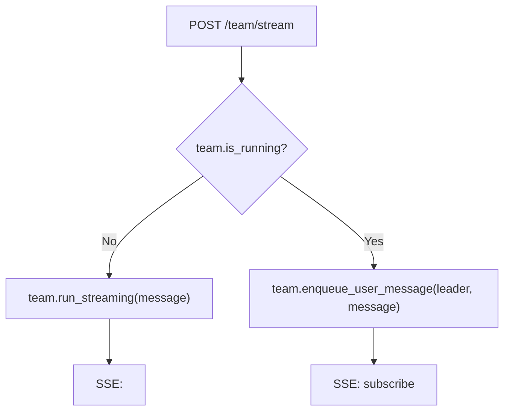
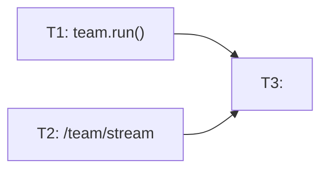

# RFC-0014: Team Stream 

- ****: implemented
- ****: P0
- ****: `bugfix`, `concurrency`, `team`
- ****: `team_routes.py`, `agent_team.py`
- ****: 2026-03-26
- ****: 2026-03-26

## 

 AgentTeam  team_mode ， `POST /team/stream`  leader agent lock  bug。

## 

### 

 DevBox  AgentTeam ，（89%），：

```
Error: Agent leader in session devbox-session-...:leader is already locked (holder: 1c1c4a787)
```

 team ， agent。

### 

 team （""）， `POST /team/stream`（ run） `POST /team/user-message`（enqueue ）。

：

```
POST /team/stream (message="")
 → registry.get_or_create()     #  AgentTeam 
 → team.run_streaming()
   → team.run()                  # ！
     →  leader Agent
     → leader.run_async()
       → agent_lock.acquire("...:leader", "leader")
         → ❌ TimeoutError（ leader ，heartbeat ）
```

：
1. `/team/stream` """"
2. `team.run()` 
3. Leader  agent lock  heartbeat ， team_mode 

### 

 `tests/unit/archs/main_sub/team/test_team_lock_conflict.py` ，。

## 

### 

：

1. **HTTP **（`team_routes.py`）：`/team/stream`  `team.is_running`， `enqueue_user_message` +  subscribe SSE 
2. **AgentTeam **（`agent_team.py`）：`run()`  `_is_running` ，

### 

1. ****: `/team/stream`  team ， `enqueue_user_message(leader, message)`  `/team/subscribe`  SSE 。。
   - ：，
   - ：，

2. **`team.run()` **:  `_is_running == True`  `RuntimeError`， run。
   - ：defense in depth，，team 

### 

#### `/team/stream` 

|  |  |  |
|------|----------|------------|
| team  |  run， SSE  |  |
| team  |  run → TimeoutError | enqueue  leader +  subscribe SSE  |

，`/team/stream` ""：
-  → `team.run_streaming(message)`
-  → `team.enqueue_user_message("leader", message)` + `team_subscribe()`  SSE 

#### `AgentTeam.run()` 

```
run() ：
  if _is_running:
    raise RuntimeError("Team is already running")
```

### 



## 

### 

1. ** 409 Conflict **
   - ：， API
   - ：；
   - ：，

2. ** Agent.run_async() **
   - ：""
   - ：，
   - ：，

### 

-  `/team/stream` （ run + enqueue），
-  `/team/user-message` API，

## 

### 

#### 



#### 

| ID |  |  |  | Ref |
|----|------|------|------|-----|
| T1 | `team.run()`  | - | implemented | `agent_team.py` |
| T2 | `/team/stream`  | - | implemented | `team_routes.py` |
| T3 |  | T1, T2 | implemented | 146 tests passed |

#### 

**T1: `team.run()` **
- ****:  `AgentTeam.run()`  `_is_running` ， `RuntimeError`
- ****:
  - `team.run()`  `RuntimeError("Team is already running")`
  - 
  -  `run()` 

**T2: `/team/stream` **
- ****:  `team_routes.py`  `team_stream` ， `team.is_running`， True  enqueue  subscribe  SSE 
- ****:
  - team  `POST /team/stream` 
  -  enqueue  leader agent
  -  SSE （subscribe ）
  - 

**T3: **
- ****: ，；
- ****:
  - `pytest tests/unit/archs/main_sub/team/` 
  - `pytest tests/unit/test_agent_lock_service.py` 
  -  lint/type 

### 

- `nexau/archs/main_sub/team/agent_team.py` -  `run()` 
- `nexau/archs/transports/http/team_routes.py` - `/team/stream` 
- `tests/unit/archs/main_sub/team/test_team_lock_conflict.py` - 
- `tests/unit/archs/main_sub/team/test_agent_team.py` - 

## 

### 

1. `test_run_raises_when_already_running` - `team.run()` 
2. `test_team_stream_auto_redirect_when_running` - `/team/stream` 
3. 

### 

 `test_team_lock_conflict.py`  lock 、AgentTeam 、HTTP 。

### 

1.  DevBox， AgentTeam 
2. ""
3.  enqueue  leader
4.  SSE 
5.  "already locked" 

## 

-  `/team/user-message` API，。 HTTP header ？

## 

- [RFC-0002: AgentTeam  Agent ](./0002-agent-team.md)
- : `tests/unit/archs/main_sub/team/test_team_lock_conflict.py`