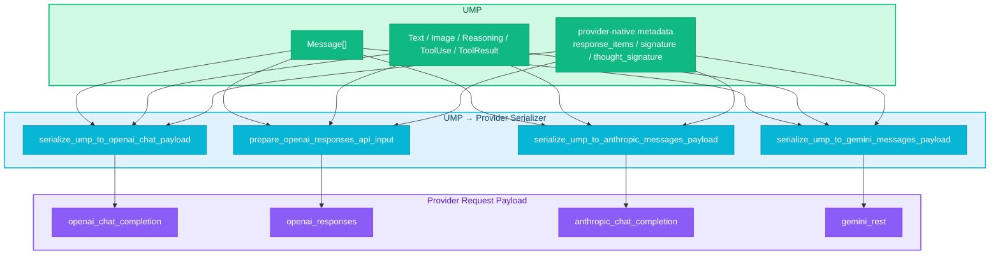

# RFC-0014: UMP  Provider Payload 

- ****: implemented
- ****: P1
- ****: `architecture`, `api`, `dx`, `compatibility`
- ****: `nexau/core/serializers/`, `nexau/core/adapters/`, `nexau/archs/main_sub/execution/`, `tests/`
- ****: 2026-03-24
- ****: 2026-03-25

## 

NexAU  `Message` / block  UMP（Unified Message Protocol）， **UMP → provider payload**  adapter ：OpenAI Chat  `legacy.py`，Anthropic  `anthropic_messages.py`，Gemini  `gemini_messages.py`，OpenAI Responses  `llm_caller.py`。 RFC  "UMP  provider  payload "  serializer （`nexau/core/serializers/`）， UMP ， provider 、、replay artifact 。

：

1.  `nexau/core/serializers/` ， provider payload serializer；
2.  adapter wrapper  thin delegate， serializer；
3.  `legacy.py`  `messages_to_legacy_openai_chat()` helper， bridge format ；
4.  ReasoningBlock  provider ，：** Anthropic signature  reasoning  `thinking` block**。

## 

### 

#### 1. UMP ，

：

- `nexau/core/messages.py`： `Message`、`TextBlock`、`ReasoningBlock`、`ToolUseBlock`、`ToolResultBlock`、`ImageBlock`
- `nexau/core/adapters/openai_chat.py` / `legacy.py`：UMP → OpenAI Chat 
- `nexau/core/adapters/anthropic_messages.py`：UMP → Anthropic Messages
- `nexau/core/adapters/gemini_messages.py`：UMP → Gemini REST
- `nexau/archs/main_sub/execution/llm_caller.py::_prepare_responses_api_input`：legacy/UMP → Responses input

，：

1. ****： provider ；
2. ****：Responses  reasoning replay、Anthropic  thinking 、Gemini  `thoughtSignature` ，；
3. ****： "UMP  provider ，"。

#### 2. reasoning / thinking  provider

 API ：

- OpenAI Chat Completion  reasoning  `reasoning_content` ；
- OpenAI Responses  typed `reasoning` item， `encrypted_content`；
- Anthropic `thinking` block ** `signature`**，；
- Gemini `thought`  `parts[*].thought == true` ， `thoughtSignature`。

 serializer  ""，：，**、**。

#### 3. `messages_to_legacy_openai_chat()`  bridge format 

 UMP → provider  `messages_to_legacy_openai_chat()`  OpenAI Chat dict， provider  dict 。 bridge （`reasoning_signature`、`thought_signature`、`response_items`） dict ， provider ，。

### 

-  provider  caller / adapter / legacy shim ；
- reasoning / tool / image ；
- UMP  ""，；
- 、、 " A， B， C" 。

## 

### 

：** UMP → provider payload  serializer ，。**

：

1. **UMP **：`Message` + typed blocks ；
2. **Serializer **： provider  UMP  wire payload；
3. **Provider **： `openai_chat_completion` / `openai_responses` / `anthropic_chat_completion` / `gemini_rest`。



### 

 scope ， RFC ****：

1.  UMP persistence schema，；
2.  provider  opaque reasoning artifact ；
3.  provider-neutral reasoning artifact ；
4.  multimodal tool-result  provider parity；
5.  `legacy projection` ； helper /。

### 

####  1：UMP ，provider payload  canonical 

：

-  provider  `Message[]` ；
- provider payload  " schema  canonical" ；
-  RFC-0006  "provider " 。

####  2：serializer  " + "， provider 

：

- Anthropic `thinking.signature`、Responses `encrypted_content`、Gemini `thoughtSignature`  provider-native artifact；
- ，、 provider ；
- ，。

####  3： provider serializer  ""  " reasoning " 

：

-  assistant turn  provider  replay  reasoning / thinking；
- ， replay 、 reasoning  text。

####  4： " provider →  provider" 

：

-  "completion → responses "、"gemini → claude "；
-  pair-wise behavior ， provider ；
-  `test_two_turn_payload_matrix.py` 。

####  5： `messages_to_legacy_openai_chat()`，serializer  UMP  provider payload

：

-  UMP  OpenAI Chat dict  provider ，；
- （`reasoning_signature`、`thought_signature`、`response_items`） serializer  UMP ；
-  `messages_from_legacy_openai_chat()` （legacy dict → UMP）。

### UMP 

 RFC  `Message` ， serializer 。

#### 1. UMP 

| UMP  |  |  |
|---|---|---|
| `TextBlock` | / |  provider  |
| `ImageBlock` |  |  provider ， |
| `ToolUseBlock` |  |  provider  function/tool call  |
| `ToolResultBlock` |  |  provider  tool result / function response  |
| `ReasoningBlock.text` |  reasoning  |  provider reasoning replay  |
| `ReasoningBlock.signature` | Anthropic thinking  |  Anthropic serializer  |
| `ReasoningBlock.redacted_data` | opaque reasoning artifact |  Anthropic `redacted_thinking`  Responses `encrypted_content`  |
| `message.metadata["response_items"]` | Responses output items |  Responses serializer  |
| `message.metadata["reasoning"]` | Responses reasoning items |  Responses serializer  |
| `message.metadata["thought_signature"]` | Gemini `thoughtSignature` |  Gemini serializer  |

#### 2. UMP  provider-neutral "" 

 RFC **** `reasoning_artifact.kind = anthropic|responses|gemini` 。 provider  replay ； serializer ， persistence schema。

### Provider serializer 

#### 1. OpenAI Chat Serializer

****: `nexau/core/serializers/openai_chat.py`

****:

```python
def serialize_ump_to_openai_chat_payload(
    messages: list[Message],
    *,
    tool_image_policy: ToolImagePolicy = "inject_user_message",
) -> list[dict[str, Any]]
```

****:
- `messages`: UMP `Message[]`
- `tool_image_policy`: 
  - `"inject_user_message"`: tool-role ， user （Chat Completions ）
  - `"embed_in_tool_message"`:  tool  content parts （ Responses ）

**Block **:

| UMP Block | → OpenAI Chat  |
|---|---|
| `TextBlock` |  → `content` ； → `{"type": "text", "text": ...}` content part |
| `ImageBlock` | `{"type": "image_url", "image_url": {"url": ...}}` content part |
| `ReasoningBlock` | `block.text` → `reasoning_content` ；`block.signature` → `reasoning_signature` ；`block.redacted_data` → `reasoning_redacted_data`  |
| `ToolUseBlock` | `{"id": ..., "type": "function", "function": {"name": ..., "arguments": ...}}` |
| `ToolResultBlock` | `role=tool` ； `tool_image_policy`  |

****:
- reasoning  assistant （`reasoning_content`、`reasoning_signature`、`reasoning_redacted_data`），
- `response_items` / `reasoning` / `thought_signature`  metadata  dict， Responses  round-trip 

****:
-  typed Responses reasoning item  Chat  typed object
-  chat-compatible provider  reasoning ， assistant  tool/image 

#### 2. OpenAI Responses Serializer

****: `nexau/core/serializers/openai_responses.py`

****:

```python
def prepare_openai_responses_api_input(
    messages: list[dict[str, Any]],
) -> tuple[list[dict[str, Any]], str | None]

def normalize_openai_responses_api_tools(
    tools: list[Any],
) -> list[dict[str, Any]]
```

****: Responses serializer  OpenAI Chat dict（ `serialize_ump_to_openai_chat_payload` ）， UMP Message。 Responses API  input  Chat Completions  shape ，。

****:

|  | → Responses  |
|---|---|
| `response_items`  |  sanitize （`sanitize_openai_responses_items_for_input`） |
| `reasoning` items  |  sanitize  |
| `reasoning_content` + `reasoning_redacted_data` |  `reasoning` item（`reconstruct_openai_responses_reasoning_items_from_message`） |
| `role=system`  |  `instructions`  |
| `role=tool`  | → `function_call_output` item |
| `role=user/assistant` | → `message` item， `input_text` / `output_text` content parts |
| `tool_calls` | → `function_call` items |
| `image_url` parts | → `input_image` parts |

****:

|  |  |
|---|---|
| `sanitize_openai_responses_items_for_input()` |  `status`、 `function_call_output` 、 `reasoning` summary |
| `ensure_openai_responses_reasoning_summary()` |  reasoning item  Responses  summary list |
| `coerce_openai_responses_tool_output_text()` |  tool output  Responses  |
| `collapse_openai_responses_message_content_to_text()` |  content  plain text |
| `parse_openai_responses_image_part()` |  legacy `image_url`  Responses `input_image` |
| `normalize_openai_responses_api_tools()` |  Chat Completions  tool  Responses  |

****:
- `response_items` （ response-only ）
- `encrypted_content`  sanitize 

****:
- Anthropic `signature`  Responses provider-native replay token
- Gemini `thoughtSignature`  Responses opaque artifact
-  Responses  **plaintext replay**， provider-native encrypted replay
-  tool output ：`output_text` → `input_text`，`image_url` → `input_image`

#### 3. Anthropic Serializer

****: `nexau/core/serializers/anthropic_messages.py`

****:

```python
def serialize_ump_to_anthropic_messages_payload(
    messages: list[Message],
) -> tuple[list[dict[str, Any]], list[dict[str, Any]]]
```

****: `(system_blocks, conversation_messages)`

**Block **:

| UMP Block | → Anthropic  |
|---|---|
| `TextBlock` | `{"type": "text", "text": ...}` |
| `ImageBlock` (base64) | `{"type": "image", "source": {"type": "base64", ...}}` |
| `ImageBlock` (url) | `{"type": "image", "source": {"type": "url", "url": ...}}` |
| `ToolUseBlock` | `{"type": "tool_use", "id": ..., "name": ..., "input": ...}` |
| `ToolResultBlock` (str) | `{"type": "tool_result", "tool_use_id": ..., "content": ..., "is_error": ...}` |
| `ToolResultBlock` (list) | `{"type": "tool_result", ...}` + sibling image blocks（ tool_result ） |

**ReasoningBlock **（ RFC ）:

```
ReasoningBlock
├─ redacted_data ？
│  └─ YES → {"type": "redacted_thinking", "data": block.redacted_data}
│           （ text  signature，redacted_data ）
├─ signature ？
│  └─ YES → {"type": "thinking", "thinking": block.text, "signature": block.signature}
│           （ thinking block，）
├─ text ？
│  └─ YES → {"type": "text", "text": block.text}
│           （⚠️ ： reasoning ）
└─ ：， block
```

****:
- ** Anthropic `signature`  reasoning  `type="thinking"`**
-  provider （Gemini thought、OpenAI reasoning_content） reasoning  Anthropic  API 400 

****:
- `Role.SYSTEM` →  `system_blocks`（ `messages`）
- `Role.TOOL` →  user  content blocks （ tool_result  user ）
- `Role.FRAMEWORK` →  `user`
- `msg.metadata["cache"]` →  `sys_block["_cache"]`（ cache_control ）

****:

```python
def apply_anthropic_last_user_cache_control(
    convo: list[dict[str, Any]],
    *,
    system_cache_control_ttl: str | None = None,
) -> list[dict[str, Any]]
```

 user  text block  `cache_control`， `system_cache_control_ttl` 。

#### 4. Gemini Serializer

****: `nexau/core/serializers/gemini_messages.py`

****:

```python
def serialize_ump_to_gemini_messages_payload(
    messages: list[Message],
) -> tuple[list[dict[str, Any]], dict[str, Any] | None]
```

****: `(gemini_contents, system_instruction)`

**Block **:

| UMP Block | → Gemini  |
|---|---|
| `TextBlock` | `{"text": ...}` |
| `ReasoningBlock` | `{"text": ..., "thought": True}` |
| `ToolUseBlock` | `{"functionCall": {"name": ..., "args": ...}}` |
| `ToolResultBlock` | `{"functionResponse": {"name": ..., "response": {"result": ...}}}` |

**`thoughtSignature` **:

Gemini  `thoughtSignature`  `message.metadata["thought_signature"]`（ `ReasoningBlock.signature`）， model part ：

```
：
1.  tool_use  →  reasoning part（ tool  part  signature）
   └─  functionCall part
2.  tool_use  →  reasoning part
3.  →  assistant_parts[0]（fallback）
```

****:
- `Role.SYSTEM` →  `systemInstruction.parts`
- `Role.USER` / `Role.FRAMEWORK` → `role: "user"`
- `Role.ASSISTANT` → `role: "model"`
- `Role.TOOL` → functionResponse  `role: "user"` parts

**Tool result name **:
1. `last_tool_call_id_to_name[block.tool_use_id]` —  ID 
2. `last_model_function_names[tool_result_index]` — 
3. `message.metadata["tool_name"]` — metadata fallback
4.  →  `ValueError`

### Replay artifact 

| Artifact |  |  |  |
|---|---|---|---|
| `response_items` / `encrypted_content` | OpenAI Responses | `openai_responses` |  plaintext reasoning / summary， |
| `ReasoningBlock.signature` | Anthropic thinking | `anthropic_chat_completion` |  provider ； reasoning  |
| `metadata["thought_signature"]` | Gemini thought | `gemini_rest` |  provider ； reasoning  |
| `reasoning_content` | OpenAI Chat /  plaintext reasoning | （） |  reasoning  |

### 

| Source \ Target | `openai_chat` | `openai_responses` | `anthropic` | `gemini` |
|---|---|---|---|---|
| `openai_chat` |  `reasoning_content` |  plaintext `reasoning` item | ** `text`** |  `thought` part |
| `openai_responses` |  |  `reasoning` / `encrypted_content` | ** `text`**（ opaque artifact  `redacted_thinking`） |  `thought` part |
| `anthropic` |  `reasoning_content` |  plaintext `reasoning` item |  signed `thinking` |  `thought` part |
| `gemini` |  `reasoning_content` |  plaintext `reasoning` item | ** `text`** |  `thought` / `thoughtSignature` |

 **native artifact preservation**；→ Anthropic  **forced downgrade**（ Anthropic ）；→ Responses  **plaintext reasoning replay**；→ Gemini  **thought part replay**。

### Adapter wrapper 

 adapter ：

```python
# AnthropicMessagesAdapter.to_vendor_format()
def to_vendor_format(self, messages: list[Message]) -> tuple[...]:
    return serialize_ump_to_anthropic_messages_payload(messages)

# GeminiMessagesAdapter.to_vendor_format()
def to_vendor_format(self, messages: list[Message]) -> tuple[...]:
    return serialize_ump_to_gemini_messages_payload(messages)
```

`LLMCaller._call_with_retry()`  OpenAI Chat / Responses  serializer， adapter wrapper。

###  legacy 

|  |  |  |
|---|---|---|
| `messages_to_legacy_openai_chat()` | `nexau/core/adapters/legacy.py` | `serialize_ump_to_openai_chat_payload()` |
| `anthropic_payload_from_legacy_openai_chat()` | `nexau/core/adapters/anthropic_messages.py` | `serialize_ump_to_anthropic_messages_payload()` |
| `gemini_payload_from_legacy_openai_chat()` | `nexau/core/adapters/gemini_messages.py` | `serialize_ump_to_gemini_messages_payload()` |
| `openai_to_anthropic_message()` | `nexau/archs/main_sub/execution/llm_caller.py` | `AnthropicMessagesAdapter` + serializer |

 `messages_from_legacy_openai_chat()` （legacy dict → UMP）。

###  RFC-0006 

- RFC-0006  **structured tool calling  provider **；
- RFC-0014  **UMP history  provider payload  serializer **；
- ：，provider wire format 。

 RFC  RFC-0006， reasoning / image / tool result / replay artifact 。

## 

### 

|  |  |  |  |
|------|------|------|------|
|  |  | 、 |  |
|  provider-neutral reasoning artifact ， |  | ， persistence / migration |  |
|  Responses  |  |  |  |
|  serializer ， legacy helper | ， |  | **** |
| Responses serializer  UMP Message |  | Responses input  Chat dict ， UMP  Chat serializer  |  |

### 

1. ，；
2. provider ；
3.  provider-neutral replay artifact ， provider ；
4. OpenAI Chat serializer  `reasoning_signature` / `thought_signature`  Responses ——， serializer。

## 

### 

。

### 

```
nexau/core/serializers/
├── __init__.py                    # "Provider payload serializers from UMP messages."
├── openai_chat.py                 # serialize_ump_to_openai_chat_payload()
├── openai_responses.py            # prepare_openai_responses_api_input() + helpers
├── anthropic_messages.py          # serialize_ump_to_anthropic_messages_payload() + cache helper
└── gemini_messages.py             # serialize_ump_to_gemini_messages_payload()
```

### 

| ID |  |  |  | Ref |
|----|------|------|------|-----|
| T1 |  UMP serializer  | - | implemented | `nexau/core/serializers/__init__.py` |
| T2 |  OpenAI Chat / Responses  payload serializer | T1 | implemented | `openai_chat.py`, `openai_responses.py` |
| T3 |  Anthropic / Gemini  payload serializer | T1 | implemented | `anthropic_messages.py`, `gemini_messages.py` |
| T4 |  source → target  | T2, T3 | implemented | `test_two_turn_payload_matrix.py` |
| T5 |  legacy helper  | T4 | implemented | `legacy.py`, `llm_caller.py` |

### 

|  |  |
|------|----------|
| `nexau/core/serializers/*.py` |  provider payload serializer |
| `nexau/core/adapters/anthropic_messages.py` |  thin delegate |
| `nexau/core/adapters/gemini_messages.py` |  thin delegate |
| `nexau/core/adapters/legacy.py` |  `messages_to_legacy_openai_chat()` |
| `nexau/archs/main_sub/execution/llm_caller.py` |  serializer  payload |
| `tests/unit/test_anthropic_gemini_serializers.py` | serializer  |
| `tests/unit/test_openai_chat_serializer.py` | OpenAI Chat serializer  |
| `tests/unit/test_openai_responses_serializer.py` | Responses serializer  |
| `tests/unit/test_two_turn_payload_matrix.py` | 16  source → target  |

## 

### 

#### A. Serializer 

 serializer ：

- `test_openai_chat_serializer.py` —  reasoning/tool/image  Chat dict 
- `test_openai_responses_serializer.py` —  response_items 、reasoning 、tool output 
- `test_anthropic_gemini_serializers.py` —  Anthropic  Gemini thoughtSignature 

****:

```python
def test_anthropic_serializer_downgrades_unsigned_reasoning_and_keeps_signed_thinking():
    """ signature  ReasoningBlock  text， signature  thinking。"""

def test_gemini_serializer_emits_thought_signature_and_function_response():
    """Gemini thoughtSignature  model parts。"""
```

#### B. 16  source → target 

`test_two_turn_payload_matrix.py` ：

- 4  source × 4  target 
- /
-  reasoning text 、signature /、tool call round-trip

#### C. 

- `test_llm_caller.py` —  `LLMCaller`  `api_type`  payload
- `test_anthropic_stream_else_branch.py` —  Anthropic 
- `test_gemini_rest.py` —  Gemini REST 
- `test_legacy_tool_image_policy.py` —  tool image 

### 

- `test_two_turn_payload_live.py` —  provider  payload 
- `test_thinking_cross_validation_langfuse.py` —  provider thinking 

###  checklist

1. ， `api_type` 
2.  payload， reasoning / thinking / thought  RFC
3. ：
   - Anthropic ， reasoning  `thinking`
   - Responses ， Responses  reasoning  plaintext `reasoning` item
   - Gemini ，Gemini  `thoughtSignature`
   - OpenAI Chat ， payload  serializer 

## 

###  1：Claude thinking → Anthropic（）

UMP message  `ReasoningBlock(text="claude thinking", signature="claude_sig")` + `TextBlock(text="Final A: 34")`

Anthropic serializer ：

```json
{
  "role": "assistant",
  "content": [
    {"type": "thinking", "thinking": "claude thinking", "signature": "claude_sig"},
    {"type": "text", "text": "Final A: 34"}
  ]
}
```

###  2：Gemini thought → Anthropic（）

UMP message  `ReasoningBlock(text="gemini thought")` + `metadata["thought_signature"] = "gemini_sig"`

Anthropic serializer ** `thinking`**，：

```json
{
  "role": "assistant",
  "content": [
    {"type": "text", "text": "gemini thought"},
    {"type": "text", "text": "Final A: 34"}
  ]
}
```

###  3：OpenAI reasoning → Responses（plaintext replay）

UMP message  `ReasoningBlock(text="completion reasoning")` + `TextBlock(text="Final A: 34")`

 OpenAI Chat serializer  Responses serializer，：

```json
[
  {
    "type": "message",
    "role": "assistant",
    "content": [{"type": "output_text", "text": "Final A: 34"}]
  },
  {
    "type": "reasoning",
    "summary": [{"type": "summary_text", "text": "completion reasoning"}]
  }
]
```

###  4：Claude redacted thinking → Anthropic（opaque ）

UMP message  `ReasoningBlock(text="", redacted_data="encrypted_blob")`

Anthropic serializer ：

```json
{
  "role": "assistant",
  "content": [
    {"type": "redacted_thinking", "data": "encrypted_blob"}
  ]
}
```

###  5：Anthropic thinking → Gemini（plaintext replay）

UMP message  `ReasoningBlock(text="claude thinking", signature="claude_sig")`

Gemini serializer （Anthropic signature ，）：

```json
{
  "role": "model",
  "parts": [
    {"text": "claude thinking", "thought": true}
  ]
}
```

###  6：Tool result with images → OpenAI Chat（inject_user_message ）

UMP message  `ToolResultBlock(tool_use_id="tc_1", content=[TextBlock(text="result"), ImageBlock(url="https://img.png")])`

OpenAI Chat serializer（`tool_image_policy="inject_user_message"`）：

```json
[
  {"role": "tool", "tool_call_id": "tc_1", "content": "result<image>"},
  {
    "role": "user",
    "content": [
      {"type": "text", "text": "Images returned by tool call tc_1:"},
      {"type": "image_url", "image_url": {"url": "https://img.png"}}
    ]
  }
]
```

## 

1. ~~ `nexau/core/serializers/` ？~~ ****：。
2. `ReasoningBlock.redacted_data`  opaque reasoning artifact ， opaque artifact model？
3. OpenAI Chat serializer （`reasoning_signature`、`thought_signature`、`response_items`）—— Responses serializer  UMP  metadata，。
4. tool result  provider 。

## 

- `rfcs/0006-neutral-structured-tool-calling.md` —  structured tool calling  provider 
- `docs/advanced-guides/api-type-thinking-survey.md` —  API  thinking/reasoning 
- `nexau/core/messages.py` — UMP 
- `nexau/core/serializers/` —  serializer 
- `nexau/core/adapters/legacy.py` —  helper（`messages_from_legacy_openai_chat`）
- `tests/unit/test_two_turn_payload_matrix.py` — 16  source → target 