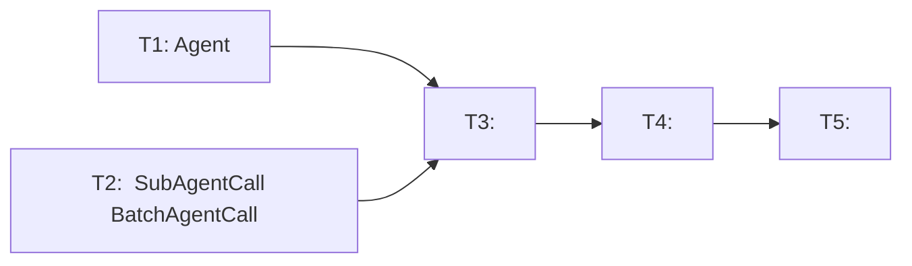

# RFC-0015:  Sub-agent  Agent 

## 

 Sub-agent ——`sub-agent-{name}`（，） `RecallSubAgent`（，）—— `Agent` ， Claude Code 。「」「」，。 Batch Sub-agent （`BatchAgentCall`、`BatchProcessor` ），。

## 

 Sub-agent ：

1. ****：LLM ——`sub-agent-{name}`（） `RecallSubAgent`（）。 LLM ，。

2. ****： `sub-agent-{name}` ，，， token，， LLM 。

3. ****：「」「」，，LLM 「」，。

4. ****：`sub-agent-{name}`  `sub-agent-` ， LLM ；`RecallSubAgent` 。

5. ****：`_build_sub_agent_tool_definition`  `Agent`  `Executor` ；`SubAgentCall` /，。

6. **Batch Sub-agent **：`BatchAgentCall` / `BatchProcessor` ，LLM  `<use_batch_agent>` XML 。 `ExecutableCall` 、`ParsedResponse`、`response_parser`、`executor`、`llm_caller`（stop sequences）、`xml_utils`（tag pairs），，。

Claude Code ： `Agent`  + ， LLM 。

## 

### 

 `Agent`  `sub-agent-{name}`  + `RecallSubAgent` ， Claude Code 。 `sub_agent_name`， `sub_agent_id` 。Sub-agent  `SubAgentCall` ， `ToolCall`， `SubAgentManager`。 `BatchAgentCall` / `BatchProcessor` ， `ExecutableCall`  `ParsedResponse` 。

### 

1. ** Claude Code  `Agent`**： `Agent`， Claude Code  `Agent` 。：， Claude Code  prompt 。

2. ****：`Agent`  `sub_agent_name`（）+ `sub_agent_id`（）。 `sub_agent_id` ，。：Claude Code  `Agent` ，。

3. **Sub-agent  ToolCall**： `SubAgentCall`  `CallType.SUB_AGENT` ，sub-agent  `ToolCall` 。：，`Agent` ， `SubAgentManager`。

4. ****：（） `Agent` ， `SubAgentManager`。：，。

5. **，**： `sub-agent-{name}`  `RecallSubAgent`，。：， API，。

6. ** SubAgentManager **：`SubAgentManager.call_sub_agent()`  `call_sub_agent_async()` ，。： `sub_agent_id` /，。

7. ** Batch Sub-agent **： `BatchAgentCall`、`CallType.BATCH_AGENT`、`BatchProcessor` 。：，LLM  `<use_batch_agent>` XML ，。 `ExecutableCall`  `ToolCall`，`ParsedResponse`  `batch_agent_calls`  `sub_agent_calls` ，。

### 

#### Agent 

```yaml
type: tool
name: Agent
description: >-
  Use `Agent` for delegating work to sub-agents.

  - To create a new sub-agent: provide `sub_agent_name` and `message`.
  - To resume a previously finished sub-agent: provide `sub_agent_name`,
    `sub_agent_id`, and `message`.

  Available sub-agent names are listed in the tool description for your context.
  `sub_agent_name` must match one of the parent agent's configured sub_agents.
input_schema:
  type: object
  properties:
    sub_agent_name:
      type: string
      description: >-
        Name of the sub-agent to call. Must match one of the parent agent's
        configured sub_agents.
    message:
      type: string
      description: Task or question for the sub-agent.
    sub_agent_id:
      type: string
      description: >-
        Optional. Identifier of a previously finished sub-agent run to resume.
        When provided, the sub-agent will restore its prior history and continue
        from where it left off.
  required:
    - sub_agent_name
    - message
  additionalProperties: false
```

#### Agent  Python 

```python
def call_sub_agent(
    sub_agent_name: str,
    message: str,
    sub_agent_id: str | None = None,
    agent_state: AgentState | None = None,
) -> dict[str, Any]:
    """Delegate work to a sub-agent.

    When sub_agent_id is provided, resumes a previously finished sub-agent.
    Otherwise, creates a new sub-agent instance.
    """
    #  SubAgentManager.call_sub_agent()
```

#### Agent 

 Agent ，`Agent`  description ， `_build_sub_agent_tool_definition`  `sub_agent_config.description` 。：

-  YAML 
-  `AgentConfig._finalize()`  `Agent` ， `description` 
- ： `agent_state` ，（，）

#### 

：

```python
{
    "status": "success",
    "sub_agent_name": "researcher",
    "sub_agent_id": "abc123",       #  ID
    "message": "",
    "result": "..."
}
```

### 

```mermaid
graph TB
    subgraph "Before（）"
        LLM1[LLM] --> || VTOOL["sub-agent-{name}<br/>（N）"]
        LLM1 --> || RECALL["RecallSubAgent<br/>（1）"]
        LLM1 --> || BATCH["&lt;use_batch_agent&gt;<br/>（XML，）"]
        VTOOL --> |SubAgentCall| RP1[ResponseParser]
        RECALL --> |ToolCall| RP1
        BATCH --> |BatchAgentCall| RP1
        RP1 --> |SubAgentCall | EXEC1[Executor]
        RP1 --> |ToolCall | EXEC1
        RP1 --> |BatchAgentCall | EXEC1
        EXEC1 --> |SubAgentCall| SAM1[SubAgentManager]
        EXEC1 --> |RecallSubAgent ToolCall| SAM1
        EXEC1 --> |BatchAgentCall| BP1[BatchProcessor]
    end

    subgraph "After（）"
        LLM2[LLM] --> || AGENT["Agent<br/>（1）"]
        AGENT --> |ToolCall| RP2[ResponseParser]
        RP2 --> |ToolCall | EXEC2[Executor]
        EXEC2 --> |Agent ToolCall| SAM2[SubAgentManager]
    end
```

：
-  `N+1`  `1`
- 
- 
- Batch Sub-agent 
-  Claude Code  `Agent`

## 

### 

1. ** `sub-agent-{name}`  `sub_agent_id` **： N ， RecallSubAgent 。，：
   - 
   - 
   -  `SubAgentCall` 

2. ** Claude Code  Agent + SendMessage **： Agent ， SendMessage 。，：
   - （ vs ）
   - SendMessage ，-
   - 

3. ** `Agent`  `SubAgent`**： Claude Code  `Agent` 。，。
   -  Claude Code 
   - `Agent` （LLM ） `Agent`  Python （），
   - Claude Code  `Agent` 

4. **，**：， LLM 。，：
   - ，
   - token 

### 

1. ****：LLM  `sub_agent_name`，。 Claude Code  LLM 。

2. ****：，， LLM 。

3. ** system prompt **： `sub-agent-{name}`  `RecallSubAgent` 、。

4. **`Agent`  `Agent` Python **： `Agent` （tool definition） `Agent` （Python class），。

## 

### 

- [ ] Phase 1:  Agent 
- [ ] Phase 2: ， Sub-agent  ToolCall 
- [ ] Phase 3: ，

### 

#### 



#### 

| ID |  |  | Ref |
|----|------|------|-----|
| T1 |  Agent （YAML + Python ） | - | - |
| T2 |  SubAgentCall  BatchAgentCall  | - | - |
| T3 |  | T1, T2 | - |
| T4 |  | T3 | - |
| T5 |  | T4 | - |

#### 

**T1:  Agent （YAML + Python ）**
- ****:
  -  `nexau/archs/tool/builtin/schemas/Agent.tool.yaml`（`Agent` ，`name: Agent`）
  -  `nexau/archs/tool/builtin/agent_tool.py`（`Agent` ， `SubAgentManager.call_sub_agent()`）
  -  `AgentConfig._finalize()`  `Agent`  `RecallSubAgent` ： `sub_agents`  `Agent` ，
- ****:
  - `Agent`  YAML ，`name`  `Agent`， `sub_agent_name`、`message`、`sub_agent_id`
  -  `SubAgentManager.call_sub_agent()`
  -  `sub_agent_id` ，

**T2:  SubAgentCall  BatchAgentCall **
- ****:
  -  `parse_structures.py`  `SubAgentCall` 、`BatchAgentCall` 、`CallType.SUB_AGENT`  `CallType.BATCH_AGENT` 
  -  `ExecutableCall`  `SubAgentCall`  `BatchAgentCall`（ `ToolCall`）
  -  `CallType` （ `TOOL` ，）
  -  `ParsedResponse`  `sub_agent_calls`、`batch_agent_calls`、`is_parallel_sub_agents` 
  -  `response_parser.py`： `SubAgentCall`/`BatchAgentCall` ， `is_sub_agent_tool_name()`/`extract_sub_agent_name()` ， `<use_batch_agent>`  `_parse_batch_agent_call` 
  -  `nexau/archs/main_sub/execution/batch_processor.py` 
  -  `nexau/archs/main_sub/execution/__init__.py`  `BatchProcessor` 
  -  `nexau/archs/main_sub/utils/xml_utils.py`  `<use_batch_agent>` tag pair
  -  `nexau/archs/main_sub/execution/llm_caller.py`  `</use_batch_agent>` stop sequences（2）
  -  `nexau/archs/main_sub/execution/hooks.py`  batch agent 
- ****:
  - `parse_structures.py`  `SubAgentCall`、`BatchAgentCall`、`CallType`
  - `ExecutableCall`  `ToolCall`
  - `ParsedResponse`  `sub_agent_calls`  `batch_agent_calls` 
  - `response_parser.py`  sub-agent/batch-agent 
  - `batch_processor.py` 
  -  `<use_batch_agent>`  XML  stop sequence

**T3: **
- ****:
  -  `response_parser.py`： `sub-agent-{name}` ，Sub-agent  ToolCall 
  -  `executor.py`： `SubAgentCall` （`_execute_sub_agent_call_safe`、`_run_sub_agent` ）， `BatchAgentCall` （async/sync batch 、`_execute_batch_call` ）， `BatchProcessor` ，Sub-agent 
  -  `Agent._build_sub_agent_tool_definition()`  `Executor._build_sub_agent_tool_definition()` 
  -  `_build_tool_call_payload()` / `_snapshot_structured_tool_definitions()`：
  -  `tool_payloads.py`： `build_sub_agent_tool_name()` 
  -  `nexau/cli/cli_subagent_adapter.py`： `batch_processor` hasattr/injection （4）
- ****:
  - Executor  `SubAgentCall`/`BatchAgentCall` 
  - `BatchProcessor` 
  - LLM  `Agent`  `sub-agent-{name}` 
  - Sub-agent  `SubAgentManager`

**T4: **
- ****:
  -  `recall_sub_agent_tool.yaml`  `recall_sub_agent_tool.py`
  -  `sub_agent_naming.py`（）
  -  `AgentConfig._finalize()`： `RecallSubAgent` ， `Agent` 
  -  `agent_state.py`  `subagent_manager` 
  -  system prompt（`examples/`  YAML  README）
  - （`docs/advanced-guides/async.md` ）
- ****:
  -  `RecallSubAgent`  `sub-agent-{name}` 
  -  `Agent` 

**T5: **
- ****:
  -  `tests/unit/test_response_parser.py`： `SubAgentCall`/`BatchAgentCall` ， `<use_batch_agent>` XML ， sub-agent  `ToolCall`
  -  `tests/unit/test_executor.py`： `SubAgentCall`/`BatchAgentCall` ， `batch_agent_calls=[]`  `sub_agent_calls=[]`  `ParsedResponse` ， `batch_processor` mock 
  -  `tests/unit/test_agent.py`： `sub-agent-child`  `Agent`
  -  `tests/unit/test_builtin_tools/test_recall_sub_agent_tool.py`， `test_agent_tool.py`
  -  `tests/unit/test_batch_processor.py` 
  -  `tests/unit/test_batch_processor_summary.md`
  -  `tests/unit/test_hooks.py`： `SubAgentCall`/`BatchAgentCall` 
  -  `tests/unit/test_context_compaction.py`： `batch_agent_calls=[]` / `sub_agent_calls=[]`  `ParsedResponse` （7+ ）
  -  `tests/unit/test_executor_coverage3.py`： `batch_agent_calls=[]` / `sub_agent_calls=[]`  `ParsedResponse` （8）
  -  `tests/unit/test_hooks_coverage2.py`： `batch_agent_calls=[]`  `ParsedResponse` 
  -  `tests/unit/test_llm_caller.py`： `</use_batch_agent>` stop sequence 
  -  `tests/unit/test_cli_subagent_adapter.py`： `batch_processor` mock/None 
- ****:
  - 
  -  `Agent` 
  -  `BatchAgentCall`/`BatchProcessor` 

### 

- `nexau/archs/tool/builtin/` —  `Agent` ， RecallSubAgent 
- `nexau/archs/tool/builtin/schemas/` —  `Agent.tool.yaml`， `recall_sub_agent_tool.yaml`
- `nexau/archs/main_sub/execution/parse_structures.py` —  `SubAgentCall`、`BatchAgentCall`、`CallType` 
- `nexau/archs/main_sub/execution/response_parser.py` —  sub-agent/batch-agent 
- `nexau/archs/main_sub/execution/executor.py` —  `SubAgentCall`/`BatchAgentCall`  `_build_sub_agent_tool_definition`， `BatchProcessor` 
- `nexau/archs/main_sub/execution/batch_processor.py` — ****
- `nexau/archs/main_sub/execution/__init__.py` —  `BatchProcessor` 
- `nexau/archs/main_sub/execution/hooks.py` —  batch agent 
- `nexau/archs/main_sub/execution/llm_caller.py` —  `</use_batch_agent>` stop sequences
- `nexau/archs/main_sub/utils/xml_utils.py` —  `<use_batch_agent>` tag pair
- `nexau/archs/main_sub/agent.py` —  `_build_sub_agent_tool_definition`，
- `nexau/archs/main_sub/config/config.py` — 
- `nexau/archs/main_sub/sub_agent_naming.py` — 
- `nexau/archs/main_sub/tool_payloads.py` — 
- `nexau/archs/main_sub/agent_state.py` — 
- `nexau/cli/cli_subagent_adapter.py` —  `batch_processor` 
- `examples/` — 
- `tests/` — ， batch processor 

## 

### 

1. **Agent **： `call_sub_agent()`  `sub_agent_id` /
2. ****： LLM  `Agent`  `ToolCall`
3. ****： `Agent` ToolCall  `SubAgentManager`
4. ****： `AgentConfig._finalize()`  `sub_agents`  `Agent` 

### 

1. ** sub-agent **： Agent， LLM  `Agent` 
2. ** sub-agent **： `sub_agent_id` 
3. ****：， LLM  `sub_agent_name` 

### 

1.  `examples/simple_research/` ，
2.  `examples/deep_research/` ，
3.  LLM  `sub-agent-*` 

## 

1. **Agent **： description，？，。

2. **Batch Sub-agent **：， `<use_batch_agent>` XML ， `Agent` 。

## 

- Claude Code `Agent` ：`tools/AgentTool/AgentTool.tsx`
- Claude Code `SendMessage` ：`tools/SendMessageTool/SendMessageTool.ts`
-  SubAgentManager ：`nexau/archs/main_sub/execution/subagent_manager.py`
-  RecallSubAgent ：`nexau/archs/tool/builtin/recall_sub_agent_tool.py`
- RFC-0006:  Structured Tool Definitions