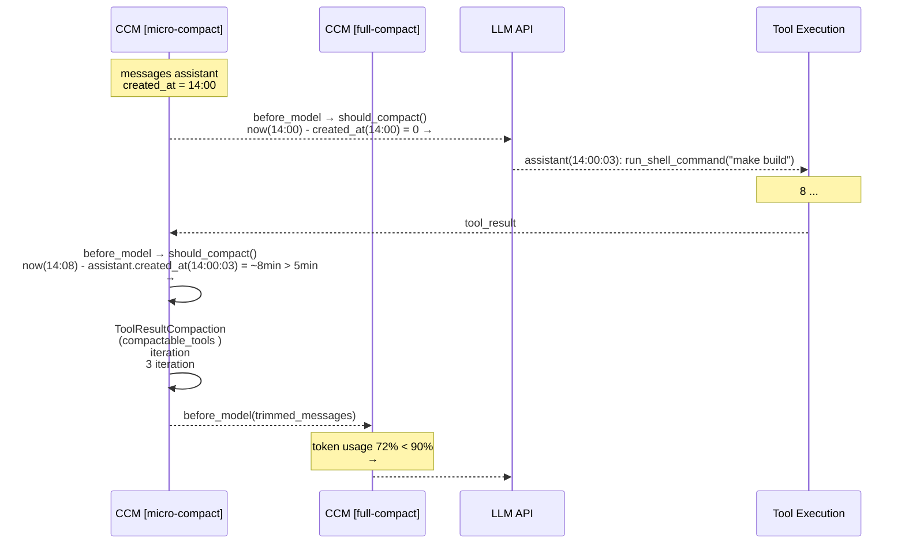
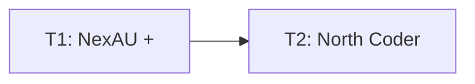

# RFC-0016: Micro-compact — 

## 

 NexAU  `ContextCompactionMiddleware` ， `TimeBasedTrigger`（ Message ） `ToolResultCompaction`（）， prompt cache ， token ，。

## 

Anthropic API  prompt cache  TTL  5 。 LLM  5 ，API —— cache ， prefix  input token 。

（grep 、、） token。 cache ，""； cache ， token ——（、）， input token 。

**：cache ，。**  prefix ，， input token、。

 RFC-0035 （`ContextCompactionMiddleware` + `SlidingWindowCompaction`） LLM  context ，****—— LLM ，。** tier-1 **，，， token 。

### 

Claude Code v2.1.88 ：

1. ** based **： assistant  60 （ 1h cache TTL）， `tool_result.content` ， N 。
2. ****： `cache_edits`  API ，。
3. **API Context Management**： `context_management`  API 。

 2、3  Anthropic / API，。** RFC  1 —— based **， 2、3  Future Work。

## 

1.  `cache_edits` （Anthropic  API，）；
2.  `context_management` （API ）；
3. （Phase 2，， API ）；
4. （data.db blocks ，）；
5.  UI ；
6.  middleware —— `ContextCompactionMiddleware`。

## 

### 

NexAU  `ContextCompactionMiddleware` ****（`TriggerStrategy`）****（`CompactionStrategy`） Protocol：

```text
ContextCompactionMiddleware
  ├── TriggerStrategy (Protocol)  → 「」
  │     ├── TokenThresholdTrigger   ← ：token 
  │     └── TimeBasedTrigger        ← ：
  └── CompactionStrategy (Protocol) → 「」
        ├── ToolResultCompaction     ←  + ：（）
        └── SlidingWindowCompaction  ← ：LLM 
```

 RFC ：

1. **（NexAU）**：
   -  `ToolResultCompaction`， `compactable_tools`（）。`compactable_tools=None` （）。
   -  `TimeBasedTrigger`， `TokenThresholdTrigger` ， messages  assistant  `created_at` 。
   -  `Message.created_at` （ `None`），/。
2. **（North Coder）**： `ContextCompactionMiddleware` ，。

```text
Middleware Chain:
  ... → CCM [micro-compact] → CCM [full-compact] → ...
        (TimeBasedTrigger +     (TokenThresholdTrigger +
         ToolResultCompaction     SlidingWindowCompaction
         with tool filtering)     LLM )
```

### 

1. ** `ToolResultCompaction`—— `compactable_tools` **
   - `ToolResultCompaction` 、`ToolResultBlock` 、`model_copy` 、 iteration 
   -  `compactable_tools` ， `keep_iterations`
   -  assistant ， iteration 、，
   - `compactable_tools=None` ，

2. **`compactable_tools` ——**
   - ：`frozenset[str] | None`，`None` （，）
   - ： assistant  `ToolUseBlock`， `block.name`  `compactable_tools` ， `ToolResultBlock` 
   - （North Coder ）：`read_file`、`search_file_content`、`list_directory`、`run_shell_command`、`read_only_shell_command`、`web_search`、`web_read`、`background_task_manage`
   - ：（`write_file`/`replace`/`apply_patch`）、（`ask_user`）、（`write_todos`、RFC/Plan ）、 Agent（`explore`/`worker`）

3. **——Message  + **
   - NexAU  `Message`  `created_at: datetime | None` ， `None`。： Message  `created_at = datetime.now(UTC)`，/
   - `TimeBasedTrigger.should_compact()`  `messages` ， assistant  `created_at`， `now - created_at`，
   - Trigger ——， messages ，
   - （ assistant ）→ （）

4. ** Anthropic prompt cache  TTL（5 ）**
   - Anthropic  prompt cache  TTL  5 ，
   - ：、run  5 （ shell ）
   -  cache ， cache miss， token
   -  OpenAI  provider —— input tokens 

5. ** `ContextCompactionMiddleware` **
   - （tier-1）：`TimeBasedTrigger` + `ToolResultCompaction`（with filtering），、
   - （tier-2）：`TokenThresholdTrigger` + `SlidingWindowCompaction`（LLM ），、
   - ， token → ， LLM 
   - ， trigger + strategy

### 

#### ：ToolResultCompaction 

```python
class ToolResultCompaction:
    def __init__(
        self,
        *,
        keep_system: bool = True,
        keep_iterations: int = 3,
        keep_user_rounds: int = 0,
        # ---  ---
        compactable_tools: frozenset[str] | None = None,  # None = （）
    ): ...
```

- `compactable_tools=None`：（，）
- `compactable_tools={"read_file", ...}`：， `ToolResultBlock` 
- `keep_iterations` ， iteration  N 

#### ：TimeBasedTrigger

 `TriggerStrategy` ， `TokenThresholdTrigger` ：

```python
class TimeBasedTrigger:
    """ assistant 。。"""

    def __init__(
        self,
        *,
        gap_threshold_minutes: int = 5,
    ): ...

    def should_compact(
        self,
        messages: list[Message],
        current_tokens: int,
        max_context_tokens: int,
    ) -> tuple[bool, str]:
        """ messages  assistant  created_at， now - created_at 。"""
        ...
```

：
- `should_compact()`  `messages`  `role=assistant` ， `created_at` 
-  `now - created_at`， `gap_threshold_minutes`（ 5 ）→  `(True, reason)`
- Trigger ，—— messages +  now 
-  assistant （）→ 

#### ：Message.created_at 

 NexAU  Message  `created_at = datetime.now(UTC)`：
- Agent loop  assistant Message 
-  user Message（ tool_result）
-  `created_at`  Message（）
- / `created_at` 

#### ：CompactionConfig 

 `CompactionConfig`（`extra="forbid"`）。 `TimeBasedTrigger`  `compactable_tools`：

```python
class CompactionConfig(BaseModel):
    model_config = ConfigDict(extra="forbid")

    trigger: Literal["token_threshold"] = "token_threshold"
    threshold_ratio: float = 0.9
    strategy: Literal["sliding_window", "tool_result"] = "sliding_window"
    keep_iterations: int = 3
    keep_user_rounds: int = 0

    # ---  ---
    trigger: Literal["token_threshold", "time_based"] = "token_threshold"
    gap_threshold_minutes: int = 5              # time_based trigger 
    compactable_tools: list[str] | None = None  # tool_result strategy 
```

#### YAML 

 `context_compaction` middleware  `middlewares` ：

```yaml
middlewares:
  # tier-1: （ +  + ）
  - type: context_compaction
    config:
      trigger: time_based
      gap_threshold_minutes: 5
      strategy: tool_result
      keep_iterations: 3
      compactable_tools:
        - read_file
        - search_file_content
        - list_directory
        - run_shell_command
        - read_only_shell_command
        - web_search
        - web_read
        - background_task_manage

  # tier-2: （token  + LLM ）
  - type: context_compaction
    config:
      trigger: token_threshold
      threshold_ratio: 0.9
      strategy: sliding_window
```

 CCM  middleware ，NexAU  YAML 。 `_ensure_agent()` 。

#### （ RFC-0051 ）

```json
{
  "agent_config": {
    "middlewares": {
      "micro_compact": {
        "gap_threshold_minutes": 10,
        "keep_iterations": 5
      }
    }
  }
}
```

### 

#### Middleware Chain 

```text
PathGuardMiddleware
  → FileLockMiddleware
    → AgentEventsMiddleware
      → ContextCompactionMiddleware [micro-compact]    ← （tier-1）
        → ContextCompactionMiddleware [full-compact]   ← （tier-2）
          → TokenUsageMiddleware
            → LongToolOutputMiddleware
              → EmptyContentRetryMiddleware
```

#### 



#### 

```mermaid
flowchart LR
    subgraph NexAU 
        MSG[Message.created_at ]
        TRC[ToolResultCompaction ]
        TRC -->|| CT[compactable_tools]
        TBT_UP[TimeBasedTrigger ]
        TBT_UP -->|| MSG
        TBT_UP -->|| GAP[gap_threshold_minutes]
    end
    subgraph North Coder 
        LOAD[ created_at] --> SETUP[_ensure_agent ]
        TBT_UP --> SETUP
        TRC --> SETUP
        SETUP --> CCM_MC[CCM micro-compact ]
        CCM_MC --> CHAIN[middleware chain]
    end
```

## 

### 

1. ** `SelectiveToolResultCompaction` **
   - ：，
   - ： `ToolResultCompaction` （、ToolResultBlock 、model_copy ）
   - ：，
   - ：。

2. ** `MicroCompactMiddleware`**
   - ：， `ContextCompactionMiddleware`
   - ： `before_model` hook、`HookResult` ， middleware 
   - ：。 middleware  +  trigger/strategy 

3. **Trigger  `_last_call_time` + blocks DB **
   - ： `Message.created_at`
   - ：Trigger ，，
   - ：， blocks DB 
   - ：blocks DB  timestamp  INSERT ，
   - ：。 Message  `created_at` ——，、、

4. ** Phase 2  based **
   - ：（）
   - ： `cache_edits` API， prompt cache 
   - ：Phase 2  Future Work， API 

### 

- 5  Anthropic  cache TTL， OpenAI  prompt cache  provider （ input tokens ）
- ，
-  `ContextCompactionMiddleware`  `compaction_started`/`compaction_finished` ， `triggerReason` 
-  NexAU  `Message`  `created_at`，（， None ）

## 

### 

- [ ] Phase 1:  NexAU  + 
- [ ] Phase 2:  North Coder YAML （trivial）

### 

#### 



#### 

| ID |  |  | Ref |
|----|------|------|-----|
| T1 | NexAU  +  | - | - |
| T2 | North Coder YAML  | T1 | - |

#### 

**T1: NexAU  + （NexAU ）**
- ****:
  - ** `ToolResultCompaction`**（`compact_stratigies/compact_tool_result.py`）： `compactable_tools: frozenset[str] | None = None`。`compact()`  `compactable_tools`  None ， `ToolResultBlock`（ `ToolUseBlock.name` ），。 `keep_iterations`。 None （）。
  - ** `TimeBasedTrigger`**（`trigger_strategies/time_based.py`）： `TriggerStrategy` Protocol。， `messages`  assistant  `created_at`， `now`  `gap_threshold_minutes`（ 5 ）。 assistant 。
  - ** `Message.created_at`**： Agent loop  Message  `created_at = datetime.now(UTC)`。 `created_at`  Message（）。/。
  - ** `CompactionConfig`**： `trigger: Literal["token_threshold", "time_based"]`、`gap_threshold_minutes: int`、`compactable_tools: list[str] | None` ， CCM  YAML `middlewares` 。
  - ****：`TimeBasedTrigger` （ message 、 assistant 、）； `ToolResultCompaction` （、）；`Message.created_at` ；`CompactionConfig` ； CCM  chain 。
- ****: NexAU ；；

**T2: North Coder YAML **
- ****:  agent YAML（`code_agent.yaml` ） `middlewares`  `context_compaction` （`trigger: time_based`），
- ****: YAML  CCM 

### 

**NexAU **:
- `nexau/.../compact_stratigies/compact_tool_result.py` —  `ToolResultCompaction`
- `nexau/.../trigger_strategies/time_based.py` — **** `TimeBasedTrigger`
- `nexau/.../config/compaction_config.py` —  `CompactionConfig`（ trigger 、`gap_threshold_minutes`、`compactable_tools`）
- `nexau/.../core/message.py`  Agent loop  —  `Message.created_at`
- `nexau/.../tests/` — 

**North Coder **:
- `backend/north_coder/agent/code_agent.yaml` — `middlewares`  CCM 
- `backend/north_coder/agent/code_agent_codex.yaml` — 
- `backend/north_coder/agent/rfc_agent.yaml` — 
- `backend/north_coder/agent/plan_agent.yaml` — 
- `backend/tests/` — 

## 

### 

- `TimeBasedTrigger.should_compact()`：
  -  assistant  `created_at`  8  →  `(True, reason)`
  -  assistant  `created_at`  2  →  `(False, "")`
  -  assistant （）→  `(False, "")`
  -  messages  → （）
  - assistant  `created_at`  `None` → （）
- `ToolResultCompaction.compact()`（）：
  - `compactable_tools=None` → （）
  - `compactable_tools={"read_file", "search_file_content"}` → 
  - （`write_file`、`ask_user`）
  - `keep_iterations=3`  3  iteration 
  - 
- Message `created_at` ：
  -  Message `created_at`  `None`
  -  Message `created_at` （NexAU ）

### 

- middleware chain  CCM  CCM 
- ， token 

### 

1. ，（`read_file`、`search_file_content`、`run_shell_command` ）
2.  5 （， `run_shell_command("sleep 360")`  6 ）
3. （ LLM ）
4.  LLM ，
5.  iteration 
6. （write_file ）
7. （blocks ）
8. 

## 

1. ** CCM **： `compaction_started`/`compaction_finished` 。 `CompactionState`， `triggerReason` 。
2. ** Anthropic provider **：5  Anthropic  cache TTL， OpenAI  provider 。 per-provider ？
3. ** Agent **： Agent 。 Agent（explore/worker），？

## Future Work

### Phase 2: （）

 Anthropic  `cache_edits` API  `context_management.clear_tool_uses` ：

- ****：
- ****： `cache_edits` ，
- ****： prompt cache，

### Phase 3: API 

 `context_management.clear_tool_uses_20250919` ：

- ****： API ， API 
- ****：`input_tokens` 
- ****：，API 

## 

- RFC-0035: （Context Compaction）—  LLM ，tier-2 
- RFC-0040: Block  — 
- RFC-0051:  Agent  — 
- Claude Code v2.1.88 ：`services/compact/microCompact.ts`、`timeBasedMCConfig.ts`、`apiMicrocompact.ts`
- NexAU `ToolResultCompaction`：`compact_stratigies/compact_tool_result.py` — 
- NexAU `TriggerStrategy` / `CompactionStrategy` Protocol — 
- 《》 11 ： — https://zhanghandong.github.io/harness-engineering-from-cc-to-ai-coding/part3/ch11.html
- Issue #359: Micro-compact — 