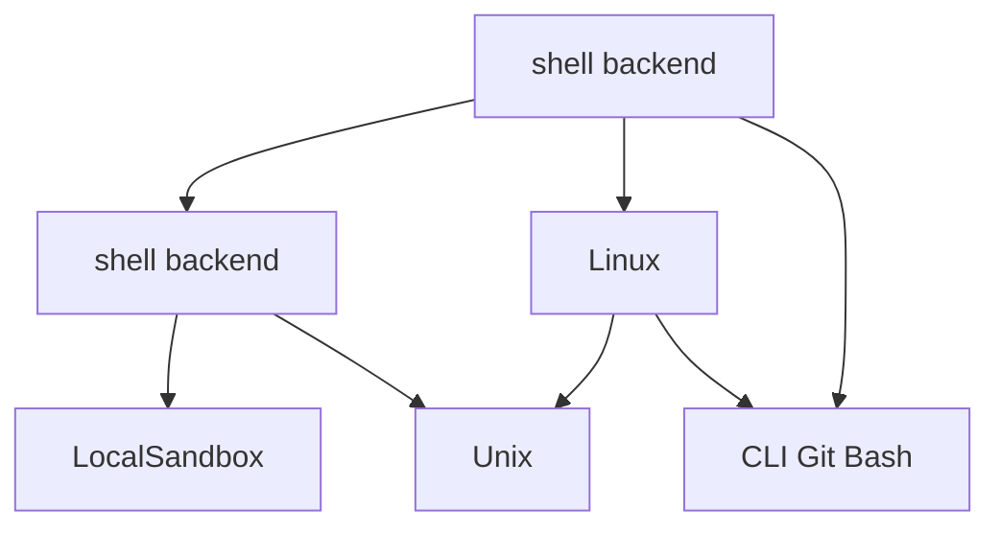

# RFC-0019: NexAU Windows （ PowerShell，Git Bash ）

## 

 RFC  NexAU  **Windows （ PowerShell，Git Bash ）** ， **Windows 10 / Windows 11**。RFC-0019 ： Windows  shell backend  PowerShell（ `pwsh.exe`， `powershell.exe`， `cmd.exe`）， Git Bash  bash-compatible backend； shell 、 LocalSandbox 、、 Unix-only  Windows ， CLI / npm /  Git Bash  Windows  PowerShell 。

 RFC ：

- Windows ：**Windows 10 / 11  PowerShell **； Git Bash。
- Windows  shell backend ：`pwsh.exe` → `powershell.exe` → `cmd.exe`。 `cmd.exe` ，， shell 。
- Git Bash  bash-compatible backend ； Git Bash backend，/ bash-only ， Git Bash 、。 `bash --version` 。
- NexAU  RFC  Git Bash ； Git Bash  bash-compatible backend， PowerShell 。
-  `execute_shell` ； `execute_bash`  deprecated / legacy alias， breaking change。
- Windows  **Local **；E2B / Remote Sandbox 。
-  **PowerShell  backend + ** ；Git Bash backend  bash-compatible 。PowerShell  runtime guidance / tool description  PowerShell here-string ；、 Bash heredoc  best-effort ， bash 、 heredoc、 Windows  Linux 。
- **E2B  Linux **， `/tmp`、`/home/user` “Windows ”。

## 

 Linux / macOS ， Windows ，“”“”。：

1. **shell  bash， Windows  bash**：`execute_bash`、heredoc scriptify、`run_shell_command`、`shlex.quote`  POSIX shell 。
2. **LocalSandbox  POSIX **：`os.killpg()`、`os.getpgid()`、`SIGTERM` / `SIGKILL`、`start_new_session=True`  Windows 。
3. ** Unix **：`/tmp`、Unix site-packages 、bash  Windows 。
4. ** Unix **： `read_visual_file.py`  `mkdir -m`、`ls | sort`、`rm -rf`；`search_file_content.py`  shell  ripgrep 。
5. ** bash ， Windows  PowerShell**：`run-agent`  `package.json` “ Git Bash” Windows ； bash-compatible backend  Git Bash 。

### 

|  |  |  |  |
| --- | --- | --- | --- |
| Windows  bash， POSIX / bash  |  Git Bash  Windows ； bash  Windows  shell | Windows  shell backend  PowerShell， `pwsh.exe` → `powershell.exe` → `cmd.exe`；Git Bash  bash-compatible backend |  Git Bash ，`nexau` / npm /  PowerShell  |
| Git Bash  Windows  |  Git for Windows， |  Git Bash backend，/ bash-only  Git Bash |  Git Bash ； Git Bash  |
| `execute_bash`  shell backend  |  Windows  PowerShell，API ， shell dialect |  `execute_shell`  API， active shell backend；NexAU  `execute_shell`； `execute_bash`  deprecated / legacy alias  `execute_shell` | ；NexAU  `execute_bash` ； `execute_bash`  Windows  Git Bash |
| `shlex.quote()`、heredoc、 command building  POSIX  | PowerShell 、、、 heredoc ， POSIX quoting  |  quoting / command building  shell backend：Unix / Git Bash  POSIX quoting；PowerShell  PowerShell quoting  executable invocation；LLM-facing  PowerShell here-string， Bash heredoc； best-effort  Bash heredoc /， agent  Git Bash | 、、；PowerShell  bash ；， bash-only  |
|  Git Bash POSIX  | PowerShell  `C:\...`  `/c/...`；Python  API  shell  |  helper  backend ：Python ；PowerShell / `cmd.exe`  Windows ；Git Bash  `/c/...`  | `cwd`、、、 Python  shell ， `/tmp`  |
| LocalSandbox  POSIX  | `killpg()`、`getpgid()`、`SIGTERM` / `SIGKILL`、`start_new_session=True`  Windows  |  process compat ，、、、 | Windows ，/， POSIX-only API |
| Windows GUI  |  `search_file_content`、`run_shell_command`、MCP stdio server、`read_visual_file` ，PowerShell/cmd/rg/ffmpeg  | Windows  `CREATE_NO_WINDOW`；shell backend  `CREATE_NEW_PROCESS_GROUP`  no-window flag ； `subprocess.run/check_output`  `asyncio.create_subprocess_exec`  no-window kwargs | `search_file_content`、shell command、visual reader/MCP ； |
|  Unix  Unix  | `mkdir`、`ls | sort`、`rm -rf`、bash  `rg`  PowerShell  |  Python / sandbox  API； shell  backend-aware quoting ；`rg` / `ffmpeg`  fallback /  | `search_file_content`、`read_visual_file`  Windows  PowerShell ； |
| CI / “Git Bash ” | 、， Git Bash-only | RFC-0020  Windows baseline  PowerShell backend +  Git Bash backend | required checks  PowerShell ；Git Bash  backend / bash-only  fail-fast |

 Git Bash ，PowerShell  Windows 10 / 11 ， NexAU 。 Windows “ PowerShell，Git Bash ”， bash-compatible 。

 RFC，：

- Windows “**Windows +  PowerShell backend**”，“Windows + Git Bash ”；
- Git Bash  bash-compatible backend，； Git Bash  bash-only ；
- LocalSandbox、 CLI  Windows  shell、、quoting、。

## 

### 

 RFC  Windows ：

1. **（Windows + PowerShell ，Git Bash ，）**
   - LocalSandbox
   - `run_shell_command` / `execute_shell`（）/ `execute_bash`（legacy alias）
- PowerShell / Git Bash backend 、、
   - 、、
   - （ `search_file_content`、`read_visual_file`）
   - Python / npm / 

2. **（ RFC  Linux ）**
   -  E2B / Remote Sandbox  Linux 
   - `/tmp`、`/home/user`  Linux 
   -  Windows RemoteSandbox，， `remote`  `linux` 

“Windows  shell ” Linux ，：** PowerShell  Windows  shell ， backend； shell backend  Git Bash  bash-compatible backend。**  Git Bash  Windows ； bash  bash-only ，/ NexAU  agent。

 RFC ：

- `Local + Windows`
- `Remote + Linux`

， `Windows`  `Local`、`Linux`  `Remote` 。

### 

-  Git Bash  Windows 。
-  PowerShell  bash-only 、 bash heredoc  POSIX ；Windows  PowerShell here-string。、 Bash heredoc / best-effort ；， PowerShell  Git Bash backend。
-  bash  Windows  Linux 。
-  E2B / Remote  Linux  shell 。
-  RFC  `execute_bash`，；NexAU  `execute_shell` API， `execute_bash`  alias 。
-  RFC  Windows RemoteSandbox；“Remote  Linux”。
-  Windows CI、、 DX （ RFC-0020 ）。

### 

1. **Windows  shell backend  PowerShell**
   - Windows 10 / 11 ， LocalSandbox / 。
   -  backend  `pwsh.exe` → `powershell.exe` → `cmd.exe`；`cmd.exe` ， PowerShell 。

2. **Git Bash  bash-compatible backend**
   -  Git Bash 。
   -  Git Bash backend，/ bash-only ， Git Bash；。

3. ** `execute_shell`， `execute_bash`  legacy alias**
   - `execute_shell(...)`  API， sandbox  active shell backend 。
   - NexAU  `execute_shell(...)`， `execute_bash`  bash 。
   -  breaking change，`execute_bash(...)` ， deprecated / legacy name， `execute_shell(...)`， subclass 。
   - Windows  PowerShell backend， Git Bash backend； wrapper、、 `execute_bash`。

4. ****
   - `Local / Remote`  `Windows / Linux` ； RFC  `Local + Windows`  `Remote + Linux`。
   -  shell backend、process compat、path helpers、PowerShell / Git Bash 。
   - ， `sys.platform` 。

5. **、quoting、 backend-aware**
   - Python ；PowerShell / `cmd.exe`  Windows ；Git Bash  `/c/...` 。
   - Unix / Git Bash  POSIX quoting；PowerShell  PowerShell quoting  executable invocation；Windows PowerShell guidance / tool description  PowerShell here-string。 Bash heredoc ， best-effort 、 Bash heredoc /； Bash heredoc、、， agent  Git Bash。
   - `search_file_content`、`read_visual_file`  RFC，“、 fallback 、”。

6. **Runtime  middleware ， PromptBuilder **
   - Agent runtime  `working_directory`、`operating_system`、`shell_tool_backend` ； CLI 。
   - LLM-facing  `RuntimeEnvironmentMiddleware.before_agent`  system prompt，、、active shell backend 。
   -  `PromptBuilder`  `Runtime Platform Contract` ， agent 。
   -  agent  middleware；agent  `system_prompt` 。

### 

#### 1. shell 

 `BaseSandbox.execute_shell(...)`， sandbox  active shell backend 。 `BaseSandbox.execute_bash(...)`  deprecated / legacy alias， sandbox 。

：

- NexAU  `execute_shell(...)`；`execute_bash(...)` 。
- `execute_bash(...)` “ bash ”， legacy shell execution entrypoint。
-  sandbox  `execute_shell(...)` ，`execute_bash(...)`  `execute_shell(...)`。
-  subclass，`BaseSandbox.execute_shell(...)`  `execute_bash(...)`。

`execute_shell(...)`  backend ：

- **Unix / Linux / macOS**： bash-compatible 。
- **Windows Local **： PowerShell ， `pwsh.exe`， `powershell.exe`， `cmd.exe` 。
- **Windows Local  Git Bash**： Git Bash backend  bash-only ， Git for Windows shell （ `bash.exe`  GUI shell binary），。
- ** Remote / E2B Linux **： Linux bash ， Git Bash  Windows  shell 。
-  Windows RemoteSandbox， shell ，“remote = Linux”。
- ：
  -  `cwd`
  -  `envs`
  - 
  -  `CommandResult` 
  - 、、

 Windows  PowerShell backend  Git Bash：

-  PowerShell 
-  Git Bash backend  bash-only 
-  agent ，
- ，

Windows Local ：

-  `shell=True`  shell 
-  shell backend ；PowerShell  `pwsh.exe` / `powershell.exe` / `cmd.exe`  argv，Git Bash  `[git_bash_path, "-c", command]` 
-  LocalSandbox  active shell backend， shell
- Windows GUI ：
  - `LocalSandbox.execute_shell(...)`  Windows shell backend launch config  `CREATE_NEW_PROCESS_GROUP`  `CREATE_NO_WINDOW`， `search_file_content`、`run_shell_command`、`read_visual_file`  `rg` / PowerShell / `cmd.exe` / `ffmpeg` 。
  -  `execute_shell(...)`  subprocess  no-window helper， PowerShell backend 、`llm_friendly`  `wc` / `du` 、MCP stdio server  `asyncio.create_subprocess_exec(...)`。
  - `CREATE_NO_WINDOW`  NexAU ；、IDE、Explorer  GUI 。
  -  Windows  Windows-only creation flags， POSIX `start_new_session` / cleanup 。

#### 2. backend-aware 

 `BaseSandbox.prepare_shell_command(command, script_dir=None)` 。： `execute_shell(...)` ， active shell backend  shell dialect 、。

`BaseSandbox.scriptify_heredoc(command, script_dir=None)` ， RFC ； executor、 sandbox 。 `prepare_shell_command(...)` ， compatibility wrapper / legacy helper， heredoc scriptify。

：

- **Unix / Git Bash backend**： Bash heredoc  scriptification ； Bash heredoc ， `.sh` ， `bash <script_path>`  backend-safe ， wrapper  heredoc delimiter。
- **PowerShell backend**：LLM-facing runtime guidance  `run_shell_command`  PowerShell ； PowerShell here-string， `'@`  single-quoted here-string； BOM UTF-8 ， `.NET WriteAllText` + `UTF8Encoding($false)` 。， Windows  UTF-8 with BOM （ `SKILL.md`）， BOM  frontmatter 。 Bash heredoc ， best-effort 、：
  - `cat > file <<'EOF' ... EOF`
  - `cat <<'EOF' > file ... EOF`
  - `cat >> file <<'EOF' ... EOF`
  - `cat <<'EOF' >> file ... EOF`
  - `cat <<'EOF' ... EOF`（ stdout）
- PowerShell heredoc  body inline  here-string； heredoc body  sandbox  payload ， PowerShell  payload  stdout， body  quotes、、`'@` / `"@` 。
-  unquoted Bash heredoc（ `<<EOF`） Bash 、； literal best-effort ， Bash 。
- **cmd.exe backend**： Bash heredoc ； Bash heredoc ， PowerShell here-string  Git Bash backend。
- ** Bash heredoc**（ heredoc  pipeline、`python - <<'PY'`、、、 heredoc、 Bash expansion ）； agent  Git Bash backend， PowerShell 。

stdout/stderr  `execute_shell(...)` ，、 agentic ； validation error、unsupported heredoc error  shell dialect error  `stdout_file` / `stderr_file`  shell command。

#### 3. Shell backend  Git Bash 

Windows ：

- `detect_powershell_backend()`： `pwsh.exe` → `powershell.exe` → `cmd.exe`  backend，、backend （）
- `ensure_default_windows_shell()`： Windows shell backend ； PowerShell  `cmd.exe`，， PowerShell 
- `detect_git_bash()`： Git Bash ，； hot path ， `bash --version` 
- `ensure_git_bash()`：、 fail-fast ， Git Bash backend  bash-only 
- `explain_git_bash_requirement()`： Git Bash 
- `handoff_git_bash_install()`： NexAU  agent “/ Git Bash”，

RFC ，。

：

-  PowerShell backend ， Git for Windows / Git Bash  `nexau`、npm/ shell 
-  Git Bash backend  bash-only ， Git for Windows / Git Bash
-  NexAU  Git Bash
- Git Bash ： > PATH > 
- Git Bash  fail-fast； discovery  `bash --version` ， shell backend  hot path 。，。
-  agent /
- ，、

#### 4. 

：

- 、、scriptify  helper 
- Windows Local  **Python **， active shell backend ：PowerShell / `cmd.exe`  Windows ，Git Bash ；
-  Local  POSIX  `/tmp`  Python  shell backend 
-  Unix site-packages 
- Git Bash ，

Windows Local ：

-  PowerShell / `cmd.exe` ， Windows  backend-aware quoting； Git Bash ， path helper  Git Bash （ `/c/...` ）
-  Python  API ， Python ， shell 
- `subprocess.Popen` / `cwd`  Python  Python ； shell backend 
- 、、、 Python  shell ， helper “”“PowerShell ”“Git Bash ”
- quoting / command building ， Windows  POSIX quoting ；PowerShell backend  PowerShell quoting  executable invocation 

（ Linux ）：

- ，E2B  `/tmp`、`/home/user` 
-  RFC  Linux  Windows 
-  Windows RemoteSandbox， Windows ， Linux 

#### 5. CLI / 

RFC-0019 ，Windows ：

-  `nexau` / Python 
-  npm / （ `npm run agent` ） Windows 
-  Git Bash ， PowerShell ； Git Bash backend  bash-only ， NexAU  agent /；，
-  WSL  bash.exe 

### 

```mermaid
flowchart TD
    A[ / CLI / npm ] --> B[Shell backend ]
    B -->|| P[PowerShell : pwsh -> powershell -> cmd]
    B -->| Git Bash  bash-only| GB[Git Bash ]
    GB -->|| D[ + ]
    D -->| agent | E[/]
    E -->|| A
    D -->|| F[]

    P --> C[run_shell_command / execute_shell preferred / execute_bash legacy]
    GB -->|| C
    C --> G{Shell Backend}
    G -->|Unix| H[ bash-compatible ]
    G -->|Windows | I[PowerShell ]
    G -->|Windows | X[Git Bash ]

    H --> J[LocalSandbox]
    I --> J
    X --> J

    J --> K[ /  / ]
    J --> L[search_file_content]
    J --> M[read_visual_file]

    N[E2B Sandbox] --> O[ Linux  shell ]

    classDef keep fill:#eef,stroke:#66f;
    class N,O keep;
```

## 

### 

1. ** WSL， Windows **
   - ：， Linux 。
   - ：；；“Windows ”。
   - ****：。

2. ** Git Bash  Windows  shell **
   - ： bash / POSIX ，。
   - ： Windows ， NexAU 。
   - ****： PowerShell 、Git Bash 。

3. ** `execute_bash`  `execute_shell` / `execute_command` **
   - ：、。
   - ：、；； RFC “”。
   - ****：“ API +  legacy alias”；NexAU  `execute_shell`， `execute_bash` alias 。

4. ** NexAU  Git Bash **
   - ：，。
   - ：、、、 NexAU ，。
   - ****：Git Bash  backend； Git Bash ， agent /。

5. ** LocalSandbox，**
   - ：RFC ，。
   - ：、 Windows ， Windows 。
   - ****：。

### 

1. **PowerShell  shell dialect **， quoting、、heredoc、。
2. **Git Bash optional **， PowerShell backend  bash-compatible backend。
3. **`cmd.exe` **，， backend。
4. ** `execute_bash` legacy alias **，、、deprecation 。

## 

### 

- ** 1： shell backend **
  - 、PowerShell  backend、Git Bash  backend、bash-only 、、/。
- ** 2：**
  -  shell backend 、LocalSandbox 、 / quoting helper、。
- ** 3： Git Bash **
  -  CLI / npm / ， PowerShell ， Git Bash / bash-only “ +  / ”。

### 

#### 



#### 

| ID |  |  | Ref |
| --- | --- | --- | --- |
| T1 |  shell backend  | - | - |
| T2 |  shell backend  | T1 | - |
| T3 | LocalSandbox  | T2 | - |
| T4 |  Linux  | T1 | - |
| T5 |  Unix  | T2, T4 | - |
| T6 | CLI  Git Bash  | T1, T4 | - |

#### 

##### T1： shell backend 

****
-  Windows（Win10 / Win11）“ PowerShell backend，Git Bash ”
-  Local 、E2B 
-  `execute_shell` / `execute_bash` ： `execute_shell`  NexAU  API  active shell backend， `execute_bash`  deprecated / legacy alias 
-  Windows  backend ：`pwsh.exe` → `powershell.exe` → `cmd.exe`， `cmd.exe` 
-  Git Bash  backend、bash-only 、 agent 、
- 

****
- RFC 、、
-  PowerShell  Windows ，Git Bash 
-  Git Bash backend  bash-only  Git Bash  fail-fast、
-  Linux ， Remote 

##### T2： shell backend 

****
-  PowerShell、Git Bash、Unix bash backend / profile 
-  Windows Local  active shell backend ， `shell=True`  shell
-  Windows  `subprocess.Popen` ， `shell=False`、`start_new_session` / `creationflags` ， T3 
-  `shlex.quote()`  quoting  backend-aware command building ：Unix / Git Bash  POSIX quoting，PowerShell  PowerShell quoting  executable invocation ，`cmd.exe` 
-  `run_shell_command`  cwd、env、
-  `run_shell_command` /“Git Bash ”，“PowerShell 、Git Bash ” RFC 
-  agent  LLM-facing tool YAML / schema ， `run_shell_command.tool.yaml` / `run_shell_command_sync.tool.yaml`  `bash -c <command>` “Exact bash command”，， schema  bash 
-  `execute_shell(...)`  backend-aware  `prepare_shell_command(...)` ； `scriptify_heredoc(...)`  wrapper。Unix / Git Bash  Bash heredoc scriptification；PowerShell  runtime guidance / tool description  PowerShell here-string， `cat > file <<'EOF'` / `cat <<'EOF' > file` / append / stdout  best-effort ； heredoc  agent  Git Bash。

**NexAU  `execute_shell` **
- ：`nexau/archs/tool/builtin/shell_tools/run_shell_command.py`、`nexau/archs/tool/builtin/file_tools/search_file_content.py`、`nexau/archs/tool/builtin/file_tools/read_visual_file.py`  `sandbox.execute_bash(...)`  `sandbox.execute_shell(...)`， mock / 。
- Sandbox ：`LocalSandbox`、`E2BSandbox` 、 wrapper  `self.execute_bash(...)`  `self.execute_shell(...)`； `execute_bash(...)` wrapper 。
-  acceptance ：“ active shell backend” `execute_shell(...)`； legacy alias、 subclass 、 `execute_bash(...)`。
- ：`docs/advanced-guides/sandbox.md`、`docs/core-concepts/tools.md`、`docs/cross-platform-guidelines.md`、`examples/nexau_building_team/**/docs/advanced-guides/sandbox.md`  API  `execute_shell(...)`， `execute_bash(...)`  legacy alias。
- ， API ； `execute_shell(...)`  API 。
- ：、 sandbox subclass  `execute_bash(...)` ； NexAU  `execute_bash(...)` 。

****
- Windows  PowerShell backend ； Git Bash backend  bash-compatible 
-  LocalSandbox  active shell backend， `shell=True`  shell 
- Windows Local  `Popen` ，T2  T3 
- `run_shell_command`  bash ，/ Windows  PowerShell、Git Bash 
- `examples/code_agent`、`examples/nexau_building_team`  shell tool schema / description  `bash -c`  “bash command”， active shell backend， Python binding 
- `execute_shell(...)`  NexAU  shell execution API；`execute_bash(...)`  legacy alias、、
- ：`prepare_shell_command(...)`  backend-aware ；`scriptify_heredoc(...)`  legacy compatibility wrapper ；PowerShell  tool/runtime guidance  here-string； Bash heredoc / best-effort ， bash heredoc  PowerShell ，。

##### T3：LocalSandbox 

****
-  Python `subprocess` / `os` / `signal`  Windows 、、、、
-  `_graceful_kill()`  POSIX process group ， Unix  Windows 
- Unix Local  process group ；Windows ：`terminate()` → wait → `kill()` ， `killpg()` / `getpgid()` 
-  `cleanup_manager.py`  signal / cleanup ， Windows 、
-  shell backend ， T2 
- Windows ，

****
- Windows 
- Windows 、、
- LocalSandbox  `killpg()`、`getpgid()`  POSIX-only API
- `cleanup_manager.py`  Windows ， Unix `SIGTERM` / `kill(os.getpid(), signum)` 
-  Windows 

##### T4： Linux 

****
-  Local  temp/output/script path helper
- Windows Local  Python ， helper  active shell backend  backend 
-  `cwd`、、、、 Python  PowerShell / Git Bash / `cmd.exe` 
-  `/tmp`  Unix 
-  PowerShell  Git Bash 
-  E2B / Remote Linux  `/tmp`、`/home/user` 
-  helper  `Remote`  `Linux`； Windows RemoteSandbox， Windows 
-  `cli_wrapper.py`  / ， Unix site-packages  Python 

****
- Windows 、、
- Local  POSIX `/tmp`  Python  shell backend 
- `prepare_shell_command` / `scriptify_heredoc` 、payload  Windows Local  `/tmp`
- Python  shell backend ，
- PowerShell  Git Bash 
-  E2B / Remote Linux ，“ Remote  Linux”
-  Unix site-packages 

##### T5： Unix 

****
-  `python3` ， `sys.executable`  helper ， shell PATH  `python3`
- `search_file_content`  Windows  backend-aware ；PowerShell quoting  Python fallback，Git Bash backend  `rg` 、Python fallback 
- `search_file_content`  grep  Windows （ `C:\path:42:content`）， `:` 
- `read_visual_file`  Unix-only ， Python 、、 `mkdir` / `ls | sort` / `rm -rf`  shell 
- `read_visual_file`  `ffmpeg` ，
-  shell  Python  API ， Python /， shell backend  Windows 

****
- Windows  Python helper ， shell PATH  `python3`
- `search_file_content`  Windows  PowerShell ；Git Bash backend  `rg`， Python fallback
- `search_file_content`  Windows ， `C:\...:line:content` 
- `read_visual_file`  Windows ； `ffmpeg` 
-  `ls`  shell  Python 

##### T6：CLI  Git Bash 

****
-  `nexau` / Python CLI ， PowerShell backend  + 
-  npm /  Windows 
- Windows  `run-agent` （ Python 、`.bat/.cmd`  Python CLI）
-  Git Bash backend  bash-only  Git Bash  fail-fast ：， NexAU  agent ；，
-  Python  CLI 

****
- Windows  Git Bash ， PowerShell backend ，
-  Git Bash backend  bash-only ，
-  NexAU  agent /
- ，
-  Git Bash ，
-  npm /  Windows 

##### T7：Windows  UTF-8 

****
-  Windows  RFC-0019 ，（ GBK）
- `SKILL.md`、YAML frontmatter、Markdown / UTF-8 ； UTF-8 /，
- Node CLI  Python `agent_runner`  JSON lines stdin/stdout  UTF-8。Node  Python runner  `PYTHONUTF8=1` / `PYTHONIOENCODING=utf-8`，Python runner  `stdin` / `stdout` / `stderr` reconfigure  UTF-8
- 、、session snapshot、history fingerprint、LLM  payload  JSON  surrogate ；， history  LLM serializer 
- shell  stdout/stderr  `errors="replace"` ；， UTF-8 

****
- Windows  ASCII  `SKILL.md`  `'gbk' codec can't decode ...`
- Windows  Node CLI ，Python agent runner  history、session snapshot  LLM ， `surrogates not allowed`  `\udcxx`  surrogate 
-  `uv run python -m nexau.cli.agent_runner <agent.yaml>` ，stdin/stdout JSON lines  UTF-8 ， Node CLI 
- Linux / macOS  UTF-8 

### 

- `nexau/archs/sandbox/base_sandbox.py`
- `nexau/archs/sandbox/local_sandbox.py`
- `nexau/archs/sandbox/e2b_sandbox.py`
- `nexau/archs/tool/builtin/shell_tools/run_shell_command.py`
- `nexau/archs/tool/builtin/file_tools/search_file_content.py`
- `nexau/archs/tool/builtin/file_tools/read_visual_file.py`
- `nexau/archs/main_sub/utils/cleanup_manager.py`
- `nexau/archs/main_sub/execution/middleware/long_tool_output.py`
- `nexau/archs/main_sub/skill.py`
- `nexau/cli/agent_runner.py`
- `cli/source/app.js`
- `examples/code_agent/tools/run_shell_command*.tool.yaml`
- `examples/nexau_building_team/**/run_shell_command*.tool.yaml`
- `nexau/cli_wrapper.py`
- `run-agent`
- `package.json`
- `pyproject.toml`
- （ shell backend / process compat / path helpers / PowerShell  Git Bash discovery / validation / handoff ）

## 

### 

1. ****
   - PowerShell backend 、 `cmd.exe` 
   - Git Bash 、、（ Git Bash / bash-only ）
   - shell backend / quoting / command building
   - `prepare_shell_command(...)` backend-aware ：Unix / Git Bash heredoc  `.sh`  bash ；PowerShell  `cat > file <<'EOF'` / append / stdout heredoc  best-effort rewrite； heredoc ；`scriptify_heredoc(...)`  legacy wrapper 
   - PowerShell heredoc rewrite  payload-file  body  `$HOME`、、、`'@` / `"@`  inline  PowerShell command 
   - Windows PowerShell backend  runtime guidance / tool description  PowerShell here-string， Bash heredoc
   -  shell tool YAML schema / description  `bash -c` / “bash command” ， active shell backend 
   - LocalSandbox 、、、
   -  helper（Local  E2B ， Python  / PowerShell / Git Bash ）
   - `search_file_content` Windows  PowerShell  Git Bash 、Windows 
   - `read_visual_file` Windows 、（Python  shell ）
   - `cleanup_manager.py` Windows  signal / cleanup 
   - `Skill.from_folder` / `SKILL.md` UTF-8 
   - `agent_runner` stdio UTF-8 reconfigure 

2. ****
   - Windows  agent 
   - `run_shell_command` 、cwd 、
   -  PowerShell backend ， Bash heredoc / `prepare_shell_command(...)` best-effort rewrite ； Bash heredoc ， PowerShell here-string  Git Bash
   -  kill
   -  PowerShell ， Git Bash “ +  / ”
   - 
   - Windows Local  PowerShell / Git Bash  Python ， shell  `/tmp` 
   - Windows  Node CLI → Python `agent_runner` → history / LLM payload  surrogate 

3. ****
   - Linux / macOS  bash 
   - E2B  Linux  `/tmp`  `/home/user` 

### 

- Windows 10 / 11  Git Bash ， agent  PowerShell backend 、、
- Windows 10 / 11  Git Bash ， Git Bash backend  bash-compatible 、、
- Windows 10 / 11  Git Bash  Git Bash backend  bash-only ， NexAU ， PowerShell 
-  NexAU  agent， Git Bash /， Git Bash backend 
- ，、
- Linux / macOS ，E2B  Linux  shell  Windows 

## 

1. PowerShell here-string guidance ； prompt / tool schema  bash-only ？
2. Git Bash 、 NexAU  agent ？
3.  agent  Git Bash ，、？
4. Windows  MAX_PATH  helper ？

## 

- `docs/rfcs/0018-external-tool.md`
- `docs/rfcs/meta/0018-external-tool.json`
- `nexau/archs/sandbox/base_sandbox.py`
- `nexau/archs/sandbox/local_sandbox.py`
- `nexau/archs/sandbox/e2b_sandbox.py`
- `nexau/archs/tool/builtin/shell_tools/run_shell_command.py`
- `nexau/archs/tool/builtin/file_tools/search_file_content.py`
- `nexau/archs/tool/builtin/file_tools/read_visual_file.py`
- `nexau/archs/main_sub/utils/cleanup_manager.py`
- `nexau/archs/main_sub/skill.py`
- `nexau/cli/agent_runner.py`
- `cli/source/app.js`
- `nexau/cli_wrapper.py`
- `nexau/archs/tool/builtin/file_tools/apply_patch.py`
- `run-agent`
- `package.json`