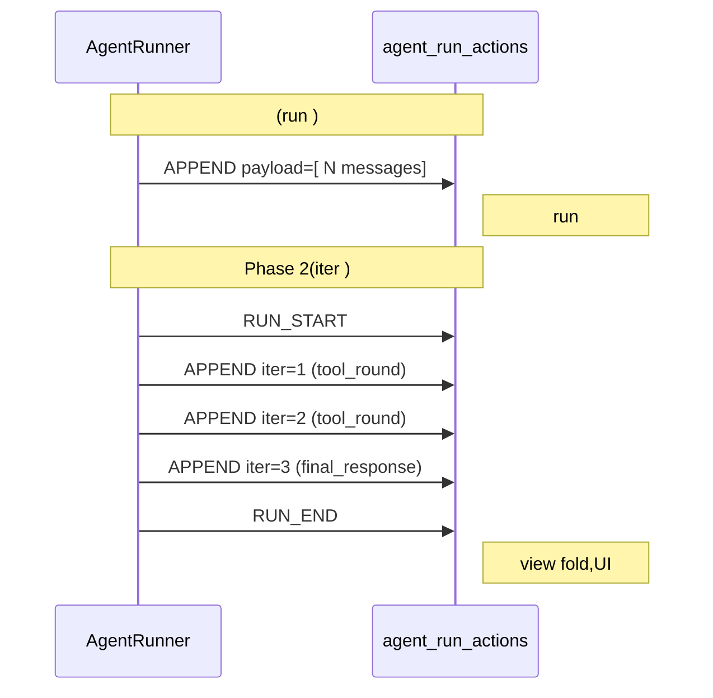

# RFC-0022: Agent Run Action ( /  / typed extra)

- ****: draft
- ****: P2
- ****: `architecture`, `dx`, `protocol`, `event-sourcing`
- ****: NexAU (`AgentRunActionModel`); NexAU Cloud (NAC)  `agent_run_actions`  single source of truth  view 
- ****: 2026-05-01
- ****: 2026-05-05

## TL;DR

 `AgentRunActionModel`  **event sourcing  mutation **( RunAction  messages  mutation,messages  fold )。Phase 1  3 :

1. **action_type ** —  `RUN_START` / `RUN_END` , 5  reduction operator; Class B aliasing(`REPLACE + ReplaceExtra(reason="compact_*")`), type( § §6 forward-compat )
2. **2 ** — `idempotency_key`()/ `extra`(typed Pydantic discriminated union)
3. **** — `action_type: str`  `str`(forward-compat, §6), `RunActionType` StrEnum ;`extra: dict` → 5  `*Extra` Pydantic (`AppendExtra` / `ReplaceExtra` / `UndoExtra` / `RunStartExtra` / `RunEndExtra`), **protobuf ** optional + `extra='allow'`, `extra.kind` magic string

iter  **Phase 2 **, RFC , Phase 2 。

## 

:

|  |  |
|------|------|
| **action** / **RunAction** |  atom, `agent_run_actions` , messages  mutation。 RFC  `action` ≡ `mutation` |
| **mutation** | action ," messages "。 RFC `action` ≡ `mutation` |
| **messages ** | `fold(actions)`  messages (,****) |
| **fold** / **reduction** | actions  → messages ( functional `reduce`) |
| **action_type** | 5  reduction operator :`APPEND` / `REPLACE` / `UNDO` / `RUN_START` / `RUN_END`( `REPLACE + ReplaceExtra(reason="compact_*")` Class B aliasing) |
| **iter** / **iteration** |  LLM iter:`LLM call →  → tool  →  tool result` |
| **run** |  `agent.run(message=...)` , run  N  iter, `run_id`  |
| **session** |  run , `session_id` , run  messages  |
| **agent event** | Set A `nexau/archs/llm/llm_aggregators/` emit  SSE event(per-token / per-block), SSE ,** RunAction ** |

("Set A "vs" RFC fold"):

```mermaid
flowchart LR
    SSE[LLM provider SSE]
    SetA[Set A llm_aggregators<br/>per-call ]
    Msg[Message]
    Action[RunAction<br/>APPEND payload]
    DB[(agent_run_actions<br/>)]
    Fold[fold actions<br/>ES ]
    State[messages <br/>]

    SSE -->|chunks| SetA
    SetA -->|N chunks → 1 Msg| Msg
    Msg -->|| Action
    Action -->|insert| DB
    DB -->|read by session+agent| Fold
    Fold -->|N actions → | State
    State -->|| UI[view  / UI]

    SSE -.SSE .-> AGUI[agent events<br/>per-token push ]
    AGUI -..-> UI
```

## 

```mermaid
graph LR
    subgraph 
        A1[APPEND]
        R1[REPLACE]
        U1[UNDO]
    end
    subgraph Phase1
        RS[RUN_START]
        RE[RUN_END]
        CB[: REPLACE + ReplaceExtra<br/>reason=compact_*<br/>Class B aliasing]
    end
    subgraph 
        IK[idempotency_key<br/>TEXT UNIQUE]
        EX[extra<br/>JSONB - typed Pydantic<br/>protobuf  optional]
    end
    subgraph 
        T1[action_type: str → RunActionType]
        T2[extra: dict → RunActionExtra<br/>discriminated union]
    end
    style RS fill:#cfc
    style RE fill:#cfc
    style CB fill:#cfc
    style IK fill:#cfc
    style EX fill:#cfc
    style T1 fill:#ffc
    style T2 fill:#ffc
```

 `nexau/archs/session/models/agent_run_action_model.py`  + 。2 :`create_run_start` / `create_run_end`, `create_replace`  `reason="compact_*"` + `strategy` / `focus_instructions` / `stats` ,sig  typed extra。

** RFC **:
- `SubagentCallBlock`  —  [Phase 4](#phase-4--sub-agent--pr), `ToolResultBlock` pairing 
- `extra.ids`  mutation  — 0 , co-design

## 

`AgentRunActionModel`  APPEND / REPLACE / UNDO  action_type,。 framing  +  4 :

1. **** — reduction ,、,
2. **Run ** —  mutation  run begin/end," APPEND"
3. **** — Phase 2 iter  mutation, dedup, apply
4. **** — `ContextCompactionMiddleware`  REPLACE,view  grep `summary`  `/clear`  compaction

## 

- (`SlidingWindowCompaction` / `ToolResultCompaction` / `UserModelFullTraceAdaptiveCompaction` )
-  RFC-0021 sandbox `transcript.jsonl` (:, RFC )
- (`idempotency_key` NULL = )
-  fork / edit (`parent_message_id` , § §1)
-  per-token / per-block ( Set A agent events SSE )
-  `SubagentCallBlock` (Phase 4  result pairing )
-  `extra.ids`  mutation  namespace(0 , co-design)

## 

 RFC  5 。

### §1. Event Sourcing framing — RunAction  mutation,messages 

**Mutation =  RunAction(action)**: messages , atom。 mutation  payload  N  message——"",** message, token, block **。

**messages  = `fold(actions)`**:, actions  `(session_id, created_at_ns, action_id)` 。view 、replay middleware、UI  fold。

>  mutation;LLM streaming  token / block  Set A `llm_aggregators` emit  agent events,** RunAction **( § #3)。

### §2. Reduction algebra — 2  state operator + 1  perf  + 2  lifecycle marker

5  action_type  5 ,:

|  | action_type |  messages state |  |
|------|------------|---------------------|------|
| **State operator** | `APPEND` | ✅ extend |  |
| **State operator** | `REPLACE` | ✅ full assign | "wipe-and-reset"(/clear、/compact、debug import…… reason  REPLACE) |
| **Perf ** | `UNDO` | ✅ assign-from-snapshot | ** REPLACE **( run  state  payload ),UNDO " state  row" |
| **Lifecycle marker** | `RUN_START` | ❌ Class A reader-NOOP |  reducer  in-memory snapshot  hook( UNDO  O(1) ) +  view  run  |
| **Lifecycle marker** | `RUN_END` | ❌ Class A reader-NOOP |  view  run  +  status/finished_at_ns  |

****: `APPEND` + `REPLACE`, messages state 。 action_type ——

>  `APPEND`  `REPLACE` ?
> -  →  Class B aliasing(`REPLACE + ReplaceExtra(...)` ), type
> -  → , §4 + §6 Class C ( reader version gate)

:`REPLACE(payload=summary)` , `COMPACT`。 `UNDO` ——: REPLACE ,( RUN_START  state  row; RUN_START  payload, §Reduction  snapshot )。

 action_type  §4 ," extra "。

### §3. Typed extra(Pydantic discriminated union per action_type, protobuf )

`extra`  DB  JSONB,** typed Pydantic discriminated union**(`RunActionExtra`), `action_type` dispatch。 action_type  `*Extra` Pydantic (`AppendExtra` / `ReplaceExtra` / ...),** generic `kind: str` magic string** —— (`reason` / `trigger` / `status` )。

** protobuf  schema evolution , Pydantic **( protobuf, § §7):
-  *Extra  `T | None = None`("" `RunEndExtra.status`)
- `model_config = ConfigDict(extra='allow')`  reader 
- *Extra body  `str`  canonical ( enum value  SDK)
- ** sig  `Literal[...]` **( strict + IDE autocomplete)
-  `schema_version` (, § §6)

:
- ❌ `extra={"kind": "user_clear"}` —  namespace,view  grep 
- ✅ `ReplaceExtra(reason="user_clear")`  + `create_replace(reason: Literal["user_clear", ...])`  — typed,

> **`extra.ids` namespace  Phase 1 **。 RFC  `extra.ids`  cross-mutation correlation (swimlane UI、billing audit、`tool_use_id` →  mutation )。 0 (NAC frontend / item_writer / reconciler ), bookkeeping 、GIN 、schema ,。** co-design**( top-level column  `trace_id`, per-Extra )。

### §4.  action_type vs  typed extra field

 RxJS / PyTorch :

> RxJS:`take(n)`  `take5`, `take` / `takeUntil` / `takeWhile` ,。
> PyTorch:`conv2d(stride=2)`  `conv2d_stride2`, `relu` / `gelu` / `sigmoid`  op, forward + gradient + perf 。

** `action_type` **:

1. ** reduction **(forward ) — :APPEND vs REPLACE
2. ** lossiness / durability **, dispatch — (): fold ;**** §6 forward-compat , Class C  reader gate
3. ** schema **(per-Extra  typed field set), tag — :`RunEndExtra(status, finished_at_ns, ...)`  `extra.kind="run_end"`

** typed extra  `Literal[...]` enum field**( `extra.kind`):
- `/clear` → `REPLACE + ReplaceExtra(reason="user_clear")`
-  reset → `REPLACE + ReplaceExtra(reason="user_replace")`
-  → `UNDO + UndoExtra(reason="user_edit")`
- crash recovery  → `UNDO + UndoExtra(reason="system_recover")`
-  → `REPLACE + ReplaceExtra(reason="compact_auto" / "compact_manual" / "compact_focused", strategy=..., stats=...)`( §6 Class B aliasing)

,Phase 1  5  action_type :
- `APPEND`  (1) extend
- `REPLACE`  (1) full assign;(Class B aliasing, §6) REPLACE  type
- `UNDO`  (1) assign from snapshot
- `RUN_START`  (1)  state +  reducer  snapshot,**** (3)  `trace_id`  schema(Class A reader-NOOP, §6)
- `RUN_END`  (1) ,**** (3)  `status` / `finished_at_ns`  schema(Class A reader-NOOP)

> **§4 **: §4  action_type  §6 forward-compat , Class A / B / C。Class C (reader gate), Class B aliasing。 Phase 1  `COMPACT` " action_type" Class B。

### §6. Forward-compat  — Class A / B / C( action_type )

****:NAC  agent runtime  PR ,** nexau SDK**。 SDK  SDK  `action_type`, reader  fold :

1. **Hard crash**:`RunActionType`  SQL ENUM → SELECT  `LookupError`( `action_type: str` )。
2. **Silent semantic corruption**:—— reader ,"", type ** messages state**(), reader  OOM,。

 `action_type` ,。

| Class |               |  reader  |                  |                   |
| ----- | ----------------- | ----------------- | ----------------------- | --------------------- |
| **A** | Reader-NOOP       | (`pass`)    | ✅                 | `RUN_START` / `RUN_END` |
| **B** | Old-Type Aliasing |  type     | ✅             |  `REPLACE`      |
| **C** | Coordinated       |  → silent corruption | ⚠️  reader gate | (Phase 1 )        |

**Class A — Reader-NOOP**: type  messages state, reader , semantic gap。:reduction  reader (`pass`)。Phase 1  `RUN_START` / `RUN_END` —— reducer  snapshots / , reader 。

**Class B — Old-Type Aliasing**: piggyback  `action_type` (`REPLACE` / `APPEND` / `UNDO`), `*Extra` 。 reader  type →  fold  → state ; extra , fold ,** semantic gap**。: fold  type (state ),(view 、UI、)。Phase 1 ——`REPLACE + ReplaceExtra(reason="compact_*", strategy=..., stats=...)`。

**Class C — Coordinated Rollout**: `action_type`  state  type  alias。 reader  fold,**** reader  reader  row( silent corruption)。():
- **Min-reader-version **:row  `min_reader_version`, reader  row  `min_reader_version > ` → loud error ( silent skip)。
- **Reader  type**: reader  `action_type`  fatal error (: type  reader )。
- ****: reader  writer (NAC )。

**Phase 1  Class C **。 `COMPACT`  Class C( state、 type), NAC  silent OOM, Class B(REPLACE + `compact_*` reason)。:view  `WHERE action_type='REPLACE' AND extra->>'reason' LIKE 'compact_%'`  `WHERE action_type='COMPACT'`—— WHERE , silent context-overflow OOM ,。

** type (checklist)**:

```
[ ]  type  messages state ?
    [ ]  → Class A, case 
    [ ]  → 
[ ]  fold  type ?
    [ ]  → Class B aliasing, *Extra  type
    [ ]  → Class C, reader version gate;
[ ]  forward-compat 
    (test_run_action_db_roundtrip.py::test_action_type_unknown_value_does_not_crash_old_reader )
```

### §5. Mutation  — run  → iter (Phase 2)

****:`AgentRunner`  run  `create_append(messages=[... N ])`,1 run = 1 RunAction。****: run  DB  mutation、、UI 。

**Phase 2 **: iter  APPEND,RUN_START/RUN_END 。



**Phase 2 **:[RFC-0023 § ③](0023-aggregator-unification.md) —  ✅(2026-05 nexau main )。

****:reduction , mutation 、payload , fold 。

## 

### §6.1 RunActionType 

| action_type   | reduction                                                                     |  payload                             | extra            |
| ------------- | --------------------------------------------------------------------------------- | --------------------------------------- | ------------------- |
| `APPEND`      | `state.extend(append_messages)` —  N                                         | `append_messages: list[Message]`        | `AppendExtra`       |
| `REPLACE`     | `state = replace_messages` —                                               | `replace_messages: list[Message]`       | `ReplaceExtra`      |
| `UNDO`        | `state = snapshot(undo_before_run_id)` —  run                | `undo_before_run_id: str`               | `UndoExtra`         |
| `RUN_START`   | ** messages ** — reducer  `snapshots[run_id] = list(state)`( UNDO) | ( payload)                            | `RunStartExtra`     |
| `RUN_END`     | ** messages ** —                                                 | ( payload)                            | `RunEndExtra`       |

** `REPLACE`(Class B aliasing, §6)**:`REPLACE + ReplaceExtra(reason="compact_auto" / "compact_manual" / "compact_focused", strategy=..., focus_instructions=..., stats=...)`。fold  REPLACE ,view  `extra->>'reason' LIKE 'compact_%'` 。 Class C  type  SDK  silent context-overflow OOM。

### §6.2 RunAction schema 

"":

####  1: top-level (13 )

|                        |                                 |                                   |
| ------------------------ | ----------------------------------- | ------------------------------------- |
| `action_id`              | `str` (PK, UUID)                    |  PK,                       |
| `user_id`                | `str`                               |                                       |
| `session_id`             | `str`                               |                                       |
| `agent_id`               | `str`                               |                                       |
| `run_id`                 | `str`                               |  `agent.run()`                |
| `root_run_id`            | `str`                               |  agent                         |
| `parent_run_id`          | `str \| None`                       |  agent  run                      |
| `agent_name`             | `str`                               |                                       |
| `created_at`             | `datetime`                          |                                       |
| `created_at_ns`          | `int` (`time.time_ns()`)            | ;sparse,, § #3 |
| `action_type`            | `str` (storage) / `RunActionType` StrEnum (write-side) | 5 , §6.1; `str`  forward-compat, § §6 |
| `undo_before_run_id`     | `str \| None`                       |  UNDO                             |
| `idempotency_key`        | `str \| None` (UNIQUE, NULL) | , `"{run_id}:{iter_index}"`; /  APPEND  NULL。** PR #547 **:executor per-iter flush  `state.iteration` → `HistoryList.flush_async(iter_index=N)` → `persist_append(idempotency_key="{run_id}:{N}")`,UNIQUE  APPEND ;`persist_append`  `IntegrityError`  collapse(retry / Consumer Group redelivery  1 )|

####  2:JSONB + Pydantic (3 )

|                    |                                                    |                           |
| -------------------- | ------------------------------------------------------ | ----------------------------- |
| `append_messages`    | `list[Message] \| None` via `PydanticJson(list[Message])` |  APPEND                   |
| `replace_messages`   | `list[Message] \| None` via `PydanticJson(list[Message])` | REPLACE ( Class B aliasing,reason="compact_*") |
| `extra`              | `RunActionExtra \| None` via `PydanticJson(RunActionExtra)` | discriminated union by action_type,  §6.3 |

####  3:catchall(0 )

。Phase 1  raw `dict[str, object]` JSONB( `extra: dict`  2)。

#### `action_type` 

 `action_type: str = Field(...)  # RunActionType value`  enum  raw str。 RFC  SDK  `RunActionType` StrEnum (StrEnum  str ),DB  + Python ** plain `str`**—— forward-compat: SDK  SDK  `action_type`  `LookupError` , § §6 Class A/B/C。

### §6.3 Typed `*Extra` Pydantic 

 discriminated union:

1. **** by `action_type`:`RunActionExtra = AppendExtra | ReplaceExtra | UndoExtra | RunStartExtra | RunEndExtra`
2. **`ReplaceExtra` ** by `reason`:5  variant + 1  unknown fallback,** protobuf  `oneof variant { ... }`**

 `ReplaceExtra`  union  *Extra  flat:`reason` ****(`UserClearVariant`  `focus_instructions`,`CompactFocusedVariant`  `focus_instructions`  required)。flat all-optional  `ReplaceExtra(reason="user_clear", focus_instructions="...")` ,union 。 *Extra  reason ,union , flat。

```python
from pydantic import BaseModel, Field
from pydantic import BaseModel, ConfigDict


# === Shared config:  optional + extra='allow' (protobuf ) ===
#  reader  →  dict, 
#  reader  →  None default, 
PROTOBUF_PHILOSOPHY = ConfigDict(extra='allow')


# === APPEND ===
class AppendExtra(BaseModel):
    """Phase 2 iter  ``iter_index``;Phase 1 batch APPEND  None。

     ``iter_kind`` (Literal["tool_round","final_response","subagent_call"]) 
    ``llm_call_id``,2026-05 (nexau#546 → #547):
    (subagent_call  tool_round  /  errored / paused / ask_input / ),
     RFC-0023 ``ModelCallFinishedEvent.model_call_id`` 。
    consumer ( §)。
    """
    model_config = PROTOBUF_PHILOSOPHY
    iter_index: int | None = None
    trace_id: str | None = None


# === REPLACE — discriminated union(protobuf oneof ) ===
#
#  reason  variant class,:
# - UserClearVariant  focus_instructions()
# - CompactFocusedVariant  focus_instructions  REQUIRED(intent )
# - UnknownReplaceVariant  protobuf oneof unknown-field :
#   reason value , SDK ,raw payload  extra='allow' 
#
#  IDE  / mypy / pattern matching  per-variant 。

class CompactStats(BaseModel):
    """ stats , Compact*Variant.stats 。"""
    model_config = PROTOBUF_PHILOSOPHY
    pre_message_count: int | None = None
    post_message_count: int | None = None
    pre_tokens: int | None = None
    post_tokens: int | None = None


class _ReplaceVariantBase(BaseModel):
    model_config = PROTOBUF_PHILOSOPHY  # extra='allow' for forward-compat
    trace_id: str | None = None


class UserClearVariant(_ReplaceVariantBase):
    """User typed /clear or equivalent reset."""
    reason: Literal["user_clear"] = "user_clear"


class CompactAutoVariant(_ReplaceVariantBase):
    """Automatic context compaction(token threshold trigger)。"""
    reason: Literal["compact_auto"] = "compact_auto"
    strategy: str | None = None
    stats: CompactStats | None = None


class CompactManualVariant(_ReplaceVariantBase):
    """User invoked /compact without focus instructions。"""
    reason: Literal["compact_manual"] = "compact_manual"
    strategy: str | None = None
    stats: CompactStats | None = None


class CompactFocusedVariant(_ReplaceVariantBase):
    """User invoked /compact <focus_instructions> ——。

    Codex CLI / Claude Code / Cursor  intent machine-readable 
    ( LLM  prompt ); compaction、audit、
    "show user what they asked for"  UX。
    """
    reason: Literal["compact_focused"] = "compact_focused"
    strategy: str | None = None
    focus_instructions: str  # REQUIRED —  variant  intent
    stats: CompactStats | None = None


class UnknownReplaceVariant(_ReplaceVariantBase):
    """ reason value  — protobuf oneof unknown-field 。

     SDK  reason → ,raw payload  extra='allow' ;fold
     extra, REPLACE state 。 fallback, reason
     §6 Class C silent corruption 。
    """
    reason: str  # 


def _discriminate_replace(v):
    """Callable Discriminator with fallback。"""
    reason = v.get("reason") if isinstance(v, dict) else getattr(v, "reason", None)
    if reason in ("user_clear", "compact_auto", "compact_manual", "compact_focused"):
        return reason
    return "__unknown__"


ReplaceExtra = Annotated[
    Annotated[UserClearVariant, Tag("user_clear")]
    | Annotated[CompactAutoVariant, Tag("compact_auto")]
    | Annotated[CompactManualVariant, Tag("compact_manual")]
    | Annotated[CompactFocusedVariant, Tag("compact_focused")]
    | Annotated[UnknownReplaceVariant, Tag("__unknown__")],
    Discriminator(_discriminate_replace),
]


# === UNDO ===
class UndoExtra(BaseModel):
    model_config = PROTOBUF_PHILOSOPHY
    reason: str | None = None  # canonical: "user_rewind" / "user_edit" / "system_recover"
    trace_id: str | None = None


# === RUN_START ===
class RunStartExtra(BaseModel):
    model_config = PROTOBUF_PHILOSOPHY
    trace_id: str | None = None  # W3C trace id (RFC-0024)


# === RUN_END ===
class RunEndExtra(BaseModel):
    model_config = PROTOBUF_PHILOSOPHY
    status: str | None = None  # canonical: "ok" / "error" / "cancelled" — ,
    finished_at_ns: int | None = None
    reason: str | None = None  # error / cancelled ()
    trace_id: str | None = None


# === Discriminated Union ( RunAction.action_type dispatch) ===
RunActionExtra = AppendExtra | ReplaceExtra | UndoExtra | RunStartExtra | RunEndExtra
```

#### ( strict /  lenient)

 sig  `Literal[...]` , *Extra:

```python
@classmethod
def create_run_end(
    cls, *, run_id: str,
    status: Literal["ok", "error", "cancelled"],   #  strict
    finished_at_ns: int,                            # 
    reason: str | None = None, trace_id: str | None = None,
) -> AgentRunActionModel: ...
```

 `RunActionExtra.model_validate(action.extra)` ——  enum value( `status="degraded"`) reader ,。

####  `trace_id`

 *Extra  `trace_id: str | None` ——  cross-mutation ( langfuse )。 ID(`tool_use_ids` / `child_run_ids` ) co-design。 trace_id  top-level column  GIN 。

### §6.4 ContentBlock id 

`ToolUseBlock`  `id: str`(LLM  id, tool_call  tool_result )。 RFC  id  `TextBlock` / `ImageBlock` / `ReasoningBlock`,**Optional **:

```python
class TextBlock(ContentBlock):
    type: Literal["text"] = "text"
    id: str | None = None   # ← RFC-0022 
    text: str

class ImageBlock(ContentBlock):
    type: Literal["image"] = "image"
    id: str | None = None   # ← 
    ...

class ReasoningBlock(ContentBlock):
    type: Literal["reasoning"] = "reasoning"
    id: str | None = None   # ← 
    text: str
    ...
```

#### : live ↔ persisted  block 

UI consumer(nac-sdk frontend、NexAU Studio ) + :

- **Live SSE**(`/agent-api/.../events`):runtime aggregator emit token ,UI 
- **Persisted run_actions**(`GET /sessions/{sid}/actions`):,reconnect /  / 

** block**  id :

|  |  text  id |
|---|---|
| live SSE | aggregator  UUID(`TextBlockBuilder.id = TEXT_MESSAGE_START.message_id`) |
| persisted | UI consumer  fallback(`${actionId}:${index}:text`) |

UI  live → persisted (RUN_FINISHED + catchUp ) React key ,unmount/remount text ,**streaming  / markdown **,「」。 nexau-cloud-runtime PR #549 。

#### 

1. **runtime emit **(LLM aggregator → `ModelResponse.to_ump_message()` → ) SSE  `message_id`  ContentBlock.id ,****。
2. **`message_id` 、**:Set A(`llm_aggregators/`) Set B(`llm_caller.py`  `*StreamAggregator`) upstream block  emit **** message_id —— aggregator_parity harness 。
3. ****: id  action  `id=None`,UI consumer fallback  id 。
4. ****: DB migration / backfill ——  session  fallback (), session  stable 。

#### 

- aggregator  id →  `id: str | None` , UI  fallback  →  id → React key  live ↔ persisted 。parity harness 「Set A emit  TEXT_MESSAGE_START  message_id  Set B emit 」。
- Set A  Set B  emit  message_id → parity harness fail, CI 。

## Reduction 

>  `nexau/archs/session/agent_run_action_service.py::AgentRunActionService.load_messages`。。**" fold", §**。

### 

production ** backward-scan +  + UNDO  cutoff_ns**:

```python
async def load_messages(self, *, key) -> list[Message]:
    cursor = None              # created_at_ns ()
    page_size = 200
    cutoff_ns: int | None = None  #  created_at_ns >= cutoff_ns  UNDO 
    appends_desc = []          #  APPEND
    base_replace = None        #  REPLACE 

    while True:
        page = await self._scan_actions_desc(key=key, page_size=page_size, cursor=cursor)
        if not page: break

        for action in page:
            # 1. UNDO  cutoff: cutoff  action 
            if cutoff_ns is not None and action.created_at_ns >= cutoff_ns:
                continue

            # 2. UNDO: target  created_at_ns, cutoff_ns()
            if action.action_type == UNDO:
                target_first_ns = await self._first_action_ns_of_run(key=key, run_id=action.undo_before_run_id)
                if target_first_ns is not None:
                    cutoff_ns = target_first_ns if cutoff_ns is None else min(cutoff_ns, target_first_ns)
                continue

            # 3. REPLACE  anchor → ( Class B aliasing reason="compact_*")
            if action.action_type == REPLACE:
                base_replace = action
                stop = True; break

            # 4. APPEND 
            if action.action_type == APPEND:
                appends_desc.append(action)

            # RUN_START / RUN_END (Class A reader-NOOP)

        if stop: break
        cursor = page[-1].created_at_ns

    # :base_replace  messages + reverse(appends_desc)  messages, message.id  + 
    return apply(base_replace) + flatten(reversed(appends_desc))
```

### 

- ****: list  session,page_size=200。 session 。
- **REPLACE **: REPLACE( reason="compact_*")—— actions 。 `/compact`, session fold 。
- **UNDO  cutoff_ns**: UNDO  `_first_action_ns_of_run`(target ), cutoff; `created_at_ns >= cutoff_ns`  action 。** action  target run**(RUN_START +  APPEND + RUN_END  cutoff,)。
- **RUN_START / RUN_END  Class A NOOP**: state , marker(view  / Phase 2 idempotency_key )。
- ****: snapshot 、 cache。:DB  events。

###  bench(sqlite in-memory)

| scenario | n_actions | median_ms |
|---|---|---|
| pure-APPEND | 5000 | 117 ms (~22μs/action, DB ) |
| periodic-REPLACE/50(compaction) | 5000 | **2.3 ms**(REPLACE anchor  fold 50  tail) |
| RUN_START + APPEND + RUN_END | 5000 runs(15000 ) | 262 ms( scale,markers ) |
| APPEND + UNDO @  | 5000 | 103 ms(UNDO  1  `_first_action_ns_of_run`, overhead) |

> Phase 2  fold / SQL  `(created_at_ns, action_id)`  ns 。

### UNDO  trace

```
DB actions(chrono order):
  1. APPEND r1 [m1, m2]     ns=100
  2. RUN_START r2           ns=200
  3. APPEND r2 [m3, m4]     ns=210
  4. RUN_END r2             ns=220
  5. UNDO before=r2         ns=300

load_messages DESC scan( ns ):
  - UNDO ns=300:  r2 first ns = 200,cutoff_ns = 200,
  - RUN_END r2 ns=220: 220 >= 200 → ( UNDO )
  - APPEND r2 ns=210:  210 >= 200 → 
  - RUN_START r2 ns=200: 200 >= 200 → 
  - APPEND r1 ns=100:  100 < 200 →  appends_desc

reversed(appends_desc) → [APPEND r1] → state = [m1, m2]  ✓
```

:DB (append-only),m3/m4 ;cutoff_ns  fold pass ,agent  undone  messages。

###  — `(created_at_ns, action_id)` 

`created_at_ns`  `time.time_ns()` 。 worker 、 SDK + NAC  run  actions、NTP ****。 PK (action_id UUID ), ORDER BY —— APPEND + UNDO  REPLACE,fold 。

production `_scan_actions_desc`  `("-created_at_ns", "-action_id")`  ns 。Phase 1 (7015 ),Phase 2 iter 。

### :" fold"

 in-memory `fold(actions: list)` "",property tests 。 drift,**production  action target run  UNDO  silent bug  mock **(`test_scenario_5_rewind`  expected, production  r2  APPEND,)。

:(`fold` / `fold_backward_anchor` / `_canonical_fold`), `AgentRunActionService.load_messages`  sqlite in-memory engine。Hypothesis property tests  helper(`fold(actions) := persist + load_messages`)。

:**""**, drift, drift  bug。production , RFC 。

## 

> 1.  `run_id`  `RUN_START`  `RUN_END`( run  RUN_END,reader ;Phase 1  RUN_START,production load_messages  RUN_START  UNDO,)
> 2. `UNDO`  `undo_before_run_id`  action stream  `run_id == undo_before_run_id`  action( RUN_START  APPEND)。** production **: silent no-op(UNDO ,messages );****:fail-loud 。(follow-up issue), production 
> 3. `(session_id, created_at_ns)`  session ****(, sparse,****,reader );Phase 2  fold  `(created_at_ns, action_id)`  ns 
> 4. `idempotency_key`() `(session_id, ...)` , NULL

##  RFC-0021 

|         | RFC-0021 sandbox transcript                | RFC-0022 ()                     |
| ------- | ------------------------------------------ | --------------------------------- |
|     |  agent ****             | view ** mutation** |
|     | sandbox  `transcript.jsonl`              | DB  action  `agent_run_actions`   |
|   | agent  `Read`/`Grep`                 | view / replay / UI          |

。

## Action Cookbook

 Claude Code / Cursor /  agent UX  mutation 。** action_type, 5  action_type + reduction **( piggyback  REPLACE , § §6 Class B aliasing)。

|  | mutation  |
|------|--------------|
| **1.  run()** | `RUN_START` (RunStartExtra(trace_id=...)) → `APPEND` iter=1 () → `APPEND` iter=2 (assistant+tool_results) → ... → `APPEND` iter=N (final_response) → `RUN_END` (status=ok) |
| **2. `/clear`** | `REPLACE` payload=[] (ReplaceExtra(reason=user_clear)); RUN_START/END  UX  |
| **3. `/compact`( sliding window)** | `REPLACE` payload=[summary+ N ] (ReplaceExtra(reason=compact_auto, strategy=sliding_window, stats={pre_message_count=..., post_message_count=...})) —  RUN_START/END |
| **4. `/compact [instructions]`** | `REPLACE` payload=[focused summary+] (ReplaceExtra(reason=compact_focused, focus_instructions="...", strategy=..., stats={...})) |
| **5. `/rewind`  run ** | `UNDO` undo_before_run_id="run_xyz" (UndoExtra(reason=user_rewind)) |
| **6. ** | `UNDO` undo_before_run_id=< run> (UndoExtra(reason=user_edit)) → `RUN_START` → `APPEND` iter=1 (edited message) → ... → `RUN_END` |
| **7.  / ** | `actions = read_actions_until(latest_run_end_or_now)` → `state = fold(actions)` → `last_iter = max(a.extra.iter_index for a in actions if a.action_type==APPEND)` →  iter=last_iter+1 (`idempotency_key="{run_id}:{iter_index}"` ) |
| **8.  cancel  run** |  APPEND ... → `RUN_END` (RunEndExtra(status=cancelled, finished_at_ns=...)) —  tool_use( ToolUseBlock  ToolResultBlock) messages ; run  request-builder  dummy  UNDO |
| **9. ( session)** | `RUN_START run=r1 ... RUN_END` → `RUN_START run=r2 ... RUN_END` → `RUN_START run=r3 []`;`fold(actions_of_session)`  |

> Sub-agent  ** cookbook **。Phase 1 sub-agent  `ToolUseBlock(name="__subagent__")` magic string(,);Phase 4  SubagentCallBlock + ToolResultBlock pairing +  runtime 。

## ( RFC , anchor)

** RFC **,****——consumer ,。

- ** / "git bisect on conversation"**:`fold(actions[:k])`  `k`  history ,""
- ** A/B **:RUN_START ,fork  `SlidingWindowCompaction` / `UserModelFullTraceAdaptiveCompaction`,
- **Live UI ("")**:Phase 2 iter ,view  push  APPEND ;SSE (Set A AG-UI events) token 
- ** agent  /  memory**: `agent_id`  `session_id`,fold  `(created_at_ns, action_id)` 
- **(prompt cache)key **:`fold(actions)`  messages , LLM provider prompt cache  key prefix
- ** session **: session  actions copy  session( `session_id`, `action_id`),""
- ** / **:RUN_START  sandbox snapshot ( RFC-0058);UNDO  *Extra  `sandbox_snapshot_id`,reducer  sandbox —— RunStartExtra / UndoExtra , RFC 

> **swimlane  UI /  / token accounting / ** " X  Y" mutation ,: top-level column /  *Extra typed field /  `extra.ids` namespace。Phase 1 。

## 

### 

| # |  |  |
|---|------|---------|
| 1 | `parent_message_id`  | ;`UNDO + parent_run_id + root_run_id`  `/rewind` / `/branch` / ;Pydantic ," break"  |
| 2 |  schema  `extra.kind`  | ;`kind` magic string  § §3 typed extra  |
| 3 |  `metadata`  `extra` | `Message.metadata` , |
| 4 | Phase 1  `SubagentCallBlock` | result-side pairing (`ToolResultBlock.tool_use_id` ?);Phase 4  NAC frontend / replay。Phase 1  |
| 5 | Phase 1  `extra.ids`  mutation  namespace | 0 ,bookkeeping + GIN  + schema ;trace_id  *Extra, co-design |
| 6 | `schema_version`  | Pydantic (`extra='allow'` + nullable);Greg Young  "don't add version field speculatively" —  |
| 7 |  protobuf(.proto + protoc) | **PostgreSQL JSONB  ⚠️ **(RFC-0088 reconciler `WHERE extra->>'kind' = ...` + GIN  JSON );psql/fixture/;build ;Pydantic/SQLModel ; codegen (serde / pydantic / zod  JSON );wire  bottleneck。**:**,schema diff  buf  |

### :COMPACT  Class B aliasing(REPLACE + reason="compact_*")

****: action_type `COMPACT`, § §4  (2)+(3), view  SQL `WHERE action_type='COMPACT'`  `WHERE action_type='REPLACE' AND extra->>'reason' LIKE 'compact_%'` 。

****( §6 Class C ):NAC  agent runtime  PR , nexau SDK。 SDK  `COMPACT` row , reader fold :

1. `RunActionType`  SQL ENUM  → SELECT  `LookupError`  hard crash。
2.  `str`  hard crash,reducer `match`  default (silent skip)→  reader **** →  LLM  context-overflow,—— silent semantic corruption,。

****: **Class B aliasing**(`REPLACE + ReplaceExtra(reason="compact_*", strategy=..., stats=...)`)。:view  `WHERE` 。: SDK  silent OOM,fold  reader ( fold  REPLACE )。

** §6 Class A/B/C **:, action_type  PR  §6 , silent corruption ( case-by-case )。

### 

- `idempotency_key` UNIQUE  PostgreSQL  NULL  OK ,
- `extra`  JSONB , Pydantic round-trip  + `model_config = ConfigDict(extra='allow')` ; `schema_version` ,( § §6)
-  Class B aliasing(REPLACE + reason="compact_*") view  `WHERE action_type='REPLACE' AND extra->>'reason' LIKE 'compact_%'`, `COMPACT` action_type —— SDK  silent context-overflow OOM( § §6)
- iter  DB  `O(1)/run`  `O(N)/run`( run  5-15 iter),;
- `created_at_ns`  ns ( worker 、 SDK + NAC  run  actions、NTP )。 7015 , Phase 2 iter ; fold / SQL ORDER BY  `(created_at_ns, action_id)` " fold "

## 

 RFC  Phase 1()****, RFC。

Phase 2(iter ) [RFC-0023(Provider Stream Aggregator Unification)](0023-aggregator-unification.md) ;**RFC-0023 § ③  2026-05 nexau main ,Phase 2 **。

## 

### Phase 1 — (PR #503, RFC )

- [x] `RunActionType`  `RUN_START` / `RUN_END`( Class B aliasing, `COMPACT`)
- [x] `AgentRunActionModel`  `idempotency_key` / `extra` 
- [x]  factory:`create_run_start` / `create_run_end`;`create_replace`  `reason="compact_*"` + `strategy` / `focus_instructions` / `stats` 
- [x] ** `schema_version` **( § §6)
- [x] `action_type`  `str`(forward-compat, § §6), `RunActionType` StrEnum 
- [x] `extra: dict[str, Any]` (loose JSONB)+ `RunActionExtra` Pydantic discriminated union( optional + `extra='allow'` protobuf )
- [x] 5  `*Extra` Pydantic (AppendExtra / ReplaceExtra / UndoExtra / RunStartExtra / RunEndExtra),CompactStats  ReplaceExtra 
- [x]  sig  typed extra:Literal , *Extra
- [x] § §6 Class A/B/C forward-compat  +  + matrix 

### Phase 2 — :run  → iter ( PR,****)

-  ✅ RFC-0023 § ③ 
- ✅ **plumbing **(PR #547,2026-05):`Executor._persist_iter_progress`  CONTINUE iter  `history.flush_async(iter_index=state.iteration)` → `HistoryList._persist_flush_async`  `idempotency_key=f"{run_id}:{N}"` → `persist_append(iter_index=N, idempotency_key=...)`。`persist_append`  `IntegrityError`  collapse,UNIQUE  APPEND 
- :`AgentRunner` (" flush"" iter ", iter  flush , RUN_START / RUN_END ),run  `create_run_start` (reducer  UNDO),run  `create_run_end`
- ** fold / SQL  `(created_at_ns, action_id)` **
- **()**:
  1. **iter **:tool  iter? agent  iter  step  RUN_START/RUN_END? cancellation  iter ?
  2. ** iter **:,—— `IterKind = Literal["tool_round","final_response","subagent_call"]` (subagent_call  tool_round ; errored / paused / ask_input;"""")。,
  3. ** call ID **: history  LLM , `model_call_id`( RFC-0023 `ModelCallFinishedEvent.model_call_id` ), `Message.model_call_id`  `AppendExtra` (message , LLM call / message , APPEND )

### Phase 3 — ( PR)

- `CompactionStrategy.compact()`  `focus_instructions: str | None`, strategy  LLM prompt 
- `ContextCompactionMiddleware`  `create_replace(reason="compact_auto"|"compact_manual"|"compact_focused", strategy=..., stats=...)`, trigger / strategy / stats  ReplaceExtra( view  `extra->>'reason' LIKE 'compact_%'` , `REPLACE`)

> **（RFC-0026  PR ）**：Phase 3  `agent_state.history.emit_typed_replace(...)` + `adopt_replaced_state` baseline ——middleware 、。RFC-0026  typed REPLACE  `HookResult.history_event`  slot（discriminated union  ReplaceEvent /  AppendEvent / UndoEvent / UnknownEvent forward-compat fallback），executor  middleware  dispatch by event type  `FrameworkContext.history.replace(messages, *, extra)`  API 。`agent_state.history` ，`emit_typed_replace` / `adopt_replaced_state`  deprecated wrapper 。 RFC-0026。

### Phase 4 — Sub-agent ( PR)

** RFC ,Phase 4 **。

-  `SubagentCallBlock`  +()`ToolResultBlock`  pair `SubagentCallBlock`
  - : `SubagentCallBlock`  `id: str`,`ToolResultBlock.tool_use_id` ; `subagent_call_id`
  -  Phase 4 PR ,RFC 
- `SubAgentManager` / `Executor`  `SubagentCallBlock` +  ToolResult 
- ** runtime **( release cycle):
  - nexau SDK()
  - NAC frontend RunsPanel(, `block.type == 'subagent_call'`)
  - NAC item_writer / view (fold )
  - replay middleware()
-  `__subagent__`  deprecated,**** release cycle 

### Phase 5 — 

 /  view、time-travel 、 A/B 、prompt cache key ……, RFC。 RFC ****。

### 

- `nexau/archs/session/models/agent_run_action_model.py` — RunActionType /  / typed *Extra / 
- (Phase 2) `nexau/archs/agent/agent_runner.py` — iter  mutation 
- (Phase 3) `nexau/middlewares/context_compaction.py` —  `create_replace(reason="compact_*", strategy=..., stats=...)`
- (Phase 3) `nexau/strategies/*compaction*.py` — focus_instructions 
- (Phase 4) `nexau/core/messages.py` — SubagentCallBlock + BlockType union 
- (Phase 4) `nexau/archs/sub_agent/*.py` —  SubagentCallBlock
- (Phase 4 ,) NAC frontend RunsPanel + item_writer + replay middleware

## 

reduction algebra (UNDO + (REPLACE Class B aliasing)+  agent + iter  + ns ,)。 RFC  4 :

### (Phase 1)

- `tests/unit/test_session_service.py` —  round-trip
- *Extra Pydantic discriminated union round-trip(`AppendExtra` / `ReplaceExtra` / ...)
- `idempotency_key` UNIQUE  NULL /  unique 
- **protobuf **:
  -  dict  `RunEndExtra.model_validate({})` , None
  -  `RunEndExtra.model_validate({"unknown_future_field": "x"})` 
  - canonical str  `RunEndExtra(status="degraded")` ( canonical),round-trip 
- **Schema diff CI gate**:
  -  `git show main:.../agent_run_action_model.py`  *Extra 
  -  /  /  → fail( protobuf buf  breaking change )
  -  /  *Extra  /  enum value → (non-breaking)

###  property-based (Phase 1)

`tests/unit/test_run_action_algebra.py` —  [Hypothesis](https://hypothesis.readthedocs.io/)  actions ,:

|  |  |
|----|-----|
| **Identity** | `fold([]) == []` |
| **APPEND ** | `fold([APPEND(a), APPEND(b)]) == [...a, ...b]` |
| **REPLACE ** | `fold([..., REPLACE(x), ...post]) == fold([REPLACE(x), ...post])`(reset ) |
| ** ≡ REPLACE** (state ) | `fold([..., REPLACE(x, reason="compact_*"))])`  `fold([..., REPLACE(x, reason="user_clear"))])` state (reason ,fold ) |
| **Forward-compat ** (RFC §6) | Class A (RUN_START / RUN_END) v0 reader  fold  v1 ;Class B (reason="compact_*") v0 reader  REPLACE  state( silent OOM);Phase 1 enum  Class A/B ( Class C ) |
| **UNDO ** | `fold([..., RUN_START_X, ......, UNDO(X)]) == fold([...  RUN_START_X ])` |
| **RUN markers ** | RUN_START / RUN_END  state( fold ) |
| **Determinism** |  actions  fold  |
| **Time-travel ** | `fold(actions[:k])`  k  history  k  |

### (Phase 1)

 §Reduction  (canonical forward /  anchor),:

|  |  |
|------|-----|
| **Forward fold ==  anchor fold** |  actions  byte-equal state |
| **In-memory snapshots vs  fold UNDO** | snapshot  vs  fold  RUN_START , UNDO  |
| **Per-agent fold scope ** | `fold(actions WHERE agent_id=A)`  agent_id=B  |
| ** agent ** | `fold(actions WHERE root_run_id=X AND parent_run_id IS NULL)`  agent  |

###  runtime parity harness(Phase 2 / PR-C )

 RFC-0023 [aggregator parity harness](../development/case-studies/2026-05-02-aggregator-parity-harness.md) ( 3  bug + 2 infra bug), fold  runtime  harness:

```
tests/parity/run_action_fold/
├── fixtures/
│   ├── simple.json              # 5 actions, APPEND
│   ├── with_undo.json           #  /rewind
│   ├── with_compact.json        #  /compact(REPLACE + reason="compact_auto")
│   ├── with_subagent.json       #  +  run 
│   ├── long_session.json        # 1000 actions, compact
│   └── ns_collision.json        #  created_at_ns  actions
├── nexau_python_fold.py         #  nexau fold(actions)
├── nac_rust_fold.rs             #  NAC item_writer  fold
└── compare.py                   # JSON  byte-equal
```

 fixture  nexau (Python) + NAC (Rust)  fold,assert  message (message_id / content / role / metadata)byte-equal。CI  PR 。

###  fuzzing(Phase 1  / Phase 2 )

- UNDO  run_id → raise( #2)
-  run_id  RUN_START → raise( #1)
-  (session_id, created_at_ns)  → action_id ( #3)
-  idempotency_key  INSERT → DB UNIQUE  + ON CONFLICT DO NOTHING
- : last action_id ,append-only 

### 

Phase 1 , Phase 2 / 3 / 4 :

- iter  + (crash ,`idempotency_key` )
-  trigger  round-trip(REPLACE + reason="compact_*",`ContextCompactionMiddleware`  → fold  → ReplaceExtra )
- Sub-agent block  +  run (Phase 4)

### 

- SQLite + PostgreSQL  round-trip, `extra` JSONB 
-  SDK( `RUN_START` / `RUN_END`  enum ) SDK  `RUN_START` , `action_type: str`  + Pydantic `extra='allow'` ( `tests/unit/test_run_action_db_roundtrip.py::test_action_type_unknown_value_does_not_crash_old_reader` )

## 

1. **iter **(Phase 2 ): iter  LLM , tool ?tool  retry  iter  iter? agent  iter  step, RUN_START/RUN_END? reduction  UI , Phase 2  PR 

2. **iter **:iter  APPEND ? iter  run?"iter  run , RUN_END.status=error",

2.5. **AppendExtra  iter  /  call ID**(2026-05 nexau#547 ): `AppendExtra`  `iter_kind: Literal["tool_round","final_response","subagent_call"]`  `llm_call_id: str | None`, producer。:
   - `iter_kind` ——subagent_call  tool_round ( agent  tool round); errored / paused / ask_input ;""""。Phase 2 ,
   - `llm_call_id`  RFC-0023  `ModelCallFinishedEvent.model_call_id` ; call ID  message ( LLM call  message, message ), `AppendExtra` 。" history ", `AssistantMessage.model_call_id`  APPEND extra
   - `iter_index` (, `iter_kind` )。**PR #547  plumbing **:executor → HistoryList → persist_append  `iter_index`,APPEND  `extra={"iter_index": N}` + `idempotency_key="{run_id}:{N}"`,`IntegrityError`  collapse。Phase 2 " / model_call_id"——`iter_index` 

3. **per-token / per-block streaming**(): RFC ** mutation(iter)**。token ——Set A `llm_aggregators` emit  **agent events**(per-token / per-block), SSE ,** RunAction **。:** mutation, agent events**。 UI , events ; `APPEND_DELTA`  fold  action_type

4. **session-level fork**(`SessionModel.parent_session_id` + `SessionManager.fork_session()`):session  sandbox  / cache  / billing ,。 RFC , RFC

## 

- PR #503( RFC ):<https://github.com/china-qijizhifeng/nexau/pull/503>
- RFC-0015: Sub-agent  Agent (; RFC )
- RFC-0016:Micro-compact()
- RFC-0021: sandbox(sandbox , RFC )
- RFC-0023:Provider Stream Aggregator Unification(Phase 2 ,2026-05 )
- Claude Code `/compact [instructions]` / `/clear` / `/rewind` / `/branch` 
- RxJS :<https://rxjs.dev/guide/operators>( § §4)
- PyTorch ATen :<https://pytorch.org/docs/stable/torch.html>( § §4)
- Event sourcing :Martin Fowler, *Event Sourcing*, 2005