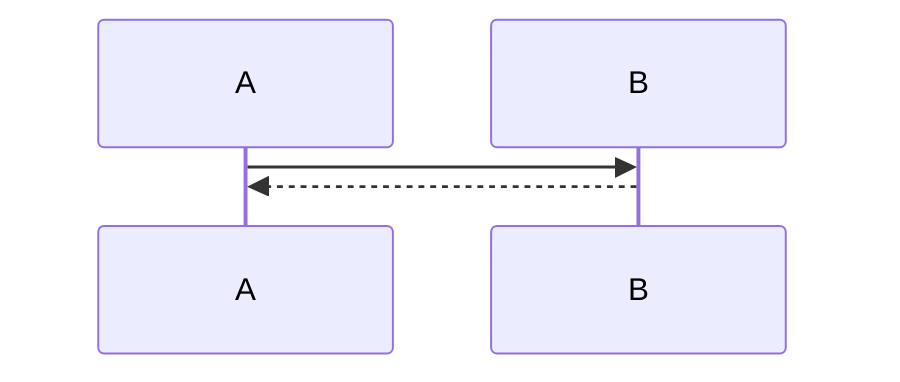
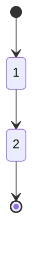
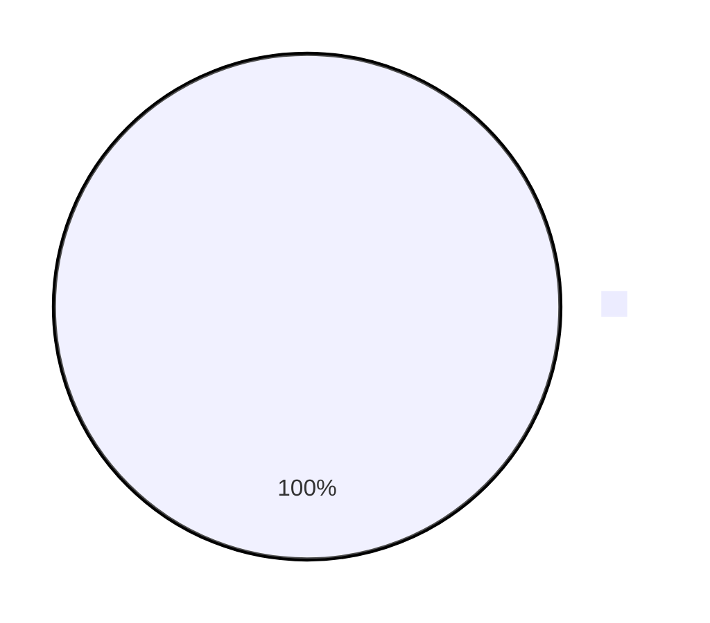
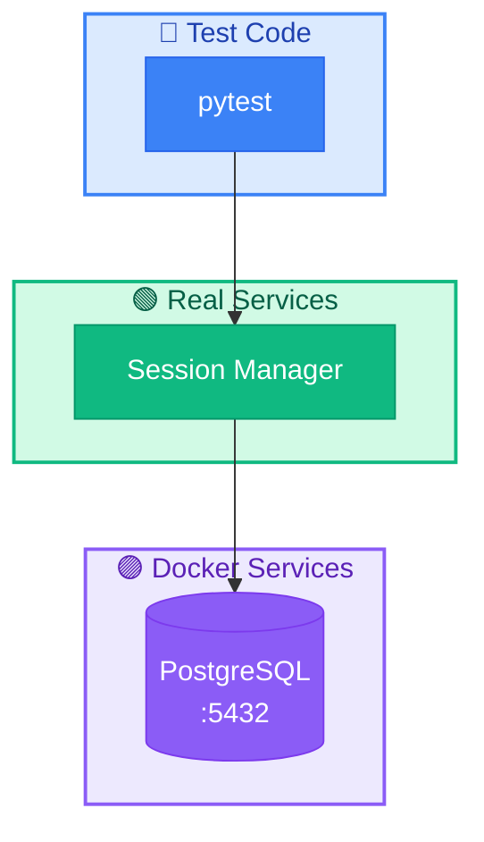

# Mermaid 

 NexAU Cloud  Mermaid ，。

## 

### （ + ）

|             | Fill      | Stroke    |                                              |                          |
| --------------- | --------- | --------- | ------------------------------------------------ | -------------------------------- |
| /     | `#10B981` | `#059669` | `style X fill:#10B981,stroke:#059669,color:#fff` | 、、   |
| / | `#F59E0B` | `#D97706` | `style X fill:#F59E0B,stroke:#D97706,color:#fff` | 、         |
|         | `#3B82F6` | `#2563EB` | `style X fill:#3B82F6,stroke:#2563EB,color:#fff` | pytest、、         |
| /     | `#EF4444` | `#DC2626` | `style X fill:#EF4444,stroke:#DC2626,color:#fff` | LLM、、      |
| Docker/     | `#8B5CF6` | `#7C3AED` | `style X fill:#8B5CF6,stroke:#7C3AED,color:#fff` | Docker、K8s Pod              |
| /       | `#06B6D4` | `#0891B2` | `style X fill:#06B6D4,stroke:#0891B2,color:#fff` | Gateway、Proxy、Protocol、Config |
| /   | `#6366F1` | `#4F46E5` | `style X fill:#6366F1,stroke:#4F46E5,color:#fff` | Langfuse、Trace、Metrics         |
| /     | `#14B8A6` | `#0D9488` | `style X fill:#14B8A6,stroke:#0D9488,color:#fff` | S3、PostgreSQL、Redis            |
| /       | `#6B7280` | `#4B5563` | `style X fill:#6B7280,stroke:#4B5563,color:#fff` | 、               |

### Subgraph （ + ）

|        | Fill      | Stroke    |                                                                  |
| ---------- | --------- | --------- | -------------------------------------------------------------------- |
|      | `#D1FAE5` | `#10B981` | `style X fill:#D1FAE5,stroke:#10B981,stroke-width:2px,color:#065F46` |
|      | `#DBEAFE` | `#3B82F6` | `style X fill:#DBEAFE,stroke:#3B82F6,stroke-width:2px,color:#1E40AF` |
|  | `#FEF3C7` | `#F59E0B` | `style X fill:#FEF3C7,stroke:#F59E0B,stroke-width:2px,color:#92400E` |
|    | `#FEE2E2` | `#EF4444` | `style X fill:#FEE2E2,stroke:#EF4444,stroke-width:2px,color:#991B1B` |
|  | `#EDE9FE` | `#8B5CF6` | `style X fill:#EDE9FE,stroke:#8B5CF6,stroke-width:2px,color:#5B21B6` |
|      | `#E0F2FE` | `#06B6D4` | `style X fill:#E0F2FE,stroke:#06B6D4,stroke-width:2px,color:#0C4A6E` |

### 

```
🟢 /:        #10B981 / #059669
🟠 /:    #F59E0B / #D97706
🔵 :          #3B82F6 / #2563EB
🔴 /:        #EF4444 / #DC2626
🟣 Docker/:       #8B5CF6 / #7C3AED
🔷 /:         #06B6D4 / #0891B2
🔹 /:     #6366F1 / #4F46E5
🩵 /:       #14B8A6 / #0D9488
⚪ /:         #6B7280 / #4B5563
```

## 

### 1.  (flowchart)

```mermaid
flowchart LR
    A[] --> B{}
    B -->|| C[1]
    B -->|| D[2]
```

### 2.  (sequenceDiagram)



### 3.  (stateDiagram)



### 4.  (pie)



### 5.  (gantt)

```mermaid
gantt
    title 
    section Phase 1
        1 :a1, 2025-01-01, 7d
        2 :a2, after a1, 5d
```

## 

### 



## 

1. ****: 
2. ****: Subgraph ，
3. ****:  `%% Subgraph `  `%% ` 
4. ****: ，